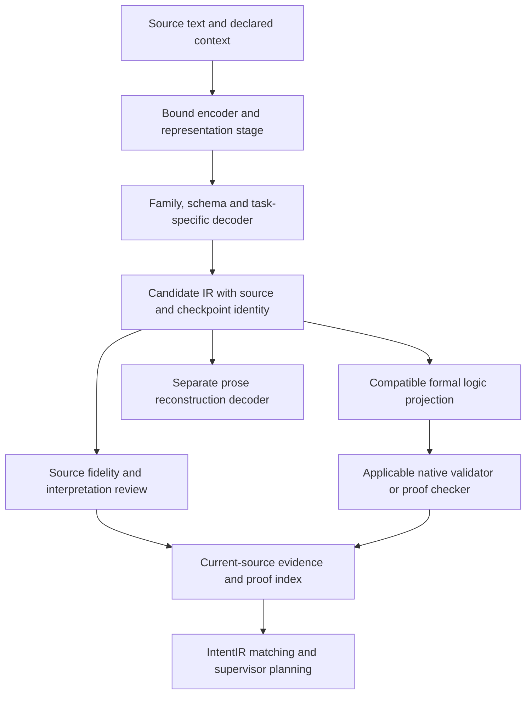

# Current autoencoder contributions to text-to-logic work

This October 6 review extends the existing sixteen-study integration review.
It checks GitHub heads, registered worktrees and effective Git blobs before
combining findings. The [integration ledger](integration-ledger.json) retains
those sixteen studies and adds two observations with distinct assets and
cohorts. It does not add their losses, sample counts or proof statuses into one
success rate. No encoder, neural inference, training, theorem prover or model
publication ran in this review.

## Published progress and actual retention

The initial parent snapshot is `b16464347c479f7a3cbda4c8e29dbaef90dda4fb`.
Its dataset gitlink is `795d960170214d03e2eaf4c0a13ad4eb922c5c08`, and its
supervisor gitlink is `d5c59e961d1a0ca8d09296b520cbd414a2078235`.
These include our contextual replay and the other agents' normative wording,
native Codex planning schema, Grok recovery and retained-planning transport
findings. The transport findings include negative results; publication is not
task success or model qualification.

The three inventories cover 37 parent GitHub heads/37 worktrees, nine dataset
heads/19 worktrees, and 41 supervisor heads/101 worktrees. Counts describe the
explicit inventory snapshots, including locked or quarantined worktrees where
status may be unavailable. They do not establish a full source review of every
unrelated branch. [Parent](root/survey.json), [datasets](datasets/survey.json)
and [supervisor](accelerate/findings.json) receipts preserve the details.

The ledger checks all 83 changed paths in four recent contributions and each
of the sixteen earlier report paths against the selected main trees. Every
selected path is present. Commit ancestry and byte retention are separate
checks; this avoids declaring a deleted source file integrated merely because
its commit remains an ancestor. The older joint-conditioning publication branch
duplicates an already published artifact tree, and supervisor Grok branches
are patch-equivalent. Neither needs another numerical merge.

Canonical live files also need separate classification. The parent checkout
is older than its remote main and dirty. In the bounded dataset source sample,
782 files already match main, 17 differ and 43 are absent. The supervisor sample
has 482 matches, 94 differing files and 39 absent files. Matching untracked
files are published work observed from an older checkout, not new contributions.
Differing or absent files remain active candidates requiring source, tests and
evidence review. These include ten grouped-span/deontic files in a dataset
integration worktree and CodebaseIR preview-successor owners/qualification
runners in the live supervisor. This review preserves those working files and
does not copy entire older trees over newer main implementations.

## Concurrent published successor

During publication preparation, another agent merged datasets PR #1271 at
`0f36163a585a9bf514c41d8eabe202936c000705`. Its 27-path contribution adds
experimental grouped Legal decoders, an explicit runtime route and preserved
handoffs. The [concurrent-main addendum](concurrent-grouped-main-addendum.json)
records this successor separately from the initial survey. All thirteen paths
in our provenance correction remain byte-identical in that merged tree. The
parent datasets gitlink includes both contributions; the initial eighteen-study
ledger and its independent review are not rewritten.

The grouped-v2 head accepts raw source text plus caller-declared modal scope,
with no 8D/384D/768D vector or latent input. Its published results report 64/64
fresh positive requests, 55/64 learned negative refusals, seven additional
validation blocks and two unsupported emitted requests. Seven official legal
paragraphs yield fourteen refusals across the two scope probes. Its explicit
experimental route preserves false semantic/proof authority. These results
contribute a distinct decoder contract and failure evidence, while reviewed
legal targets, latent conditioning and broader logic coverage remain open.

## Findings that change the next experiment

| Contribution | What it establishes | What it does not establish |
| --- | --- | --- |
| Original contextual Legal384/768 replay | Exact existing weights/caches; 48/48 ordered IRs and 180/180 rules per width | Fresh meanings, nonempty qualifiers, arbitrary prose or proof |
| Separate IR-to-text baseline | 48 outputs per width; 0/48 UTF-8 and NFC/whitespace original-text matches | A trained prose decoder or source meaning equivalence |
| Broader normative wording fit | 384D zero/auxiliary 55/60→60/60; 768D both 60/60; original development remains 48/48 | Untouched semantic holdout or broad law coverage; meanings were previously exposed |
| Source-only 8/384/768 MLPs | Real fits/resume evidence and lower source-vector MSE | A semantic benefit; the selected MLPs trail TRAIN-only PCA |
| Frozen native768 conditioning and joint spans | Same raw/PCA/AE decoder outputs; structural proposals 10→183/192 | Matched decoder training, independent source fidelity or globally optimal assignments |
| Protected 8D teacher and separate learned sidecar | Preserved lineage and separately measured decoders | A shared decoder/task or inherited teacher fidelity; sidecar wording exactness remains poor |
| Native4096 head studies | Real native producer and small TRAIN fits | Generalization; exposed development remains 0/12 in the reviewed comparison |
| Native family semantics/checkers | Scoped validators, logic-family routes and actual applicable Lake evidence | Correctness of new generated source meaning merely from syntax or a successful build |

The normative comparison uses four unique tensors. Selected and last-state
observations are aliases within each arm. Its 297 pure-contract checks and the
contextual replay's earlier 454 checks are different verification sets; they
are not an aggregate model accuracy measure. The 384D improvement fixes five
obligation outputs in the new wording panel. The 768D auxiliary slightly worsens
token CE despite exact outputs. Preserve both results when choosing a teacher
or a loss, and test retention on the exposed v3 cohort separately.

The new selected normative checkpoint serializations and their four last-state
aliases are absent from the explicitly selected 670-binding ModelManager catalog
and the three inspected public Hub main snapshots. Both original contextual
states remain registered and published. This is an exact serialization-identity
observation, not proof that equivalent tensors cannot exist in another format,
store or repository. The [presence summary](datasets/presence/presence-summary.json)
binds the inspected observations. The aggregate Hub also has grouped experiment
manifests; their later source delivery is recorded in the concurrent-main
addendum above. A public artifact alone does not establish a runtime or native
profile.

## Integration repairs from this review

The parent `.gitmodules` still named `agent/ui-ux-ir` for datasets, but that
branch no longer exists on GitHub and has no local tracking override.
`git submodule update --remote` therefore cannot resolve the configured branch.
The fix selects `main` for this one tracking field. The
[UI retention review](datasets/UI-branch-review.json) checks the preserved
historical branch and later wiring snapshots: 99, 101 and 103 useful paths,
zero missing in each. Existing UI code is preserved on main; modified shared
owners reflect later strict schema restoration and lazy exports. Other submodule
tracking policies, dirty checkouts, historical pins and sealed contexts are
preserved. No submodule-update command is run here.

The runtime review also corrects one source provenance claim. Saved source/text
identities and clause-context digests authenticate those inputs. A paragraph
file pin authenticates caller-selected bytes, but the saved validation inventory
has no independent paragraph-vector/producer receipt. Replacing a same-width
unit paragraph vector and explicitly repinning the file can pass preflight.
The [metadata-only reproducer](semantic/paragraph-pin-boundary.json) records that
boundary. The runtime now exposes caller-byte binding with producer
authentication false; its documentation states that limit. The actual original
44-asset replay still uses exactly its recorded vectors. These corrections
change metadata/description and documentation, not numerical calculations or
original weights/caches. The 163 affected contracts and nine existing effective
Git-tree auditor fixtures pass.

The [hosted CI observation](dataset-ci-observation.json) records benchmark and
CodeQL jobs that could not start for the repair and grouped successor commits
because the GitHub account is locked for billing. Those jobs are unverified;
their startup failures are separate from the passing local contract checks.

The earlier paraphrase diagnosis now distinguishes its initial scratch proposal
from the independently sealed, completed normative successor. A proposal file
is not substituted for the successor's recipe, source inventory or execution
receipt. Existing metrics and historical receipts remain unchanged.

## How the work contributes to autoformalization

Keep raw native vectors, learned latents, inverse reconstructions and decoder
conditions as different representation stages with their own producer contracts.
The historical linguistic8 input, the source-only8 MLP and an internal8-wide
projection are different assets. Larger numerical width alone does not change
the formal output grammar or establish source meaning.

Keep CodebaseIR, SecurityIR, LegalIR and IntentIR separate at 8D/384D/768D, with
their existing distinct inventories, databases and Hub lanes. Preserve UI and
4096D research as additional distinct profiles. Within each lane, checkpoints
need schema/version, decoder task, run/ablation and immutable asset identities.
An IR-to-text head, semantic IR head and FOL/TDFOL projection cannot share
qualification just because they share a family or a numerical width.

The next shared dataset step is independently reviewed source/formal material
covering roles, negation/modality, nonempty qualifiers and their attachment,
context, operators and multi-rule composition. The richer 64-source caches are
reusable under their actual native producers; their zero semantic masks cannot
become gold labels through compiler agreement or this integration review.
Review and type the targets before selecting a compatible decoder vocabulary.

Then compare matched raw/PCA/AE and source-only conditioners with equal decoder
architecture, initialization, updates, selection and output budgets. Warm-start
compatible 768D tensors from authenticated8D/384D donors, with a name/shape/dtype
and codec transfer manifest. Reuse width-specific caches and cohort IDs; do not
reinterpret padded384 vectors as native768 embeddings. A trained prose task
needs its own lexical/residual information contract and separate text metrics.
Increase encoder span and decoder output budgets independently; current512
experiments do not qualify8192-token formalization.

Before new normative endpoints are used by the supervisor, import their exact
candidate asset identities into ModelManager and publish scoped per-dimension
releases, preserving existing records and roots. Availability registration must
keep unknown native schema/profile/format identities and runtime/teacher/proof
authority false until matching contracts and quality gates exist. New catalog
generations require fresh reviewed task contexts; old sealed bundles are not
edited into currentness.

Codebase scans and proof caches bind the tested repository commit/content,
source spans, decoder/projection identities, checker/version, assumptions and
dependency hashes. Generated CodebaseIR remains a candidate until the applicable
checks pass; invalidate dependent entries when code changes. On-the-fly training
is a new pinned run whose outputs do not overwrite admitted indexes. IntentIR
matching and planning must distinguish those candidates from checked entries.
Source-fidelity, formal validity and proof admission stay separately attributable.

The existing [implementation backlog](../../implementation_plan/docs/50-autoformalization-alignment-implementation-backlog-2026-10-04.md)
remains the shared engineering sequence. This review updates source/contribution
currentness and concrete next inputs; it does not formalize a Constitution span,
grant universal family semantics or replace an applicable `lake build <Lib>`.
