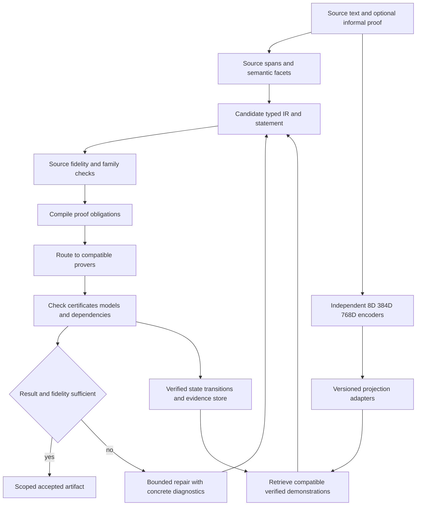

# Formal logic autoformalization improvement plan

Date: 2026-10-03; updated 2026-10-04. Status: proposed architecture and implementation sequence, updated with executed development experiments, source-only review recording, a concrete label evidence design, reusable contrastive owners and an audit of previously saved Leanstral embeddings. Priority assumption: improve source fidelity first, then proof coverage and cost. Measured diagnostic results are identified below; proposed acceptance targets remain unmeasured.

Extend the existing system with a shared retrieval space connecting natural language, typed logic, and verified proof traces. Preserve the independent 8D spaCy, 384D GTE-small, and 768D multilingual GTE paths. Give Leanstral two separately evaluated roles: formalization and proof repair, and an optional embedding teacher. Keep source meaning, executable syntax, and proof authority as distinct requirements throughout.

The next priority is an independently reviewed corpus with richer statements, explicit context and novel combinations of semantic facets, followed by matched comparisons of raw source vectors, admitted learned representations, and source/formal alignment. Decoder replay exposes literal-copy and fixed-vocabulary limits; opt-in source warnings, an anchored proposal contract and a replayed decoder wrapper provide a concrete development foundation. A separately trained source-only typed generator and anchor head now reproduce weak TRAIN proposals exactly across three seeds, while matching none of the available weak DEV proposals. An opt-in TRAIN-alias consistency checker now withholds the exposed DEV candidate that assigns incorrect action/object symbols to exact source spans. Its static agreement result supplies no independent fidelity measurement. A further 64 authored compositional sources are ready for candidate-blind review, with all training and evaluation admission masks zero. Source-to-symbol binding and compositional generalization therefore need direct evaluation before broader generator training. Native 8D, 384D, and 768D source production, declared-context input delivery, three learned endpoints of one retained 384D checkpoint, retained native768 replay, deterministic source grounding and preflight filtering have also executed on the authored panel. Preserve every raw retrieval control: the tested checkpoint endpoints rank below raw GTE-small, while the small 768D ridge improvement and numerical context sensitivity do not yet select a production lane. Add verified demonstration retrieval and bounded Leanstral repair after statement fidelity is measured. Develop Leanstral embeddings in a separately admitted runtime before changing encoder weights or undertaking large generator training.

## Research basis

[ProofBridge v3](https://arxiv.org/html/2510.15681v3) aligns natural-language theorem and proof pairs with Lean proof-state representations through contrastive training. It projects MiniLM 384D and ByT5 1472D representations into 512D, retrieves five demonstrations, and combines generator fine-tuning with bounded repair. Its reported semantic correctness checks generated statements against trusted formal references; this assumes those references preserve the source meaning. Its formal encoder averages proof-state representations, which does not explicitly retain traversal order or graph edges. These mechanisms motivate this proposal; the broader logic-family architecture below is our proposed extension.

## Executed development evidence and current priorities

The [native embedding and retrieval report](../../artifacts/autoformalization-alignment-20261003/richer-embedding-report.md) and [validation receipt](../../artifacts/autoformalization-alignment-20261003/richer-embedding-validation.json) record 102 actual source vectors: 34 in each independent lane. Each structural ridge head fits exactly 16 authored training pairs and retrieves five demonstrations from those same 16 training records. The following nDCG scores use eight authored positive development queries and a fixed seven-facet relevance definition.

| Source lane | Raw cosine nDCG at five | Structural ridge nDCG at five | Observed difference |
| --- | ---: | ---: | ---: |
| 8D spaCy features | 0.906353 | 0.787888 | -0.118465 |
| 384D GTE-small | 0.961897 | 0.915219 | -0.046678 |
| 768D multilingual GTE | 0.983838 | 0.995722 | +0.011885 |

These runs exercised source encoders and three small linear alignment probes. The subsequent checkpoint experiment below measures three selected learned endpoints, and the retained-decoder replay executes source-only generation. Autoencoder retraining, paired source/formal contrastive learning, Leanstral retrieval quality, independent statement fidelity and native proof execution remain unevaluated within this alignment study. Previously generated Leanstral hidden vectors are audited later in this plan. Separate earlier decoder experiments also executed generation and action-specific contrastive training on exposed development cohorts. The retrieval stage passed 182 focused tests and Ruff; these verify engineering behavior rather than source fidelity.

All six retrieval controls attain the same available unscoped qualifier identity ceiling. Condition recall is 0.75 averaged over queries and 0.80 weighted by atom occurrences; exception and temporal identity recall reach 1.0. Two development condition occurrences are absent from the training pool. No development target has an exact counterpart or full core tuple in that pool, so exact-counterpart recall is unavailable and observed full-rule coverage is zero. The 768D gain concerns ordering under authored relevance; it supplies no additional qualifier identities or independently established proof utility.

The earlier [parser experiment](../../artifacts/autoformalization-alignment-20261003/parser-report.md) matched 22 of 24 authored positive references under its opt-in grammar. Two unknown conditions abstained. Those examples have already informed development and cannot become an independent confirmation set. All 34 richer review items remain pending. The [richer review workflow](../../artifacts/autoformalization-alignment-20261003/richer-review-admission-report.md) now records candidate-blind submissions and disagreements under exact source/context bindings. Its zero-submission readiness run preserves all 34 pending items. Reviewer identity, independence and semantic adjudication remain unauthenticated; organizer-authored references are development labels.

Two examples share identical wording but have different explicit assumptions. Their source-only vectors are exactly equal in every lane, because the encoders received no context. Both were excluded from semantic retrieval scoring. The eight unsupported or ambiguous inputs received diagnostic rankings only; ranking does not yet implement an abstention or clarification policy.

The subsequent [declared-context report](../../artifacts/autoformalization-alignment-20261003/context-embedding-report.md) and [validation receipt](../../artifacts/autoformalization-alignment-20261003/context-embedding-validation.json) record 204 new native vectors: two framed arms for all 34 inputs in each lane, compared with the 102 saved raw-source vectors. The frame-only arm withholds assumptions; the declared-context arm uses the identical JSON shell and forwards exact assumption text and bindings for the two contextual inputs. Their same-wording vectors remain exactly equal without assumptions and separate with the declared contexts in every lane. Pair cosine distances are 0.006120290 for 8D, 0.004075981 for 384D and 0.017622256 for 768D. These measure input-token sensitivity, rather than recovered meaning or encoder superiority.

All 32 unchanged-text controls per lane remain within the fixed `1e-5` numerical tolerance. The 8D and 768D controls are exactly equal; 29/32 of the 384D controls are exactly equal, with maximum L2 difference 3.542e-7. Framing itself changes every raw-source vector beyond tolerance, which makes the matched frame-only control necessary. The new input policy preserves original source/context identities separately from serialized encoder-text identities and leaves native producer receipts intact. All 42 distinct predecessor sources and the frozen protocol remain unchanged. The context stage passed 262 focused tests and Ruff on seven files. Independent interpretation, retrieval quality under this profile, and all 34 pending human reviews remain open.

The [frozen checkpoint comparison](../../artifacts/autoformalization-alignment-20261003/checkpoint-representation-report.md) and [validation receipt](../../artifacts/autoformalization-alignment-20261003/checkpoint-representation-validation.json) record 102 actual learned endpoint vectors from one retained neural source384 decoder: 34 residual activations of width 8, 34 projected vectors of width 384, and 34 decoder-conditioning states of width 32. Each endpoint uses the same saved GTE-small input and fixed TRAIN16 retrieval pool. On the eight positive queries, raw source nDCG@5 is 0.961897; residual activation is 0.842882, projected vector 0.903596, and decoder condition 0.758260. All endpoints rank below raw under this authored measure, with the same qualifier-pool coverage. Keep reconstruction and formula conditioning separate from a learned retrieval objective. The 8D activation belongs to the 384D checkpoint and requires its input skip connection; it is not the separate spaCy lane or a complete compressed encoding.

The selected checkpoint's full current loader rejects a changed cross-domain UI-decoder pin. A separately identified projection-only route binds its unchanged thirteen tensors and fourteen preserved donor sources; all 46 predecessor source files remain unchanged. Public sparse `encode()` calls can apply target-assisted reconstruction safety projection and must not serve as the primary learned-state control. The retained spaCy checkpoint has empty vector-weight tables despite populated categorical heads; its vector endpoint was not evaluated. The inspected 768D catalog selects no trained autoencoder checkpoint, while native source vectors are available. Readiness is asset-specific rather than a global absence claim. The checkpoint stage passed 176 focused tests and Ruff on six files; fidelity, context resolution, native proof and all 34 independent reviews remain open.

The subsequent [decoder discovery](../../artifacts/autoformalization-alignment-20261003/decoder-discovery-report.md) and [inventory](../../artifacts/autoformalization-alignment-20261003/decoder-discovery-01/inventory.json) identify real 768D-conditioned decoder weights outside that selected catalog. Three open-vocabulary source-span runs each completed 800 new updates and selected the 400-update checkpoint. Their UTF8 byte-token GRU copies spans into one canonical deontic rule, conditioned by a separate native768 FiLM path. This is a narrow source-plus-embedding decoder, not an embedding reconstruction autoencoder or a generic multi-rule generator. All five current checkpoint implementation pins match; the public loader exists, but no numerical reload ran in this discovery stage. The historical context receipt reports 1,485 verified source/vector joins. Previous challenge aggregates do not establish a benefit from real context over disabled, zero, or swapped context.

Sixteen native768 formula-sidecar fits across native-dimension, action-binding, and generated-field r2 experiments retain 48 initial, selected, and final-attempt state files. Each trained for 340 updates; every selected state remains epoch 0 with the initial model-state digest, while every final-attempt state has changed weights. Their projection is frozen identity. One final attempt records 42/48 ordered exact development outputs, seven extra and seven missing whole rules, and final rejection for extra-rule regression at lengths 4 and 8. These are unselected, repeatedly exposed development observations. Replay gate decisions and full rule associations before changing the training objective or acceptance policy. Existing action-specific contrastive training is distinct from the proposed source/formal/proof alignment.

An isolated decoder source checkout now exists at `/home/barberb/lift_coding/.worktrees/alignment-decoder-768-20261003`, branch `codex/alignment-decoder-768-20261003`, pinned to local commit `64bc5734dc82db72e955f2e809b770127e9b6cfc`. It contains the newer formula-sidecar owners and is clean; eight inspected helper files match both the exact commit and canonical bytes. Preserve the older September release-validation checkout and locked October recovery checkout. Source-span owners absent from this commit need a separately hashed overlay or a later complete commit before integration. Frozen experiment source exports remain the owners of historical replay. The discovery stage executed no model or proof and preserved all 55 preceding source bindings and the frozen protocol.

During the typed-anchor stage's final validation, this checkout was absent from disk and worktree registration while its local branch still pointed to that exact commit. It was restored at the same path and branch, with all 16 accumulated frozen source-file bindings matching both committed and restored bytes, and marked with a persistent worktree lock. The disappearance's cause is unestablished. New source contracts and the typed-anchor owner remain separately hash-bound in the canonical tree; restoration adds no implementation to the pinned commit.

The subsequent [retained decoder replay](../../artifacts/autoformalization-alignment-20261003/decoder-replay-report.md) executes those assets on the 34 saved source-only native768 inputs. Nine source-span states comprise exact reconstructed initial controls and retained selected400/last800 checkpoints for three seeds. Four conditioning controls and nine private reloads complete 1,530 row forwards; every reload agrees exactly and model weights remain unchanged. Per control, seed1729 decodes 4/34 initially and 3/34 at both trained checkpoints; the other seeds decode none. All abstentions report overlapping copied spans. Trained conditioning changes modality logits, but real, disabled, zero and rotated vectors change no generated IR, status or reason. Identical-source contextual predictions remain equal when assumptions are withheld.

The source-span owner's unchanged output contract fits zero of the 24 positive references: fourteen require canonical condition symbols absent from literal source tokens, six require multiple qualifier atoms, and four have ambiguous repeated object mentions. Literal accuracy is unavailable because its eligible denominator is zero. The three trained seed1729 outputs occur on unsupported/ambiguous diagnostics and include source-meaning red flags despite passing narrow syntax checks. They remain proposals, not accepted artifacts. Source capability and semantic gates must precede acceptance, and all requests remain in service coverage accounting.

One representative formula-sidecar triplet restores all 32 saved tensors per state, retains original normalization and its identity projection, and completes 102 BOS-only observations and 102 free-running generations. Initial and epoch-0 selected numerical outputs agree bitwise; neither produces parse-valid JSON. The trained last attempt produces parse-valid JSON on 34/34 inputs, but every output omits conditions, exceptions and temporal qualifiers. Its fixed vocabulary cannot express `clerk`, `custodian` or `case_file`; JSON parsing establishes no source fidelity or native validity. Its historical 42/48 result and extra-rule rejection were not reproduced on the historical corpus in this replay. No checkpoint was promoted, optimizer updated, independent reference review completed, or proof executed.

Output representation is therefore an explicit prerequisite for broader decoder experiments. Preserve literal source anchors separately from canonical symbols; version any alias normalization or open vocabulary extension and evaluate it as a new arm. Add multiple atoms, operators, scope and whole-rule associations without silently changing the references or widening the old decoder's support claim. A posthoc reference-compatibility diagnostic is distinct from an inference capability gate: the deployed gate must use only source text, declared context and an admitted profile. Measure unsupported/ambiguity outcomes and independent all-facet fidelity alongside syntax and numerical conditioning.

The subsequent [source grounding implementation and assay](../../artifacts/autoformalization-alignment-20261003/source-grounding-report.md) introduces separate opt-in source preflight, grammar grounding and static proposal transport contracts. Preflight has no vocabulary or target input and leaves warning-free text unassessed. On 34 requests, it records 24 unassessed, six unsupported-profile and four clarification outcomes, including both unresolved declared contexts. Grounding uses the unchanged complete qualifier grammar and frozen TRAIN-supervised vocabulary, producing 22 proposals with 172 exact source-character anchors, ten source-blocked outcomes and two unavailable condition mappings. Canonical symbols remain distinct from literal anchors; repeated object/condition mentions receive different offsets, and multiple qualifier atoms retain field paths and explicit flat connectives.

Both retained decoder transport contracts are incompatible with all 22 source-constructed proposals; the new anchored proposal contract represents them statically, without a trained decoder or candidate acceptance. Source construction finishes before query references are read. Its 22/24 authored-positive agreement reproduces the earlier exposed parser result and supplies no independent fidelity gain. A posthoc overlay associates all ten previously decoded occurrences, on four distinct sources across nine real-vector state runs, with preflight blocks; the outputs were not modified or reexecuted. The stage executed no model, embedding, proof or training and preserved 245 preceding bindings. Combined new and existing contract tests passed 275 tests, and Ruff passed. All 34 semantic reviews remain pending.

The subsequent [opt-in decoder wrapper and replay](../../artifacts/autoformalization-alignment-20261003/preflight-decoder-report.md) makes these source warnings operational without changing checkpoint owners or runtime defaults. It validates the complete vector batch and applies zero/full-order rotation before filtering, preserving blocked rows as possible rotation donors; disabled conditioning remains separate. Across nine native768 states and four controls, each 34-request response withholds six unsupported-profile inputs and four clarification inputs, then returns 24 decoder abstentions and zero proposals. All 864 surviving primary decoder rows match the corresponding frozen raw outputs bitwise, including scores; nine disjoint private restores repeat exactly. The matched replay executes 1,080 row forwards instead of 1,530, preserves all 258 preceding bindings and actual model/checkpoint/RNG state, and uses no training, new encoder or proof. The 450 avoided forwards are an invocation-count result on exposed diagnostics, not a production latency or independent false-acceptance result. Warning-free inputs remain unassessed. Saved-receipt validation recomputes structure and joins without authenticating model predictions; the observed raw comparisons supply separate numerical evidence. Combined tests passed 382 tests and Ruff passed. Independent fidelity and a trained compatible output contract remain open.

The subsequent [canonical byte transport and preparation](../../artifacts/autoformalization-alignment-20261003/canonical-codec-report.md) adds a separately versioned fixed 259-ID UTF8 alphabet. Compact output carries canonical symbols and exact source anchor offsets, reconstructing all 22 full proposals with 172 anchors exactly. TRAIN sequences use 534–701 framed byte tokens and constructed DEV sequences 532–693; none fits a numeric 512-byte-token ceiling, while the predeclared 4,096 cap fits all. This is lossless serialization, not source generation or accuracy. Target-free input records join the existing 102 raw vectors across all three lanes; only 16 TRAIN proposals across four groups receive weak decoder-fit masks. Their grammar labels retain upstream TRAIN supervision; all strong semantic, contrastive, proof and fidelity-evaluation masks remain zero. Six DEV proposals are capacity diagnostics, with two unavailable positives retained in the DEV8 denominator and no invented negative target sequences. An older typed-atom codec already supports canonical aliases and up to four qualifiers; its retained checkpoint cannot encode the current sources or targets. A TRAIN-refitted vocabulary statically represents all 22 sources and canonical targets with 19–22 target tokens, but has no new trained state and emits no anchors. Compare a typed generator with a separate anchor head against full byte output before choosing a learned architecture; unseen symbols remain a declared typed-vocabulary limitation. Combined tests passed 474 tests and Ruff passed. No neural fit, new embedding production, proof or semantic review ran.

The subsequent [typed-rule and learned-anchor experiment](../../artifacts/autoformalization-alignment-20261003/typed-anchor-decoder-report.md) executes compatible source-only training under that TRAIN-fitted typed vocabulary. For seeds 1729/1730/1731, a 44,257-parameter source/attention/formula GRU and a separate 4,354-parameter anchor head each complete 100 epochs and 200 updates on the same 16 weak TRAIN records; the head freezes its parent and queries only source-generated canonical leaves at inference. Each seed reproduces all 16 TRAIN proposals and 124 anchors exactly, but matches none of six available DEV weak references, with two unavailable positives retained in DEV8. Final complete proposals number 17/16/16 out of all 34 requests, compared with zero for each initial head; unsupported, clarification and source-OOV counts remain 6/4/2. A DEV proposal with exact span coordinates nevertheless misassigns action and object symbols. Transport closure, offsets and training agreement therefore do not establish interpretation or acceptance.

The [recovered experiment report](../../artifacts/autoformalization-alignment-20261003/typed-anchor-decoder-recovery-01/report.json) records the initial worker's CPU-limit interruption, preserves all 36 partial files and trains only the missing third head in a new worker. Completed ancestry contains 1,200 updates; attempted work remains bounded at 1,210–1,410 including a ten-update disposable canary and unknown interrupted work. Recovery alone takes 11.066 seconds wall, 11.060 seconds worker CPU and 737,108 KiB peak RSS with explicit native and Torch thread limits. Twelve primary 34-row receipts and three disjoint private repeats preserve checkpoint/model/RNG state and match completed original outputs. Hooks distinguish actual generation, frozen feature encoding and head execution. No external embedding conditioning, new embedding production, proof, DEV checkpoint selection or semantic review runs. The [saved-artifact validation](../../artifacts/autoformalization-alignment-20261003/typed-anchor-decoder-validation-01/validation.json) recomputes structural and weak-label diagnostics separately from numerical observations. Combined tests pass 537 tests and Ruff passes; all 34 semantic reviews remain pending.

The subsequent [source-symbol consistency and review preparation](../../artifacts/autoformalization-alignment-20261003/symbol-binding-report.md) introduces an opt-in profile aggregating 20 observed aliases from 124 weak TRAIN anchors across 16 pairs. Closed proposal assessment checks exact per-leaf literals against facet-specific canonical symbols, preserving unknown or colliding aliases as unassessed. Across 408 saved primary slots, 49 candidates have complete anchors: 48 TRAIN candidates agree and one DEV candidate contradicts both `retain` and `the filing`. The optional static filter withholds that one candidate; 359 slots remain unavailable rather than acquiring synthetic anchors. Three private repeats match exactly. This does not check omitted meaning, whole-source coverage, connective scope, binders, domains or contextual interpretation. A wrong TRAIN correspondence can pass. The counterexample was previously exposed and the assay is not an independent quality study.

The completed [static recovery receipt](../../artifacts/autoformalization-alignment-20261003/symbol-binding-recovery-02/report.json) preserves both earlier resource stops and the frozen profile. A fresh child worker completes without new fitting, decoding, model, encoder, optimizer or prover calls under the unchanged 512 MiB worker cap. The [provenance addendum](../../artifacts/autoformalization-alignment-20261003/symbol-binding-recovery-02/provenance_scope_addendum.json) distinguishes algorithmic reference use, which is absent, from deserialization of a historical metadata container containing one posthoc weak reference. The [new reviewer packet](../../artifacts/autoformalization-alignment-20261003/binding-review-packet-01/reviewer_items.json) supplies 64 authored sources in 16 private groups, all review fields blank and all fit/evaluation masks zero. Draft group splits propose 32 TRAIN and 32 DEV; source texts have no exact overlap with the older 34, but reuse exposed components. The newer recorder below now accepts this schema; authenticated review, independent adjudication and an explicit semantic label-admission contract remain required, followed by disjoint natural sources for confirmation. All 98 old and new reviews remain pending. Combined contract tests pass 613 tests with explicit CPU isolation; these engineering checks establish no source fidelity.

The subsequent [compositional review recording readiness](../../artifacts/autoformalization-alignment-20261003/binding-review-admission-report.md) implements a source-only adapter and usable command line for that packet. It reuses unchanged annotation validators while binding the new 64-item schema, exact source/context envelopes and required canonical-content pin separately from file-byte pins. Partial declarations, ordered rule/qualifier agreement and disagreements are recorded without authenticating identities or selecting an answer. The real zero-submission workflow verifies all 64 joins and leaves all items pending, all 512 annotation cells blank and all 320 item-mask values zero. Its private wrapper verifies group/split metadata separately; the recording API receives only the public packet. All 483 preceding checked bindings are preserved. The final four-file review suite passes 224 tests and Ruff passes the new files; no model, encoder, proof, training, semantic adjudication or label admission occurs. The [runbook](../../external/ipfs_datasets/docs/autoencoders/alignment_binding_review_recording.md) provides actual submission instructions. Complete or mechanically matching declarations still require authenticated provenance and external adjudication before a separately versioned contract can enable any supervision mask.

The [next experiments report](../../artifacts/autoformalization-alignment-20261003/alignment-next-experiments-report.md) now connects the [semantic label evidence design](../../artifacts/autoformalization-alignment-20261003/label_admission_contract_design.md), [weak contrastive prototype design](../../artifacts/autoformalization-alignment-20261003/contrastive_prototype_design.md) and [saved Leanstral embedding inventory](../../artifacts/autoformalization-alignment-20261003/leanstral-embedding-inventory-01/inventory.json). The proposed label intake binds a trusted review process selected outside submissions, authentic provenance, interpretation alternatives and separate adjudication; it remains unimplemented and enables no masks. Existing autograd source/formal heads are reusable for native384. A proposed 12-arm, 960-update CPU diagnostic requires its own versioned weak-fit policy: the original TRAIN16 manifest permits decoder fitting while contrastive supervision remains zero, and its 16 distinct targets supply no equivalence classes. No such fit has run.

The inventory also finds numerical Leanstral results outside this campaign: three byte-identical 800-source passes contain 2,400 finite, normalized 4096D vectors from last-token pooling. This establishes a working hidden-vector route for the inspected asset. It does not qualify a general statement embedding producer: single-versus-batch L2 difference is 0.145932 against a registered 0.001 tolerance, despite exact A/B/A and fixed-workload repeats. The saved 16-slot runtime has 512 context tokens per slot. None of its 800 distinct source texts joins the old 34 requests or new 64-item packet, so those caches cannot populate the current panels. Source/backend pins and a bounded streaming audit preserve the evidence; no new model, encoder, fit, proof, review or service operation ran. The [resource snapshot](../../artifacts/autoformalization-alignment-20261003/alignment-next-experiments-readiness-02/snapshot.json) separately evaluates the current common-runner formula: 42.12 GiB observed available host memory versus 84.78 GiB required including reserve. This is a recorded formula result, not an invoked runtime preflight or a permanent resource judgment.

The immediate work sequence is therefore:

1. **Establish independent semantic supervision.** Obtain independent review and adjudication for the old 34 items and new 64-source compositional packet. Use the implemented source-only recorder for the new packet's declarations. Authenticate reviewer identity and independence, resolve disagreements and unsupported scope, and define explicit semantic label admission before enabling any training or evaluation mask for reviewed annotations; every mask in the new recorder remains zero. Then assemble a separate corpus from natural sources across selected legal, Lean mathematics, and program/specification profiles. Split original source groups before creating derivatives. Label assumptions, ambiguity, unsupported constructs, every semantic facet, and complete rule associations. Size confirmation after measuring pilot variance and review cost.
2. **Evaluate context interpretation.** The first role-marked source/assumption profile and matched empty-assumption control have executed in all three native lanes. Next measure interpretation and retrieval on independently reviewed examples, including identical wording under different contexts, missing context, definitions and premises. Preserve raw and frame-only controls. Compare JSON rendering with separately versioned natural-language role rendering or source/context fusion; choose using semantic outcomes. Bind every supplied context byte and authority scope. Missing information should produce a clarification or abstention outcome.
3. **Extend admitted learned-state comparisons using retained assets.** The retained neural 384D checkpoint's three learned endpoints rank below raw source retrieval on this panel; keep that control. Native768 replays establish numerical execution and expose incompatible output contracts. The new source warnings, anchored proposal format and decoder wrapper have matched replay; evaluate their scope independently. The compatible typed-rule/anchor baseline now trains and generates, with exact weak TRAIN agreement and zero available weak DEV agreement. The new profile-bound symbol checker detects observed alias contradictions only; compare it with source-grounded symbol inventories and explicit actor/action/object binding losses on independently reviewed novel compositions. Include omitted qualifiers, consistent wrong weak labels and unknown/colliding aliases in that evaluation; retain original candidates and all-request denominators. Compare full byte generation as a new, untrained arm under matched budgets. Then add separate real, disabled, zero and full-order rotated 8D/384D/768D conditioning around the frozen source-only baseline; the typed and static binding experiments consumed none of those vectors. Preserve the narrow copy baseline, epoch-0 sidecar selections and unselected trained states. Bind exact producer, source/context, normalization, clause positions, vocabularies, code, and checkpoint identities. Preserve unsupported outcomes and reproduce recorded selection failures separately on their admitted historical scope. Admit populated sparse/vector or categorical states separately; use source-only, pre-safety endpoints. Distinguish raw features, reconstructed vectors, categorical heads, decoder conditions and token-copy capabilities. Measure meaningful statement differences and free-running decoder fidelity alongside retrieval.
4. **Extend existing contrastive alignment as a new arm.** Reuse the differentiable native384 source/formal heads and compare 384D and 512D shared spaces with frozen backbones. The proposed weak diagnostic has fixed TRAIN-only settings and requires a separate weak-fit policy; it cannot reuse decoder-fit admission or author groups as semantic positives. Independently reviewed labels then support equivalent positives and profile-checked negatives. Version unknown-pair exclusion and native8/native768 checkpoint profiles, and verify gradients and detached replay. Retain raw cosine, learned autoencoder endpoints and fixed ridge baselines. Add reconstruction or decoder losses only through named ablations.
5. **Add proof retrieval and bounded Leanstral repair.** Capture native traces, admit compatible verified demonstrations, and hold a fidelity-checked statement fixed during proof repair. Compare useful accepted artifacts per total resource budget. Run the Leanstral embedding probe only after its own resource and output contracts pass.

The existing implementation supplies useful source production, declared-context input delivery, structural features, review preparation, and replay infrastructure. Their narrow executed scopes do not close the corresponding work packages or qualify a general autoformalizer. The frozen research protocol and earlier experiment receipts retain their recorded identities.

## Current system and evidence

This inventory uses files in the canonical `external/ipfs_datasets` checkout, the local Leanstral runner, and existing plans. The inspected root HEAD is `fe18069df4203da9bddfb77b1ed41748f4d5fb4d`; datasets HEAD is `d5238def256d1c352793ee7d977e6b17b6d8cbee`; accelerator HEAD is `18e0f79e56def8ba426cafdfad568fe6bf7440b7`. Existing worktree changes mean these commits alone do not identify all inspected bytes. Implementation and experiments must bind source-file hashes and complete dependency manifests.

| Asset | Inspected implementation or evidence | Role in this plan |
| --- | --- | --- |
| 8D spaCy path | Preserved linguistic feature-hash profiles and `legacy_v1` numerical lineage. Input width is 8; the legal sparse core is an additive residual model. | Fast feature baseline, family and ambiguity diagnostics, narrow formula generation where independently qualified. |
| 384D path | `thenlper/gte-small` source representations; `current_v2` numerical lineage; separate source decoders and optional joint formula heads. | First dense retrieval arm and primary inexpensive source encoder. |
| 768D path | Pinned `Alibaba-NLP/gte-multilingual-base` profile; native producer, inherited-interface preparation, replayed source-span selections and one formula-sidecar triplet. | Resolve observed output-contract limits, then compare independently aligned retrieval and decoder transfer; establish language/context capability separately. |
| Leanstral | Local runner defaults to `Leanstral-1.5-119B-A6B-NVFP4.gguf` and serves chat through llama.cpp. Header inspection identifies a 4096D hidden width for this cached asset. | Generate or repair Lean; experimentally encode statements and proof states through a separate embedding runtime. |
| Runtime interface | Explicit domain/version selection, checkpoint identities, target preparation, inference, and formal decoder entry points. | Extend the current interface and contracts for new representation adapters. |
| Logic and prover infrastructure | Canonical family/profile catalogs, typed IR, native adapters, trust tiers, translation receipts, and source-bound verification requirements. | Route and verify obligations under their actual semantics and evidence scope. |

The 8D, 384D, and 768D labels describe source vector widths. Decoder hidden sizes, sparse-core representations, formula vocabularies, and shared retrieval dimensions are separate quantities. An optional formula head has its own checkpoint and support scope; a numerical checkpoint does not gain that head through a dimension label.

The inspected [source-decoder evaluation](../../external/ipfs_datasets/docs/autoencoders/gte_decoder_source_evaluation.md) reports 0/60 exact matches for its original 384D head on an exposed validation cohort despite syntactically valid outputs, exact reproduction of two authored training examples by an experimental learned 8D GRU head, and 0/62 native 768D evaluation coverage. That learned 8D head is a separate donor asset from the preserved full spaCy/sparse lineage. These observations apply to those named generations and cohorts. The [aligned interface preparation](../../external/ipfs_datasets/docs/autoencoders/gte_aligned_interface_training.md) records missing native inputs and no executed production fit at that stage. Later source-span and formula-sidecar training belong to different decoder lineages and do not retroactively execute that inherited-interface preparation. The user-confirmed multilingual GTE URL identifies the source backbone; the newly found decoder checkpoints have their own identities and receipts. The scoped discovery establishes trained conditional decoding, while learned768 vector reconstruction remains unestablished for these assets.

The immediate opportunity is to improve source-conditioned fidelity and useful retrieval. Existing structural tests and preparation tooling supply a foundation for that work.

Reuse these established documents and owners:

- [Autoencoder handbook](../../external/ipfs_datasets/docs/autoencoders/README.md), [lineages](../../external/ipfs_datasets/docs/autoencoders/legal_autoencoder_lineages.md), and [versioned runtime interface](../../external/ipfs_datasets/docs/autoencoders/versioned_runtime_interface.md).
- [Parallel 8D 384D 768D migration plan](../../external/ipfs_datasets/docs/autoencoders/gte_multilingual_migration_plan.md), [decoder reuse](../../external/ipfs_datasets/docs/autoencoders/gte_decoder_reuse.md), and [joint formula training](../../external/ipfs_datasets/docs/autoencoders/modal_joint_formula_training.md).
- [Logic output requirements](../../external/ipfs_datasets/docs/autoencoders/logic_output_requirements.md), including the eight-family floor, source-bound Lake checks, and fourteen additional code routes.
- [AF-002 frozen research protocol](../../papers/completion/autoformalization/protocol.md) and [ProofGroundedIRLearningFabric handoff](../proof_grounded_ir_learning_fabric/README.md).
- [Existing Hammer and Leanstral optimization plan](../../external/ipfs_datasets/docs/implementation/plans/HAMMER_LEANSTRAL_LEGAL_IR_NEXT_OPTIMIZATION_PLAN.md) and [source-free proof-feedback contract](../../external/ipfs_datasets/ipfs_datasets_py/logic/integration/reasoning/legal_ir_proof_feedback.py).

AF-002 already separates source fidelity from checker success and groups source derivatives for evaluation. Preserve its frozen conditions and final-test lock. Run the proposed new arms under a separately versioned study, or an explicitly recorded pre-outcome protocol amendment. Earlier inventories remain historical evidence; their dated capability gaps need current revalidation.

## Proposed end to end architecture



Treat the exact symbol table, binders, types, source spans, assumptions, and semantic profile as structured records. The latent vector proposes or ranks candidates; the structured records retain the information needed to check them. Generated source references are claims until a trusted resolver binds them to actual input bytes.

For the established legal production path, the deterministic compiler remains the semantic authority within its admitted controlled-language production contract. Learned source decoders and retrieval produce separately attributed candidates and disagreements. The new development grammar and wrapper do not establish fidelity for arbitrary prose. A learned improvement reaches production compiler behavior through a verified, bounded deterministic rule change and its promotion checks. Measure learned output, current compiler behavior, and promoted behavior independently, following the existing optimization plan.

Every stage should emit explicit outcomes: accepted within scope, rejected with evidence, unknown, unsupported, unavailable, timeout, or ambiguous input. Keep proof validity, source fidelity, proof-step fidelity, and translation completeness as separate fields. A high retrieval score or prover agreement does not merge those fields.

Support two task modes. Theorem-only input requests a faithful statement plus a synthesized proof. Theorem-and-proof input additionally requests preservation of the supplied argument. Score and train those modes separately; a valid alternative proof can satisfy the first while failing the second.

## Representation design for all four model paths

### Preserve the existing lanes

Maintain separate model instances, checkpoint ancestry, optimizer state, input receipts, caches, and output namespaces. Cross-lane supervision reads immutable donor generations. Continue independent 8D, 384D, and 768D improvement; distinguish native source production from learned autoencoder and decoder qualification. Reuse existing compatible embeddings before producing missing vectors.

For every representation, record model and code revisions, tokenizer, exact source digest, pooling, normalization, precision, context policy, checkpoint, and adapter generation. Fit an adapter from each source representation to a common dimension `d`; initially compare `d=384` and `d=512`, then test 256 or 768 only if accuracy, memory, or cost justifies it. A larger projection can reorganize an 8D input, but cannot recover distinctions the feature codec discarded.

For context-aware representations, serialize the source, definitions, premises, and assumptions with explicit roles. Keep their exact records available to the structural checks. Compare a joint text serialization against separate source/context views and a small fusion head; choose through independent context-sensitive outcomes. A context-aware generation arm must receive the same admitted information as its retrieval arm, and every input policy creates a separately named representation.

For inherited 768D decoder transfer, admit the original donor codec and target vocabulary before fitting the input boundary. The documented donor accepts its V2 reference cohort and rejects the V3 cohort; new vocabulary needs an explicit migration and independent evaluation. A ready transfer arm requires compatible donor targets, admitted native source-vector joins, and an authenticated affine fit using training pairs only. Direct native 768D retrieval can be evaluated separately from these decoder-transfer prerequisites.

| Path | Proposed representation and training | Required comparison |
| --- | --- | --- |
| 8D | Preserve codec/core; add a small projection and feature classifiers only where useful. Retain exact source/IR side information. | Dense system with and without 8D diagnostics; 8D alone on its supported narrow tasks. |
| 384D | Compare raw GTE vectors, sparse-core outputs, and the attached learned representation. Begin with frozen encoders and trainable projection heads. | Raw dense retrieval versus autoencoder representation under identical examples and budgets. |
| 768D | Reuse admitted native vectors and retained source-span/formula-sidecar states; replay each under its own source-input contract. Compare direct alignment with inherited decoder/interface transfer as a separate arm. | Raw versus learned conditioning, source-token copy control, direct alignment versus 768-to-384 transfer; language and length strata. |
| Leanstral | Pool final hidden activations before the vocabulary head, project to `d`, and train for retrieval only after a frozen baseline. | Raw pooled activations versus contrastively trained head; quality per latency and memory. |

For actual autoencoder evaluation, identify the learned representation from its checkpoint contract rather than assuming the named input width is a compressed bottleneck. Replay inference with sample-memory lookup, reference tokens, and target-aware safety projection excluded from the primary endpoints. Report raw learned reconstruction, supported formula generation, and retrieval separately. A 768-to-384 decoder transfer can fit a fresh input adapter around a copied differentiable decoder; verify its normalization, vocabulary, nonzero gradients, and unchanged donor weights before selectively unfreezing the copy.

The upstream [GTE-small](https://huggingface.co/thenlper/gte-small) and [multilingual GTE](https://huggingface.co/Alibaba-NLP/gte-multilingual-base) cards establish different native spaces. The latter supplies 768D vectors and an 8192-token context; neither truncating its vectors nor padding 384D vectors establishes coordinate compatibility. Preserve the repository's pinned revisions, including multilingual implementation code and pooling profile.

### Separate statement meaning from proof strategy

Create distinct, versioned representations for source meaning, typed statement structure, current proof goal, and proof strategy. Fuse their scores only after validation. Two statements can use similar vocabulary while differing in a quantifier; two proofs of the same statement can have different reusable strategies.

For formal statements, encode a canonical typed AST with binder scope, domains, operator identities, and semantic profile. Normalize variable names through capture-safe binding indices, preserve constants and units, and record each approved normalization. For proof retrieval, compare three increasingly expressive representations:

1. A frozen mean of proof-state vectors as the inexpensive baseline.
2. Ordered transition tuples containing pre-state, action or tactic, post-state, and cited premises, pooled with an order-sensitive encoder.
3. A dependency graph with goal, premise, action, and derivation nodes, and explicit parent/subgoal edges.

Validate graph extraction independently before training on it. Instrument Lean's actual execution states and proof terms rather than parsing tactic text alone. For other backends, retain the available resolution steps, SMT proof objects, model-checking traces, or domain-native derivations. If a backend exports only an outcome, label proof structure unavailable.

The executed richer structural baseline uses exact complete-rule records and 2048D or 4096D positive hashed counts. Those formal feature widths are separate from source widths and shared latent dimensions. Preserve qualifier-to-rule associations, multiplicity, and exact opaque atom identities in the records; bag-level qualifier coverage is only a diagnostic. Hashed features can collide and do not implement binder semantics. Add typed AST and binding-aware representations before claiming general first-order or dependent-type structural fidelity.

## Leanstral embedding experiment

Leanstral's final layer yields token representations that require an explicit pooling policy. The [saved embedding audit](../../artifacts/autoformalization-alignment-20261003/leanstral-embedding-inventory-01/inventory.json) now verifies actual 4096D, finite, unit-normalized outputs from three fixed 800-source passes, using raw source text and last-token pooling before the vocabulary head. Its backend header declares the same hidden width; vocabulary logits have width 131,072. A separate [embedding benchmark](../../scripts/benchmark_leanstral_embeddings.py) exists, while the common generation runner and JevOps chat client do not expose this route. The [local asset manifest](../../../.cache/ipfs_accelerate_py/llama_cpp/models/refs/Frosty40_Leanstral-1.5-119B-A6B-GGUF-NVFP4/Leanstral-1.5-119B-A6B-NVFP4.gguf.json) records SHA-256 `4668fd2a6d2764de250489852230e96238eb5c0d7495866eb3b9c6c4fac5c7da`. This remains a manifest declaration, rather than a newly verified full-weight hash. Matching metadata-prefix, backend and executable pins do not authenticate all weight bytes or establish a separately customized fine-tuned checkpoint. Bind the selected asset's verified identity before a new embedding run.

The saved benchmark's single-versus-batch L2 difference is 0.1459320842, exceeding its registered 0.001 tolerance; the cause is unestablished. A/B/A replay is exact, and the three fixed-order workload files are byte-identical, but arbitrary batch peers, order, position and padding remain unqualified. Retain the batching/workload identity with these vectors. Its 16 parallel slots divide the requested 8,192 context into 512 tokens per slot; that profile does not establish general 8,192-token statement support. The saved report records a 249.23-second cold load and median 15.43 seconds per warm 800-source pass, about 51.85 sources/second. Warm timing includes HTTP inference, validation and cache erasure, and excludes output-file writing; it measures no retrieval or formalization quality. No cached source exactly matches either current panel. The existing benchmark temporarily stops the managed generation service and lacks the common runner's full lock/admission envelope. Use a separately bounded runtime owner for the next canary; this audit performed no service operation.

The inspected [DeepSeek2 backend graph](https://github.com/ggml-org/llama.cpp/blob/571d0d540df04f25298d0e159e520d9fc62ed121/src/models/deepseek2.cpp#L426) exposes the final normalized hidden representation before the vocabulary projection. Its [server documentation](https://github.com/ggml-org/llama.cpp/blob/571d0d540df04f25298d0e159e520d9fc62ed121/tools/server/README.md) describes embedding mode and pooling. Use that exact backend capability as the starting point, then verify it numerically with the selected asset.

The [Transformers output contract](https://huggingface.co/docs/transformers/main_classes/output) distinguishes hidden activations shaped `[batch, sequence, hidden_size]` from vocabulary logits. A [decoder embedding example](https://huggingface.co/intfloat/e5-mistral-7b-instruct) pools the final valid token and normalizes it. [LLM2Vec](https://arxiv.org/html/2404.05961v2) provides supporting research for adapting decoder models for representation learning. These sources support the experiment; they do not establish Leanstral retrieval quality.

Continue the experiment in this order:

1. Bind the actual local model digest and backend revision; verify hidden width from the loaded artifact metadata. Keep the generation runtime's identity separate from the embedding profile.
2. Use a bounded separate llama.cpp embedding process with last-token pooling first. Reproduce and resolve or explicitly scope the observed single/batch discrepancy. Predeclare comparisons across batch sizes, slot/row positions, peer content, request order, padding and cache isolation; bind the actual per-slot context and overlength rejection. Verify the registered numerical tolerance before admitting arbitrary-input caches.
3. Compare masked mean pooling only with a verified physical microbatch policy. The inspected backend requires the complete sequence in one physical microbatch for mean pooling; the current runner's microbatch of 64 is not a general long-input mean-pooling setup.
4. Embed the same source statements, typed formulas, and proof states as the inexpensive encoders. Version task prefixes and serialization; ensure the vector is computed from available inference input.
5. Normalize the pooled vector and learn a projection into the shared space. Evaluate raw frozen activations first. Intermediate-layer comparisons require backend support and remain a later experiment.
6. Consider retrieval-specific adapters or selective model tuning only after a frozen baseline wins. Keep those weights separate from generation tuning and rerun generation regression checks if any shared backbone changes.
7. If Leanstral improves retrieval at excessive online cost, distill its ranking distributions into the 384D or 768D encoder on qualified training examples.

The observed server profile uses `--embeddings --pooling last --embd-normalize 2`. Treat raw embedding tokenization separately from the Tekken generation template. Bind prefixes, actual forwarded token IDs, BOS/EOS handling, and the selected pooling token; the final position may be a special token. A saved tokenize request or header flag alone does not independently establish the token IDs used by inference. Record missing token-level evidence as unavailable. Admission should compare single and batched requests, A/B/A replay, cache isolation, padding, and rejection beyond the declared per-slot context. Mean pooling creates a separate profile and requires a validated complete-sequence microbatch. Freeze the backbone for the first raw-versus-projected comparison.

Begin with a small fixed capability canary of short source statements, typed formulas, and proof-state text. Require actual finite vectors at the selected artifact's verified hidden width, pre-vocabulary extraction, recorded token/pooling identities, repeatability within a registered numerical tolerance, and measured load/encode memory and latency inside the admitted envelope. The inspected asset implies 4096D, but a different fine-tuned asset must verify its own width. If this canary cannot run, retain an unavailable outcome; if the subsequent frozen retrieval comparison offers insufficient benefit for its measured cost, retain the negative result. Neither outcome blocks the GTE alignment schedule. Large-model tuning is a later, separately justified experiment.

Illustrative extraction, where a compatible hidden-state API exists:

```text
H = final_hidden_activations(input)       # [B, L, 4096] for the inspected asset
h = pool_valid_tokens(H, attention_mask)
z = L2_normalize(projection(h))          # [B, d]
```

A chat-completion API does not provide these tensors merely because it serves the model. The historical benchmark outside this alignment campaign loaded the model and generated the saved vectors; this planning audit loaded no model. Its new read-only [snapshot](../../artifacts/autoformalization-alignment-20261003/alignment-next-experiments-readiness-02/snapshot.json), taken at 04:40 UTC on October 4, records 42.12 GiB available host memory. Evaluating the common runner's selected 90 GiB limit, 12 GiB reserve and model/headroom formula gives 84.78 GiB required, so that formula would reject at the recorded moment. No runner preflight, service query or runtime admission was invoked, and numeric GPU memory availability was not established. Recheck resources at execution time and retain an explicit unavailable result if the selected bounded runtime cannot be admitted.

## Training data and supervision

Build records on the existing source, formalization, and evidence contracts. Join exact source units to independently reviewed facets, canonical targets, successful proofs or checked countermodels, and available execution traces. Record whether each target originated from a human, deterministic compiler, model, or teacher, and what independently verified its scope.

Use three supervision tiers. Independently adjudicated source/IR pairs supervise source fidelity. Verified formal proofs supervise proof validity and trace representations. Model proposals and teacher reconstructions remain weak labels with explicit masks. A compiler output can establish conformance to its supported grammar while leaving source interpretation unresolved.

Preserve the existing source-free legal proof-feedback boundary: it admits bounded verifier-owned labels and identifiers, and excludes raw solver output, proof scripts, and model assertions as labels. Put verified proof demonstrations and traces in an explicitly versioned retrieval/representation corpus with their own admission rules. Convert outcomes to existing trusted feedback records where needed; do not place raw traces into that store. Run verification offline and bind its receipts before fitting; proof calls remain forbidden in the ordinary gradient path.

Split by original source family, theorem/template family, document lineage, and time before deriving paraphrases, translations, spans, alternate proofs, or embeddings. Keep derivatives together. Build retrieval indexes from allowed training material only. Exclude each training item's target, alternate proofs, and derivative siblings from its demonstration retrieval. Seal the final evaluation corpus from prompts, threshold selection, error-driven patches, and index construction.

Construct hard negatives by changing one meaningful facet at a time:

- Universal/existential quantifiers, scope, binder capture, and domains.
- Negation, implication direction, conjunction/disjunction, equality/inequality, and units.
- Missing assumptions, inconsistent added premises, and vacuous conditions.
- Obligation/permission/prohibition, exceptions, temporal bounds, and agent identities.
- Modal accessibility, event persistence, open/closed-world assumptions, and bounded/unbounded scope.

Check that a proposed negative is actually distinguishable under its profile; many surface changes preserve meaning. Mask equivalent paraphrases and valid alternative proofs from negative sampling. Use multiple positives for a statement with several valid proofs. Match source-family strata so the model cannot win through author names, document IDs, formatting, or repeated templates.

For multilingual records, preserve the original language and jurisdiction. A translation is a derivative with a shared split group and its own fidelity review. Evaluate each language separately. Segment overlength sources using a named span policy that preserves linked definitions and exceptions; record missing context explicitly.

### Proposed learning objective

Train source and formal projection heads with a symmetric, normalized, multi-positive contrastive objective. Add decoder, facet, reconstruction, or distillation losses only in arms where they answer a specific measured question:

Reuse the pair admissions, memory-bank identities, deterministic negative sampling, and proof-equivalent/same-lineage false-negative exclusions already present in [legal IR loss configuration](../../external/ipfs_datasets/ipfs_datasets_py/optimizers/logic_theorem_optimizer/legal_ir_loss_configuration.py). Its Python-float contracts supply validation rules. The existing [alignment projection owner](../../external/ipfs_datasets/ipfs_datasets_py/logic/formalization/autoencoder/alignment_projection.py) already implements differentiable normalized dual heads and symmetric multi-positive contrastive loss, with native384 inputs and shared widths 384/512. Its negative weights must be at least one, so excluding unknown or equivalent pairs requires a separately versioned extension. Reuse and verify that owner in a TRAIN-only runner rather than assuming autograd is absent. The [prototype design](../../artifacts/autoformalization-alignment-20261003/contrastive_prototype_design.md) records exact input identities, a fixed diagnostic matrix and the original zero contrastive masks. Current 27D bag-of-facet formal features omit operator/multi-rule scope; extend the formal view before broader semantic claims. Native8/native768 and reviewed multi-positive supervision need their own checkpoint profiles and admission evidence.

```text
L = L_alignment
  + lambda_formula * L_formula_tokens
  + lambda_facets  * L_source_facets
  + lambda_recon   * L_reconstruction
  + lambda_kd      * L_qualified_teacher
```

Normalize auxiliary losses per applicable example and output unit; do not combine raw losses across widths or tasks without scale controls. Select weights on development data. Start with `L_alignment` alone to measure its contribution. Decoder and reconstruction objectives can compete with retrieval, so retain explicit ablations.

The sparse cores can remain frozen while differentiable projection/formula heads train around them, following the existing joint formula profile. Do not assume the sparse optimization path supports ordinary end-to-end backpropagation. Attach new trainable state under a distinct runtime profile and resume contract.

Use qualified teacher labels only within the donor's independently supported scope. The inspected 384D cohort motivates reference-supervised repair before broad knowledge distillation. Record teacher abstentions and disagreement; evaluate every student against independent references rather than teacher similarity alone.

## Retrieval and generation

Store statement, proof-strategy, and subgoal indexes separately. Index entries bind source, profile, proof scope, checker receipt, environment, assumptions, representation, and generation. Keep known counterexamples and failed attempts in separately labeled stores for diagnostics and training.

Begin with exact dense search for the pilot. For scale, combine lexical retrieval, dense retrieval, and structural/operator matches through rank fusion. Filter incompatible family/profile/backend/environment entries before ranking. Retrieve a proposed pool of 20 to 50 candidates, then select 3 to 5 useful demonstrations within a token budget. Tune those counts on development data.

Keep source-based demonstration retrieval upstream of the existing LegalIR Hammer boundary. Its [premise selector](../../external/ipfs_datasets/ipfs_datasets_py/logic/integration/reasoning/legal_ir_premise_selection.py) deliberately ranks source-free typed metadata. A new formal-only proof selector needs a separate reviewed version; natural-language wording must not silently become a feature of the current legal premise-ranking receipt.

Rerank for statement compatibility, relevant proof strategy, available premises, and diversity. A semantic near miss can be useful as a labeled contrast, but must not appear as a trusted positive demonstration. Use source-only retrieval for statement generation and state-only retrieval for proof continuation; keep target information out of each inference query.

Give Leanstral a structured packet containing the source span, symbol/domain table, explicit ambiguities, requested family/profile, retrieved verified examples, available premises, and a narrow output contract. Use few-shot retrieval first. Attempt retrieval-conditioned generator fine-tuning only after retrieval demonstrably improves useful proof coverage or source fidelity under matched cost.

Pin the actual Tekken v15 tokenizer/chat-template profile and verify the server's `/apply-template` behavior before generation comparisons; the [local runner guide](../../scripts/run_leanstral_ephemeral.md) records earlier malformed turns with generic ChatML. Budget source, retrieved examples, formatting, and output reserve within the selected context allocation. The current runner defaults to 4096 tokens; the upstream model's larger context does not increase that allocation implicitly.

Use grammar-constrained output and capture-safe symbol copying where available. Keep generated ASTs and Lean code attributable to their actual generator. Let the existing compiler and native checker handle covered cases before model repair. Compare joint theorem/proof generation with staged statement-then-proof generation; select by measured fidelity and cost for each domain.

## Semantics and proof verification

Acceptance needs several independently visible checks:

| Check | What it establishes | Required evidence |
| --- | --- | --- |
| Source grounding | Which exact input bytes are referenced by the proposal | Resolved spans and trusted source digests; occurrence alone does not establish interpretation. |
| Structural fidelity | Preservation of domains, binders, operators, premises, exceptions, and units | Canonical AST/facet comparison against independently established targets. |
| Formal equivalence | A specified relationship between formal statements under a profile | Checked reconstruction or equivalence certificate, with dependency and assumption audit. |
| Proof validity | The formal obligation follows under admitted assumptions | Native checker or kernel receipt with exact environment and dependency scope. |
| Proof fidelity | A supplied informal argument is reflected in formal steps | Step alignment, cited premises, and independently audited intermediate claims. |
| Translation completeness | An adapter preserved the relevant semantics | Translation receipt, supported fragment, disclosed losses, and required reconstruction. |

### Avoid a weak equivalence gate

Our design inference is that arbitrary `P ↔ Q` for two already-proved closed propositions cannot, by itself, establish that they express the same source meaning. Given proofs of both, both implications follow while ignoring their contents. Lean's [logical connective semantics](https://lean-lang.org/doc/reference/latest/Basic-Propositions/Logical-Connectives/) supports that observation. An equivalence prover can also exploit inconsistent premises or imported target facts.

Compare aligned open predicates and binder/assumption schemas where the task permits. Require facet and structural checks before bounded formal equivalence. Restrict simplification to an audited normalization environment; prevent importing candidate/reference theorem proofs into the equivalence environment. Audit every generated certificate's actual dependencies rather than relying solely on a tactic allowlist. Include `True`, omitted-premise, contradictory-premise, and wrong-domain mutants in evaluation.

Even open formulas can coincide in a particular theory, so formal equivalence remains scoped evidence alongside the source audit. In production without a trusted formal reference, compiler-supported cases, candidate-blind human review, countermodel search, and controlled reconstruction provide different evidence strengths. Agreement among learned models remains advisory. A failed proof search is unknown; a checked countermodel can establish a specific mismatch.

Where applicable, test premise satisfiability and witness existence to expose vacuity. Lack of a contradiction within a bounded search is not an unbounded consistency proof. For paraconsistent or nonmonotonic profiles, use their native inference semantics and preserve the applicable consequence relation.

Enforce the existing source-bound Lake requirements for decoded schemas. Distinguish schema/type admission from semantic theorem evidence. Keep model-generated proof candidates proposal-only until independently checked, including audit of extra axioms, placeholders, admitted facts, and proof dependencies.

## Logic families and prover routing

Use the current taxonomy and lifecycle catalogs. Family IDs, parser availability, backend installation, executable translation, and certificate support are independent capabilities. Maintain a measured capability matrix containing each exact family/profile, supported operators, theories, semantic assumptions, backend, proof/model format, reconstruction path, and latest health result.

| Obligation class | Proposed use of existing infrastructure | Semantic boundary to preserve |
| --- | --- | --- |
| Propositional and supported FOL fragments | Existing native/ATP/SAT/SMT routes according to profile. | Quantifiers, arithmetic theories, finite bounds, and proof reconstruction. |
| Lean/dependent-type obligations | Leanstral proposals plus installed Lean/Lake verification. | Elaborated types, universe/domain constraints, admitted axioms, and library/toolchain identity. |
| Modal, deontic, temporal, and TDFOL | Native family routes or reviewed embeddings into supported backends. | Frame axioms, time semantics, exceptions, and normative operators. |
| CEC and DCEC | Distinct cognitive/event and deontic cognitive/event profiles. | Actual cognitive/event operators, rather than simple predicates in a richer syntax. |
| Frame, Datalog, and defeasible systems | Native adapters and qualified consequence engines. | Open/closed world, nonmonotonicity, priorities, and object/slot semantics. |
| State, program, and temporal verification | Existing software-verification routes and model checkers where installed. | Boundedness, fairness, heap/state models, transition semantics, and trace scope. |
| Other catalog families | Capability-driven dispatch or explicit abstention. | Production support requires measured execution and appropriate evidence. |

The existing eight-family floor and additional code-bearing schema routes remain the schema qualification requirements. Input-level routing selects applicable constructs; it does not manufacture eight translations of every sentence. Learn family selection only after collecting explicit multi-label ground truth and measuring wrong-family rejection.

Use deterministic eligibility checks before learned routing. Rank eligible provers by development-measured success probability, cost, and budget; record all dispatches. Invoke a second prover when it adds useful independent diagnostics. Agreement can increase diagnostic confidence but cannot substitute for a checkable certificate.

For every claimed family/profile, register a small independently reviewed semantic discrimination suite alongside its availability probe. Include supported consequences and expected rejected or unresolved cases. Test permission versus obligation, modal frame assumptions, open versus closed world, bounded versus unbounded time, and defeasible priorities where applicable. The same surface syntax under different profiles can have different consequences. Record whether each observation has a native checked countermodel, certificate, kernel reconstruction, or only an outcome. Parser acceptance and a responsive backend alone do not establish semantic coverage.

Preserve the router's four positive trust tiers: backend-reported, native-checked, deterministically checked, and kernel-checked. Deterministic typing or graph checks establish their named obligation scope. Require the selected policy's `trust_satisfied` outcome as well as a proof result. A checked proof of a lossy translation proves only that translated obligation. Promotions need the matching reconstruction/translation evidence. Cache keys include artifact, profile, assumptions, theory, translation, checker/toolchain, dependencies, and admitted trust scope; invalidate stale receipts and replay acceptance as required.

The current LegalIR router's default trust policy is backend-level. Require explicit kernel policy and successful reconstruction for kernel-level claims. A [saved admission report](../../external/ipfs_datasets/workspace/generic-prover-admission-qualification-20261003/REPORT.md) records real Lean/Rocq/TLC checks under bounded shared resources; use it as existing evidence, then re-probe the exact environment selected for this study.

## Repair and learning from failures

Use concrete diagnostics to choose the repair stage. Parse/type errors return to syntax generation. Facet mismatches return to source interpretation. Unsupported translations return to routing or abstention. Proof failures with a faithful statement return to proof search. Countermodels identify particular assumptions or claims to revise.

Freeze a fidelity-checked statement during proof repair. A separate statement repair proposes a new artifact generation and reruns source checks. This prevents search from quietly weakening the theorem to obtain an easy proof.

Start with deterministic normalization, library search, existing hammers, and documented transforms. Admit Leanstral repair with the smallest relevant source span, exact pre-state, error/countermodel, permitted change scope, and compatible demonstrations. Set a pilot maximum of three repair rounds plus a total per-item time/token budget; tune the bounded policy on development data.

Reuse the [JevOps prompt study](../../JevOps/jevops/leanstral_prompt_lab.py) and [repair study](../../JevOps/jevops/leanstral_repair_lab.py) request binding, development/confirmation split, native verification, and token-budget ledgers. Their existing three-round repair envelope is a useful starting point. Set combined prompt and output limits for the actual 4096-token slot; the repair lab's default 6144-token prompt and 1024-token output allowances require an explicitly larger admitted context. Treat saved pilot outcomes according to their exact scope rather than inferring proof gains from prompt-format success.

Hash candidates to detect cycles. Preserve unsuccessful attempts and their cost. Feed verified semantic mutants, counterexamples, and successful repairs into the next training generation using training/development material only. Distinguish a proof timeout from an incorrect theorem when creating labels.

## Evaluation and proposed acceptance gates

Run a small, grouped pilot first, then expand independent evaluation based on observed variability and review cost. Reuse AF-002's cluster-aware reporting and record unavailable arms explicitly. Evaluate natural documents separately from authored diagnostic examples and benchmark math.

### Controlled experiments

| Arm | Change from the corresponding baseline | Question |
| --- | --- | --- |
| B0 | Current source-to-IR/proof pipeline | What fidelity, proof coverage, and cost do we currently achieve? |
| B1 | Frozen raw 384D vectors plus text retrieval | Does inexpensive retrieval already help? |
| B2 | Autoencoder representation replaces raw vectors | Does the existing autoencoder improve useful retrieval? |
| B3 | Learned source/formal alignment heads | Does paired alignment help beyond raw retrieval? |
| B4 | Verified proof-state or transition representations | Does proof structure help beyond statement retrieval? |
| B5 | Bounded retrieval plus Leanstral repair | Does repair improve useful proof coverage under a matched total budget? |
| E8 | Add 8D diagnostics to the best inexpensive arm | Do linguistic features add measurable value? |
| E768 | Native 768D encoder and its own adapter | Do language/context gains justify this arm's cost? |
| EL | Frozen or adapted Leanstral pooled representations | Does the generator also provide useful embeddings? |
| ED | Qualified embedding or decoder distillation | Can the inexpensive student retain independently measured quality? |

Avoid evaluating the full Cartesian product. Advance arms through retrieval quality, source fidelity, then proof coverage and cost. Add graph learning, generator SFT, or selective unfreezing only when simpler comparisons leave a measured gap.

Measure exact-counterpart retrieval separately from useful-demonstration retrieval. Finding the paired theorem in an evaluation candidate pool measures alignment; finding a usable training-only demonstration for a new theorem measures the actual application. Report Recall@1/5/10, MRR, relevance judgments, and downstream benefit for both tasks.

ProofBridge defines counterpart Recall/MRR while describing a held-out retrieval cohort and a training database in Sections 5.2 and 5.4. Clarify the exact candidate pool when reproducing those metrics; our inference is that a disjoint training pool cannot contain a held-out counterpart. Report exact-counterpart metrics only in an explicitly constructed alignment benchmark. For training-only demonstration retrieval, report independently judged utility, candidate-pool ceilings, core-scoped and full-rule support, and downstream fidelity or proof benefit. This distinction leaves the paper's reported results as research motivation rather than a directly comparable local baseline.

Primary outcomes are independently adjudicated all-facet source fidelity, checker-accepted useful proof coverage, false acceptance, abstention/coverage, and cost per useful accepted artifact. Report per-family, per-language, domain, source length, quantifier depth, operator complexity, proof length, and in/out-of-distribution strata.

Register every denominator before evaluation. Service-level useful accepted coverage is the number of independently source-faithful outputs satisfying the requested checker/trust policy divided by all prespecified evaluation requests. Also report conditional proof success among the independently defined supported, source-faithful tasks; eligibility is fixed from reviewed inputs before model predictions. Unsupported, unavailable, ambiguous and timeout outcomes remain visible in the service coverage accounting. Report false acceptance both per independently assessed accepted output and per evaluated request, with unresolved or unreviewed acceptances disclosed rather than counted as correct. For multiple rules, extra rules, missing rules, incorrect rule associations and binder/qualifier scope remain primary fidelity errors; facet averages, teacher-forced loss and vector reconstruction are diagnostics.

Secondary outcomes include parse/type validity, exact/canonical AST match, statement/reference equivalence, informal proof-step fidelity, retrieval metrics, calibration, latency, memory, and repair efficiency. Evaluate pass@1 and bounded pass@k under identical total candidate/repair budgets; retain every attempt. Do not let a many-candidate arm hide its additional compute behind the same pass@k label.

Measure final generation free-running from inference-available source inputs. Teacher-forced token loss remains a training diagnostic. Reject evaluation configurations that supply reference token prefixes, target-aware safety reconstruction, copied gold constructor records, or inference targets to the decoder. Any parser/compiler features consumed at inference must be attributable to the source-only pipeline.

Proposed gates, to register before outcomes are inspected:

- Reproducibility: every evaluated item binds exact source, split, representation, checkpoint, configuration, and checker/environment identities; saved checkpoints replay within declared precision tolerances.
- Fidelity: the selected arm improves the primary fidelity endpoint against B0 with a prespecified cluster-aware confidence interval; register the minimally useful effect after the pilot and before the final test.
- Proof coverage: any improvement counts only among source-faithful artifacts with appropriate native/kernel evidence. A compile-rate gain with unchanged or worse source fidelity fails this gate.
- Semantic regressions: critical quantifier, modality, exception, domain, and vacuity mutants must remain rejected or unresolved within their registered expected outcomes. Report mutation false acceptance separately from natural-input false acceptance.
- Cost: meet a measured per-item resource envelope and report total encoder, generator, prover, storage, and human-review costs. Choose a quality/cost frontier per workload.
- Qualification: each claimed family/profile and decoder generation meets its current domain policy, including applicable Lake and translation checks.

If a future claim requires a false-acceptance rate below 1%, size the independent evaluation accordingly. As a simple IID illustration, zero errors in about 300 independent observations gives an approximate one-sided 95% upper bound of 1%; source clustering requires its own sample-size analysis. A small pilot cannot establish that claim.

## Implementation milestones and work packages

Effort ranges are planning estimates in engineer weeks, conditional on corpus, reviewer, and compute availability. Milestones are ordered by acceptance evidence rather than calendar dates. The existing 768D November continuation remains an independent lane schedule until explicitly revised.

The diagnostic campaign has executed parts of source inventory, native embedding production, declared-context input delivery, selected learned384 endpoint comparison, baseline retrieval, parser development, structural/review preparation, retained native768 generation, opt-in source preflight/grounding contracts, a matched wrapper replay and weak source-only typed-rule/anchor training. Decoder discovery supplies an isolated source checkout; private restoration and compatible output are demonstrated on their named contracts. The new baseline's zero weak DEV agreement exposes source-to-symbol and compositional generalization gaps. M1's independent semantic outcomes, M2's broader admitted-state and contrastive comparisons, and M3's native checker/proof outcomes remain open. The immediate milestone is independent review and a larger disjoint source corpus, with direct evaluation of binding, warning coverage, source-anchor consistency and context interpretation. Broader decoder comparisons retain real, disabled, zero and swapped conditioning controls; historical sidecar rejection reproduction remains separate. Subsequent source/formal alignment preserves raw and learned-state controls. Effort estimates describe the remaining broader evidence work rather than another fit of the same 16 weak TRAIN records.

| Milestone | Indicative effort | Reviewable deliverable | Exit gate |
| --- | --- | --- | --- |
| M0 Establish current inputs | 1 | Source/checkpoint inventory, current capability matrix, new study manifest, baseline plan. | Correct canonical imports; all lanes classified ready/prepared/unavailable; independent split plan sealed. |
| M1 Measure fidelity baseline | 1 to 2 | Grouped pilot corpus, source-facet labels, semantic mutants, B0/B1 reports. | Source fidelity and proof scope measured separately; review and compute costs known. |
| M2 Train alignment and retrieval | 2 to 3 | 384D projection heads, formal representations, filtered indexes, B2/B3/B4 report. | Training-only retrieval and reproducible checkpoints; useful retrieval gain assessed. |
| M3 Integrate bounded generation and repair | 2 to 3 | Structured Leanstral packets, immutable statement gate, verified repair receipts, B5 report. | Useful proof gain or fidelity gain under matched budget; no authority promotion from proposals. |
| M4 Evaluate extra lanes | 2 to 4 | E8, ready E768, and source-supported EL experiments; optional qualified distillation. | Lane-specific independent results and resource envelopes; unavailable arms remain explicit. |
| M5 Qualify and expand | 2 to 3 | Sealed study report, domain/family qualification, shadow inference, selected runtime generation. | Selected supported scopes pass fidelity, proof, reproducibility, and resource gates. |

Work packages below are planning IDs, not an activated supervisor board. Map them into existing canonical boards before execution, retaining their dependencies and evidence requirements.

| ID | Concrete work | Dependencies | Acceptance evidence |
| --- | --- | --- | --- |
| AFI-01 | Reconcile actual source trees, checkpoint locations, encoder identities, and bytes. | None | Full manifests, import-path probe, preserved donor identities. |
| AFI-02 | Audit current family/profile/backend and certificate capabilities. | AFI-01 | Executed bounded capability matrix with explicit unsupported/unavailable entries. |
| AFI-03 | Register the new study and group/split/reference contracts. | AFI-01 | Versioned protocol; target and retrieval leakage exclusions. |
| AFI-04 | Implement the designed diagnostic evidence intake and a separate semantic label-admission gate; feed independently reviewed declarations from the existing recorder into that gate. | AFI-03 | Externally selected review process; authenticated independent provenance; interpretation/derivation and adjudication records; separately versioned semantic admission policy; profile-checked mutants; zero masks through recording and diagnostic intake. |
| AFI-05 | Replay source-only B0 and raw-vector retrieval B1. | AFI-02, AFI-04 | Per-item fidelity, proof scope, and cost; preserved baseline generations. |
| AFI-06 | Add versioned representation adapters without changing sparse donor cores. | AFI-01, AFI-03 | Dimension/identity/replay checks and explicit optimizer state. |
| AFI-07a | Extract canonical typed statement ASTs, binders, domains and semantic-profile views. | AFI-02, AFI-03 | Capture-safe normalization and exact scope/domain preservation. |
| AFI-07b | Capture verified Lean proof-state transitions and dependencies. | AFI-02, AFI-03 | Native trace replay; state/action and parent/subgoal links. |
| AFI-08 | Add native trace adapters for available non-Lean backends. | AFI-02, AFI-07b | Profile-specific traces and checker scope; missing traces disclosed. |
| AFI-09a | Extend existing native384 autograd heads to admitted source/typed-statement alignment, exclusion masks and native lane profiles. | AFI-04, AFI-06 | TRAIN-only gradient/reload and retrieval comparisons; any weak diagnostic has a separate versioned policy; no sibling leakage or equivalent false negatives; full typed scope. |
| AFI-09b | Extend alignment to verified proof states and transition representations. | AFI-07b, AFI-09a | Proof-view gradients, native trace bindings, and structure ablations. |
| AFI-10 | Build profile-filtered statement retrieval; add proof/subgoal indexes as ready. | AFI-09a; proof views additionally AFI-09b | Useful-demonstration relevance and allowed training-index manifests. |
| AFI-11 | Extend the opt-in observed-alias consistency checker with independently evaluated source-facet, binder/domain, and audited equivalence gates. | AFI-02, AFI-04, AFI-07a | Critical omission/scope mutants and unknown/colliding aliases; independent fidelity results; certificate dependency audit; unknown/disproved separation. |
| AFI-12 | Integrate structured Leanstral generation with exact artifact provenance. | AFI-10, AFI-11 | Source-only outputs; current prompt/client regression checks. |
| AFI-13 | Route proof obligations through current trusted eligibility and result contracts. | AFI-02, AFI-11 | Per-route execution, translation loss, and reconstruction receipts. |
| AFI-14 | Add bounded repair with fixed statements, cycle detection, and countermodel feedback. | AFI-12, AFI-13 | Matched-budget B5 report with retained attempts. |
| AFI-15 | Measure 8D diagnostic/routing contribution without replacing exact semantics. | AFI-05, AFI-10 | E8 ablation and wrong-family/ambiguity outcomes. |
| AFI-16 | Extend completed native768 inventory, raw replay, opt-in filtering, weak typed-rule/anchor baseline and static alias assay with independent warning, symbol-binding and compositional evaluation. | AFI-01, AFI-03 | Private restore and matched-control receipts; independent warning/fidelity results; compatible output and exact symbol/anchor joins; binding contradictions distinguished from fidelity; explicit fixed-vocabulary and weak DEV failures; separate span selections and epoch-0/unselected sidecars; historical gate reproduction under its own scope. |
| AFI-17 | Compare direct 768D alignment, retained conditional decoder baselines and inherited decoder transfer. | AFI-09a, AFI-16; transfer additionally compatible donor codec and admitted train-only affine fit | E768 fidelity/language/length results, preserving donor bodies, source-token requirements, vocabularies, and identities. |
| AFI-18 | Qualify the observed 4096D last-pooling route and compare mean pooling in a separately bounded embedding runtime. | AFI-01, AFI-03 | Resolve or scope failed single/batch tolerance; peer/order/position/padding and per-slot context canaries; token, asset, cost and current admission receipts. |
| AFI-19 | Compare raw/adapted Leanstral embeddings against inexpensive encoders. | AFI-09a, AFI-18; proof views additionally AFI-09b | EL retrieval and downstream fidelity/cost results. |
| AFI-20 | Distill only qualified teacher scopes or ranking distributions. | AFI-17 or AFI-19, qualified donor gate | ED independent evaluation; source and teacher masks. |
| AFI-21 | Consider retrieval-conditioned generator SFT or graph encoders for remaining gaps. | AFI-14, measured gap | Prespecified targeted comparison, generation regression checks. |
| AFI-22 | Run sealed final evaluation, calibration, and domain qualification. | AFI-14, selected extra arms | Cluster-aware report; per-scope family/Lake/proof gates. |
| AFI-23 | Package selected adapters, indexes, and rollback generations for shadow inference. | AFI-22 | Immutable manifests, replayable receipts, measured shadow behavior. |

## Engineering boundaries and resource management

Extend the runtime registry, existing lineage/profile adapters, canonical source/formalization contracts, family catalogs, proof router, evidence store, and current Leanstral client. Avoid a parallel universal logic registry or a replacement checkpoint system. New proof-view, pooling, and alignment contracts can be versioned extensions whose exact owners are selected during AFI-01.

| Existing owner | Proposed extension |
| --- | --- |
| [Runtime registry](../../external/ipfs_datasets/ipfs_datasets_py/optimizers/logic_theorem_optimizer/autoencoder_runtime_registry.py) | Explicit representation/adapter selection and resume contracts. |
| [Formalization samples](../../external/ipfs_datasets/ipfs_datasets_py/logic/formalization/samples.py) and [source provenance](../../external/ipfs_datasets/ipfs_datasets_py/logic/ir_core/provenance.py) | Reuse grounding and shared sample identity for aligned views. |
| [Source preflight](../../external/ipfs_datasets/ipfs_datasets_py/logic/legal_ir/canonical_decoder_preflight.py) and [anchored proposal contracts](../../external/ipfs_datasets/ipfs_datasets_py/logic/legal_ir/canonical_source_grounding.py) | Evaluate new opt-in warnings and exact source anchors independently; extend context, typed scope and multi-rule transport through new profiles. |
| [Opt-in decoder wrapper](../../external/ipfs_datasets/ipfs_datasets_py/logic/legal_ir/canonical_span_decoder.py) | Preserve complete-input controls and all-request outcomes; independently evaluate filtering and separately version a compatible generation contract. |
| [Canonical byte codec](../../external/ipfs_datasets/ipfs_datasets_py/logic/legal_ir/canonical_byte_codec.py) | Reuse exact symbol/anchor transport in a separately identified generator; compare byte sequence cost against TRAIN-fitted typed-atom output and assess interpretation independently. |
| [Typed source-anchor head](../../external/ipfs_datasets/ipfs_datasets_py/logic/legal_ir/canonical_typed_anchors.py) | Preserve the frozen parent, generated-leaf queries, closed checkpoints and all-request outcomes; independently compare source-symbol binding, complete anchor fidelity and new conditioning arms. |
| [Observed TRAIN-alias consistency](../../external/ipfs_datasets/ipfs_datasets_py/logic/legal_ir/canonical_symbol_bindings.py) | Keep the opt-in checksum-bound profile and per-leaf receipts; independently evaluate unknowns, collisions and omissions before broader source-facet gates or production filtering. |
| [Source-only review recording](../../external/ipfs_datasets/ipfs_datasets_py/logic/legal_ir/canonical_binding_review.py) and [file workflow](../../external/ipfs_datasets/ipfs_datasets_py/logic/legal_ir/canonical_binding_review_workflow.py) | Record exact source-bound declarations and disputes; retain zero masks until authenticated provenance, external adjudication and an explicit semantic label-admission contract. |
| [Joint formula profile](../../external/ipfs_datasets/ipfs_datasets_py/optimizers/logic_theorem_optimizer/modal_latent_formula.py) | Reuse frozen-core/trainable-head composition where its scope applies. |
| [Loss configuration](../../external/ipfs_datasets/ipfs_datasets_py/optimizers/logic_theorem_optimizer/legal_ir_loss_configuration.py) and [autograd projection heads](../../external/ipfs_datasets/ipfs_datasets_py/logic/formalization/autoencoder/alignment_projection.py) | Reuse admissions, identities and native384 differentiable heads; add TRAIN-only orchestration, exclusion masks, scope-preserving formal views and new lane profiles. |
| [768D decoder reuse](../../external/ipfs_datasets/ipfs_datasets_py/logic/formalization/autoencoder/gte_decoder_reuse.py) and [native profile](../../external/ipfs_datasets/ipfs_datasets_py/logic/formalization/autoencoder/gte_multilingual_profile.py) | Extend separately identified native alignment and decoder arms. |
| [Canonical catalog](../../external/ipfs_datasets/ipfs_datasets_py/logic/families/canonical_catalog.py) and [LegalIR proof router](../../external/ipfs_datasets/ipfs_datasets_py/logic/integration/reasoning/legal_ir_proof_router.py) | Preserve profile eligibility, translation scope, and trust tiers. |
| [Leanstral runner](../../scripts/run_leanstral_ephemeral.py), [saved embedding benchmark owner](../../scripts/benchmark_leanstral_embeddings.py) and [JevOps client](../../JevOps/jevops/leanstral.py) | Reuse observed hidden-vector extraction in a separately bounded embedding probe/client; qualify batch behavior and current resources; retain generation studies. |

Reuse the isolated-worker approach already required by the parallel-lane plan. Allocate separate numerical sessions and one writer per mutable generation, with serialized publication by the existing registry owner. Keep checkpoint bytes, encoder assets, shared adapters, decoder heads, and index versions independently identifiable.

Start CPU pilots with cached vectors and small projection heads. Reserve expensive Leanstral embedding/generation separately and measure model residency rather than estimating memory from active expert count. Materialize verified traces and embeddings once per exact version; generate missing native vectors only after cache admission.

On this workstation, generation and embedding experiments must share the existing exclusive GPU lock and use sequential model residency. Separate experiment processes provide isolation; they do not justify simultaneous weight residency or bypass resource admission. Precompute an embedding generation, release its resources, and then run generation/repair against its immutable index when one GPU is available.

For scale planning, one million 512D float32 vectors use about 2.05 GB before ANN structure, metadata, and additional views. Several indexes and multiple model generations multiply that storage. Measure p50/p95 latency, peak host/GPU memory, tokens, prover time, and review effort before choosing an online architecture.

Checkpoint every new trainable adapter with its objective, optimizer state, seed, split, donor bindings, and input profile. Incremental fine-tuning or index refresh creates a new generation requiring regression and scope qualification. Drift monitoring should track changed source domains, operator distributions, language, assumptions, and retrieval support; its response can be abstention and review rather than automatic retraining.

## Decisions to resolve from measured evidence

1. Admit exact checkpoints and their input contracts for every lane. Reuse the newly discovered 768D source-span selections and separately retained trained sidecar final attempts; do not relabel epoch-0 selections or identity projections as learned vector reconstruction. The confirmed source backbone establishes a separate capability.
2. Select the first legal and mathematical or code-bearing pilot strata based on available independently reviewed targets and installed native checkers.
3. Choose shared dimension, proof representation, pooling, and routing thresholds on development data.
4. Set total compute and human-review budgets after the pilot; retain explicit unavailable outcomes for unready arms.
5. Select the smallest runtime combination that improves useful, source-faithful proof coverage. Retain other lanes as independent supported experiments or qualified alternatives.

The next deliverable should be admitted independent source-facet reviews and a larger disjoint corpus, with explicit context and candidate-pool coverage. Use that evidence to compare raw source vectors, actual autoencoder representations, and contrastive alignment before advancing proof retrieval and bounded repair.
