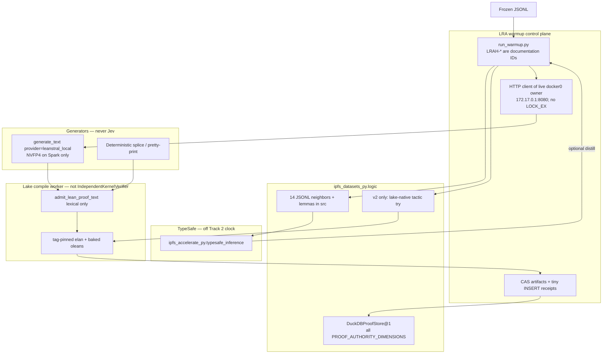
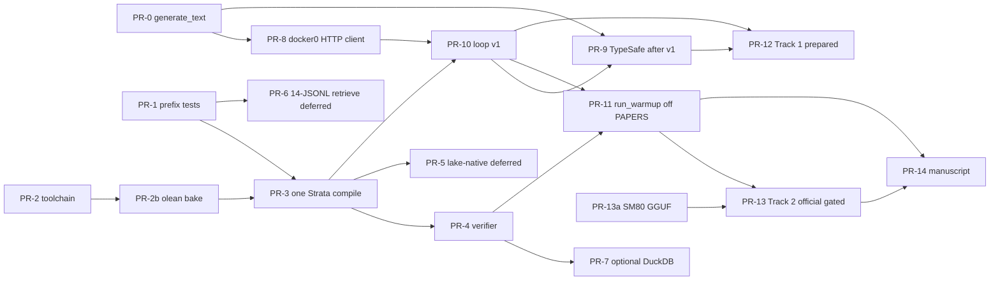

# Lean Refactor Arena Winning Architecture: Supervisor + Logic Hammers + TypeSafe Jev + Leanstral

| Field | Value |
| --- | --- |
| **Title** | Competition-Winning Architecture for Lean Refactor Arena (NeurIPS 2026 VeriCodeGen) |
| **Author** | Benjamin Barber (`starworks5@gmail.com`) — matches `papers/completion/lean_refactor_arena/manuscript/main.tex` |
| **Date** | 2026-09-16 |
| **Status** | Draft (rev. 4 — Leanstral + in-repo harness is the primary path; TypeSafe distill after v1; prepare Track 1; stay off PAPERS) |
| **Track recommendation** | **Primary: Leanstral on live docker0 + in-repo `harness/run_warmup.py`.** Spark-dev is the 30 Sep path. Official Track 2 remains gated on a named 4×A100 cluster and an SM80-legal GGUF by 2026-10-15. **Optional Track 1 is prepared** (grok + Jev in-loop, ≤ $3/problem), not the default winning path. TypeSafe and Track 1 are additives, not replacements. |
| **Protocol** | `papers/completion/lean_refactor_arena/protocol.md` (`LRA/v1`, frozen 2026-09-16) |
| **Warm-up SHA-256** | `6209680cf00cde0765b77b24834cd72c64dd585b2f7e3f2a58209980ab59a804` |
| **Harness state** | Specified; **unrun**. No Arena scores exist. Do not invent them. |

**Import vs tree paths.** Supervisor and TypeSafe live under `external/ipfs_accelerate/ipfs_accelerate_py/`. Import as `ipfs_accelerate_py.agent_supervisor…` and `ipfs_accelerate_py.typesafe_inference`. Workspace-root `ipfs_accelerate_py/agent_supervisor` is a stub (not the package). Logic hammers live under `external/ipfs_datasets/ipfs_datasets_py/logic/`. New Lean toolchain files go next to `hammers/frontends/lean.py`.

---

## Overview

Lean Refactor Arena (LRA) is not a proving contest. Every warm-up record already ships a Lean-correct reference proof. The game is to rewrite the *proof body* so that (1) proof-source token count falls, (2) Lean elaboration effort falls, and (3) the same body still compiles on every Lean tag in that record's `version_info`, while the theorem *statement* is preserved as the JSONL `statement` prefix of `src`. Lean is the only correctness oracle. Failed candidates stay failures.

This design composes four existing systems rather than inventing a fifth prover:

1. **`ipfs_accelerate_py.agent_supervisor`** — exclusive GPU owner via `scripts/run_leanstral_ephemeral.py`, fenced worktrees, typed receipts, fail-closed *lexical* admission (`admit_lean_proof_text`), tiny-byte DuckDB writes.
2. **`ipfs_datasets_py.logic`** — Lean frontend (PATH `lean --json`, **not** lake-aware), Lean reconstructor, hammer portfolio, premise selection, proof corpus, DuckDB proof store, tactician planner.
3. **TypeSafe Jev (System One)** via in-tree `ipfs_accelerate_py.typesafe_inference` — typed Choice / Score / Noul gates. Code owns control flow. Jev does **not** generate Lean and does **not** choose the next action.
4. **Leanstral-1.5-119B-A6B-NVFP4** on Spark (`llama-server` at `172.17.0.1:8080`, docker0) for **development only**. Frozen in-tree identity: Hugging Face `Frosty40/Leanstral-1.5-119B-A6B-GGUF-NVFP4` revision `abcc5ce2528c6375148d41dac6dce20f06c339f4`, CID `bafkreicgnd6su3jhmtpckbejqurdb2lchdvvydluswdg5m5zy3cpvroh3i`, local file `~/.cache/ipfs_accelerate_py/llama_cpp/models/cid-v1/bafkreicgnd6su3jhmtpckbejqurdb2lchdvvydluswdg5m5zy3cpvroh3i/Leanstral-1.5-119B-A6B-NVFP4.gguf` (~62.52 GiB, 67135119264 bytes). NVFP4 is a Blackwell format; it is **not** a legal Track 2 4×A100 (SM80) artifact. Official Track 2, if entered, uses an SM80 export **derived from that same file / Frosty40 revision**, with a **new** SHA in `evidence/run_freeze.json` when it exists.

**Primary execution path (hard requirement):** the user runs **this repo’s local harness** against **this machine’s live Leanstral**.

- **Primary generator:** Leanstral on the live docker0 owner (`172.17.0.1:8080`). Fail-closed `generate_text` as an HTTP client. Never `LOCK_EX`. Never a second `llama-server`. Loop v1 **must** call Leanstral when `/health` is ok. Skipping generate is **only** the fail-closed path when docker0 is down, not the intended 30 Sep run.
- **Primary control plane:** in-repo files under `papers/completion/lean_refactor_arena/` — `harness/run_warmup.py`, frozen JSONL, `tools/verify_lra_batch.py`, filesystem receipts. That is how we run on this machine. **Do not** add `lean_refactor_arena` to `scripts/paper_supervisors.py` `PAPERS`.
- PR-0, PR-8, and PR-10 are on the **critical path** and are **not** deferred. TypeSafe (PR-9) and Track 1 (PR-12) are additives **on top of** Leanstral + local harness after v1, not replacements.

**Track split (rev. 4):** Spark-dev (`resource=spark_gb10`) via that primary path is the **30 Sep** run. Official **Track 2 is not the winning path until** a named 4×A100 80 GB cluster **and** an SM80-legal open weight derived from the Frosty40 NVFP4 package exist by **2026-10-15**. **Optional Track 1 is prepared** (not the default winning path): closed APIs under $3/problem with `grok` / `grok-4.6` and Jev in-loop. `TYPESAFE_API_KEY` will exist; distill Jev gates on warm-up **after v1**. Official Track 2 still runs `--typesafe=off`. Using Jev during official Track 2 scoring would be track contamination.

---

## Background & Motivation

### Competition facts (organizer-defined)

| Item | Fact |
| --- | --- |
| Sites | https://leanrefactor.github.io/ · https://huggingface.co/spaces/delta-lab-ai/lean-refactor-arena · https://vericodegen.github.io/ |
| Track 1 Closed | ≤ US$3 API / problem |
| Track 2 Open | ≤ 4×A100 80 GB, ≤ 48 h full benchmark |
| Scoring | proof-source token count, Lean elaboration effort, zero-shot version transfer |
| Oracle | Lean compile. Statement must be preserved. |
| Warm-up | Now – 30 Sep 2026. 15 problems, 3 each Strata / PhysLib / CSLib / ArkLib / PutnamBench. |
| Full benchmark | 1 Nov 2026. Report + proof/code deadline 8 Nov 2026. Review/awards 22 Nov 2026. Workshop 12 Dec 2026. |
| Desk-reject | missing Approach/Models/Budget/Reproduction; over-budget; under-reporting cost; undisclosed models; unreproducible run. |

The local paper at `papers/completion/lean_refactor_arena/` is a competition-report scaffold plus a frozen warm-up census. `supervisor.json` records `"native_campaign_registered": false` and `"refactoring_run_executed": false`. `scripts/paper_supervisors.py` `PAPERS` is only `("autoformalization", "law_to_action", "neurosymbolic_supervision")`. LRA-005 (execute harness) is **blocked**. There is no entry point that emits refactored proofs.

### Warm-up census (measured; not scores)

From `data/warmup_summary.json` (regenerated by `tools/summarize_warmup.py`, fail-closed on digest drift):

| Source | n | `proof_length` | toolchains | repo URL? |
| --- | --- | --- | --- | --- |
| Strata | 3 | 222–313 | 1 or 3 (v4.26–v4.29) | yes |
| PhysLib | 3 | 851–1372 | **1 (v4.32.0 only)** | yes |
| CSLib | 3 | 251–408 | 3–4 including `v4.33.0-rc2` | yes |
| ArkLib | 3 | 1353–1906 | 3–4 (v4.28–v4.31) | yes |
| PutnamBench | 3 | 1754–4085 | 2–3 (v4.25–v4.27) | **no** (`file_path`/`url` empty; nonempty `header`) |

Overall: 15 records, 113 826 bytes, `proof_length` mean 1173, `num_lines` mean 142.9. Putnam is the only source with a nonempty `header` (`import Mathlib` / `import Aesop` / `set_option maxHeartbeats 0`). PhysLib cannot exercise version transfer. This 15-problem set is the **only legal development set** until the full JSONL ships.

JSONL fields (all 15 share the schema): `name`, `source`, `statement`, `src`, `proof_length`, `num_lines`, `header`, `file_path`, `url`, `start_line`, `end_line`, `version_info` (list of `{lean_tag: git_commit}` maps).

**Measured splice fact (all 15 records):** `src.startswith(statement)` is true. Several statements contain `:=` *inside the type* (`Cslib.CCS.bisimilarity_congr_choice` first `:=` at byte 55 of a 117-byte statement; ArkLib `fold_advances_evaluation_poly` has **27** `:=` in the statement). The body is the suffix after `statement`. Never scan for the first `:=`.

### Why the existing stack is the right control plane

The supervisor's contract is already the LRA contract: **models propose; policies admit; Lean/kernel is the oracle; evidence is typed; isolation by default**. Relevant packages (under `external/ipfs_accelerate/ipfs_accelerate_py/agent_supervisor/`):

- `merge/worktree_lifecycle.py` — fenced worktrees (`WORKTREE_LIFECYCLE_SCHEMA`).
- `proof/leanstral_proof_provider.py` — Leanstral is an **untrusted draft** provider with `ProofContextCapsule` / `FixedTheoremIdentity` obligations. **Not** the PR-0 JSONL splice runner.
- `proof/kernel_verification.py` — `admit_lean_proof_text` is a **lexical** splice into exactly one `sorry` in supervisor-owned `native_source`. Module-level `verify_admitted_lean_proof(..., timeout_seconds=30.0)` independently maps an admission; the class method is `IndependentKernelVerifier.verify_lean_proof_text` (it calls `admit_lean_proof_text` then `verify_admitted_lean_proof`). **Neither is the multi-tag lake oracle.**
- `semantic_refactoring/proof_adapter.py` — SPAR-030: Tactician owns search, Hammer owns production proof, adapter is nomination-only, `PROOF_CANDIDATE_CANNOT_ADMIT_PROOFS = True`.
- `analysis/program_egraph.py` — equality saturation for *Python* fragments only. **Do not** treat it as a Lean rewrite engine.
- `architecture_refactorer/` — Python architecture IR / authority-graph refactor. **Not** a Lean rewriter.
- Native campaigns: `scripts/paper_supervisor_campaign.py` + `scripts/paper_supervisors.py`.

`ipfs_datasets_py.logic` already has a real Lean ITP path. **Do not invent a second Lean backend.** Honesty about what it can see:

- `logic/hammers/frontends/lean.py` — `LeanFrontend` (HAMMER-006). Writes a temp file and runs `[lean, "--json", file]` via `run_bounded_process` (**not** `run_lean_process`, **not** `lake env`). Availability = `find_executable("lean")` on PATH. Works for a self-contained `theorem foo : n ≠ 0 := sorry`. **Does not** elaborate Strata/PhysLib/CSLib/ArkLib lake-project goals.
- `logic/hammers/reconstructors/lean.py` — `LeanReconstructor` (HAMMER-010). Builds `first | (t1; done) | …`, appends `#print axioms`, rejects `sorryAx` even when Lean exits 0. Needs a `GoalSnapshot` from the frontend.
- `logic/hammers/premise_selection.py` — deterministic top-k over a `CorpusManifest` of `TheoremEntry` / `GoalFeatures`, not raw `.lean` files.
- `logic/hammers/portfolio.py` + `policy.py` — Z3/CVC5/Vampire/E; solver output is untrusted until reconstruction.
- `logic/hammers/fallbacks.py` — native automation then bounded decomposition; still wants a snapshot.
- `logic/hammers/models.py` — `EnvironmentLockRecord.executable_paths: Dict[str, str]` (tool name → path). **There is no `primary_executable` field** on the record; `build_environment_lock(..., primary_executable="lean")` is a helper argument that indexes `capability.executables`.
- `logic/hammers/receipts.py` — content-addressed `HammerReceipt`.
- `logic/proof_corpus/` — `ProofCorpusStore@1`.
- `logic/common/duckdb_proof_store.py` — `DuckDBProofStore@1`; `PROOF_AUTHORITY_DIMENSIONS` is fail-closed and includes `assumptions`, `backend_id`, `backend_binary`, `backend_version`, `backend_config`.
- `logic/tactician/planner.py` — `LogicTactician`: plans only; no proof, write, or network.
- `logic/external_provers/interactive/lean_prover_bridge.py` — **TDFOL → Lean notation**, not a lake-project compiler. Keep it off the LRA hot path.
- `logic/modal/lean_runtime.py` — `resolve_lean_executable` / `run_lean_process` under Hammer process lifecycle. The compile worker should use this; `LeanFrontend` currently does not.

### Lessons from law_to_action that LRA must copy

1. **Exclusive Leanstral owner vs LRA client.** `papers/completion/law_to_action/benchmark/generated_code_study/model_profile.json` pins `exclusive_inference_owner: true`, bind `172.17.0.1:8080`, docker0, 10 000 s wall / 360 s startup. `scripts/run_leanstral_ephemeral.py` flocks `$XDG_RUNTIME_DIR/leanstral-jobs-$UID/gpu-0.lock` (`--gpu` default `"0"`) with `fcntl.LOCK_EX | LOCK_NB` for the **whole owner job** (server + its own client). That EX lock is **owner-only**. LRA is an HTTP client of the live listener: probe `/health`, then `generate_text`; **do not `LOCK_EX`**. A port conflict is an error in the runner (it will not reuse another listener). LRA must never start a second `llama-server`. Set `IPFS_ACCELERATE_LLAMA_CPP_AUTOSTART=0`.
2. **Dedicated verifier, fail-closed.** Campaign scripts cite `verify_batch.py --require-complete`, but that file is **not** in `generated_code_study/` (only `verify_preparation.py`). LRA must land `tools/verify_lra_batch.py`.
3. **INSERT-only DuckDB edge writes.** `insert_la031_child_dependencies.py`: DuckDB ART-index DELETE/upsert of huge parent rows fatally crashes Quack.
4. **Sequential GPU owner.** One in-flight Leanstral completion. Compile workers may parallelize on **the same node's** CPUs (4×A100 is typically one node, not four nodes).
5. **Retain negative results.**

---

## Goals & Non-Goals

### Goals

1. **Use Leanstral + this repo’s local harness on this machine.** Primary generator is docker0 Leanstral; primary control plane is `papers/completion/lean_refactor_arena/harness/run_warmup.py`. Loop v1 **must** call Leanstral when `/health` is ok. Land PR-0 / PR-8 / PR-10; do not defer them.
2. Land an **implementable LRA campaign** that can run the 15-problem warm-up with Lean receipts before 30 Sep 2026 on Spark, labeled `hardware_class=spark_gb10`. Harness remains **unrun** until PR-10 actually executes.
3. Optimize the **three official axes** under Lean-as-oracle. Transfer is a **hard filter** (all `version_info` tags). Among valid candidates, pick by a frozen tokens+elab composite. Never publish a fake leaderboard score.
4. Generate drafts with a **thin** `ipfs_accelerate_py.llm_router.generate_text` call (fail-closed kwargs below) and an LRA-specific prompt. Do not route PR-0 through `LeanstralProofProvider` capsules.
5. Use TypeSafe Jev **only** as typed gates, through `ipfs_accelerate_py.typesafe_inference` (and optionally `integrations/typesafe_advisor.py`). Never as a proof generator. **`TYPESAFE_API_KEY` will exist.** Distill on warm-up after loop v1 (`LRA_TYPESAFE=distill`). Official Track 2: `--typesafe=off` / `LRA_TYPESAFE=off`. Track 1 in-loop uses `LRA_TYPESAFE=inloop`. TypeSafe does **not** replace Leanstral or the local harness.
6. Do **not** treat `LeanFrontend.snapshot_goal` as lake-ready. **Loop v1 (30 Sep)** does not run hammers. **Loop v2** (PR-5, after warm-up) is **lake-native tactic try** via `lake env lean` in the checkout. A lake-aware frontend is a later sibling, not a sorry punch.
7. Keep DuckDB/Quack writes tiny: candidate CIDs, verdicts, token/elab numbers. Proof bodies live in content-addressed files. Project **every** `PROOF_AUTHORITY_DIMENSIONS` entry.
8. Bake lake `.olean` caches and a Putnam Mathlib+Aesop lake project **before** any 48 h clock. Fail closed if Mathlib is missing under `network=deny`.
9. Produce an SM80-legal Track 2 GGUF (or skip Track 2) rather than claiming NVFP4 tensor-parallel on A100.
10. Freeze protocol, code, and prompts **before** any scored run; retain every failure.

### Non-Goals

- Inventing Arena leaderboard scores, token-saving percentages, or "harness already ran" claims.
- Reporting Spark GB10 wall-clock or NVFP4-on-Spark as official Track 2.
- Using TypeSafe to generate tactic scripts or to pick its own next tool call.
- Treating `program_egraph.py` as a Lean rewriter.
- Treating `architecture_refactorer/` as a Lean rewriter (it is Python authority-graph IR).
- Treating `LeanProverBridge` (TDFOL converter) as the LRA compiler.
- Treating `LeanFrontend.snapshot_goal` + sorry-punch as sufficient for lake-project goals.
- Registering LRA in `scripts/paper_supervisors.py` `PAPERS` (operator decision: **no**; local `run_warmup.py` + filesystem receipts).
- Fine-tuning Leanstral before a measured warm-up baseline exists.
- Changing theorem statements, adding axioms, or leaving `sorry`/`admit`.
- Competing on Putnam by scraping an unofficial repo URL not in the JSONL.
- Mathlib-scale premise ingest per commit on the warm-up critical path.
- Requiring `todo_daemon` / grok-codex implementation providers to run the 15-problem warm-up.
- Adding a second `typesafe-sdk` client unless it is proven identical to `ipfs_accelerate_py.typesafe_inference`.
- OpenReview / Space upload from this workflow (human author action; LRA-006).

---

## Winning Theory of the Game

### The payoff is three-dimensional and fail-closed

A candidate is **valid** iff all of the following hold (mirroring `manuscript/main.tex` Validity and scoring, still unmeasured):

1. **Statement prefix bind:** `src.startswith(statement)` on the reference; the candidate file is `header + statement + body_suffix` where `body_suffix` starts with the reference suffix's leading whitespace/` := by`. `by omega` (and any other `:=` / tactic) *inside the type* stays in the frozen statement.
2. Lean accepts the candidate on **every** tag in `version_info`. A subset of snapshots is a failure, not a partial win.
3. `#print axioms` does not mention `sorryAx`; no new `axiom` / `sorry` / `admit`. Lean exit 0 with a `hasSorry` warning is a failure.
4. No untrusted oracle (LLM-as-judge, TypeSafe Noul, hammer `candidate` status) can flip a compile failure to success.

Invalid candidates score as failures on **all three** organizer axes. Keeping the reference proof is always legal and is the baseline.

### Axis-specific theory

**Proof-source tokens.** Warm-up `proof_length` is the organizer's reference token count (222–4085, mean 1173). Local scoring records (a) JSONL `proof_length` for the reference, (b) a frozen local tokenizer id + count for both reference and candidate, and (c) never publishes a "percent saved" from (b) as an Arena score. Compression that can win: collapse `have`/`show` noise (Strata); hammer/aesop/omega when they close; do not "refactor" 222-token proofs into something longer.

**Elaboration effort.** Shorter source can be *more* expensive. Local proxy until the official heartbeat/elab metric is published:

- Measurement command: `lake env lean --json` with `LEAN_NUM_THREADS=1`, median of 3 wall-ms and CPU-ms.
- **Force a finite `maxHeartbeats` in the measurement command** even if the Putnam header has `set_option maxHeartbeats 0`. Record both the header value and the measurement cap (default cap: `400000`). Unbounded search is not a metric.
- Heartbeat count if the official harness exposes it.

Never optimize the proxy after seeing official numbers on the full set; freeze the proxy on warm-up and disclose the mismatch. `arena_score_*` stays null.

**Zero-shot version transfer.** **Hard filter**, not a composite weight. Among valid candidates, transfer has already passed.

| Source | Transfer game |
| --- | --- |
| PhysLib | **None.** Single tag `v4.32.0`. Do not spend search budget on portability. |
| Strata | Mixed. Two problems v4.26-only; `InitsUpdatesComm` has three tags. |
| CSLib | Hard. Up to four tags through `v4.33.0-rc2`. |
| ArkLib | Hard. v4.28–v4.31. Compact `aesop` that exists only on v4.31 fails transfer. |
| Putnam | Medium. v4.25–v4.27, Mathlib+Aesop lake project (not a lone `Tmp.lean`). |

### Search policy (hard-filter transfer, then tokens+elab)

Per problem keep the **valid** candidate set (all tags passed). Discard dominated points on `(token_ratio, elab_ratio)` where `*_ratio = candidate / reference` (lower better). From the Pareto front pick:

```text
score = 0.55 * token_ratio + 0.45 * elab_ratio
```

Optional continuous transfer *proxy* (not a validity substitute): coefficient of variation of per-tag elab-ms, used only to break ties. Weights live in `policy/open_policy_v1.json`.

**Freeze rule (pre-registered):** if TypeSafe or other thresholds are fit, use **leave-one-source-out** on the 15 (hold out one of {strata, physlib, cslib, arklib, putnambench} at a time; pick thresholds that do not increase invalid-skip rate on the held-out source). Then freeze. n=15 is too small for a learned policy to be the Track 2 default.

**Loop v1 (30 Sep) does not use this table.** v1 is prefix splice + optional fail-closed `generate_text` + lexical admit + lake compile + keep-best (submit the reference if docker0 is down). Skipping LLM on Strata-222 is **not** a v1 requirement.

**Loop v2 heuristic table** (PR-5+, distillation optional; keep out of v1 so Strata-222 cannot wait on a deferred PR):

| Condition | Action |
| --- | --- |
| `proof_length < 400` | try lake-native `simp_all`/`omega`/`rfl`; **do not** call Leanstral |
| `source == physlib` | try calc-preserving compress first; then Leanstral |
| `source == putnambench` | try `aesop` in the Putnam lake project; then Leanstral with 4096 `max_new_tokens` |
| `n_toolchains > 1` | prefer core tactics over version-specific syntax |
| else | lake-native try, then Leanstral |

### Budgeting search effort

Warm-up is 15 problems. Full benchmark size unpublished; plan as if ~10× (~150) until the JSONL ships.

**Compile is the bottleneck, and first `lake build` is hours, not 2 minutes.** Serial 150×8×3×2 min = 120 h assumed oleans already exist. They will not, unless baked.

- Bake `.lake` / `.olean` for every `(clone, commit)` and every Putnam Mathlib pin **before** the 48 h clock (PR-2b). Official image ships caches. Harness **fails** if Mathlib/project oleans are missing and `network=deny`.
- Compile workers are processes on **one node's CPUs** (4×A100 single node unless topology is named). Not a four-node fleet.
- Fail fast: newest tag first; abort candidate on first tag failure.
- Loop v2 only: lake-native tactic try is seconds–minutes and runs *before* any Leanstral call. v1 skips it.
- Spark NVFP4 generation is development. Official Track 2 generation uses the SM80 GGUF (if the 15 Oct gate passes). Conservative: 1 in-flight generation.

Track 1 $3/problem (optional, not default): Jev is **$0.042 / 1M input tokens, output free** (TypeSafe public pricing, Sep 2026). A few dozen Jev calls will not break the cap. The cap is the closed generator. If Track 1 is entered: 1 draft + 1 Lean-feedback repair, then stop.

### Warm-up as the only legal development set

Until 1 Nov 2026, every threshold and family prior is either the hand-written table or leave-one-source-out fit on these 15. After the full JSONL ships, the policy is frozen.

---

## Proposed Design

### System diagram



### Authority lattice (fail-closed)

| Actor | May do | May not do |
| --- | --- | --- |
| TypeSafe Jev | Rank, route, gate (advisory) | Generate tactics; admit a proof; choose next tool |
| Leanstral via `generate_text` | Propose a tactic block | Self-approve; mutate statement |
| Hammer portfolio / SMT | Nominate a candidate | Mark `VERIFIED` without reconstruction |
| `admit_lean_proof_text` | Lexical splice into one `sorry` | Compile a lake project |
| `LeanFrontend` PATH `lean --json` | Snapshot self-contained files | See Strata/PhysLib/CSLib/ArkLib lake goals |
| Lake elaborator on pinned tag | **Sole correctness oracle** | — |
| Spark GB10 / NVFP4 timings | Development only | Official Track 2 score |

### Per-problem loop (normative)

The warm-up **owner** is `papers/completion/lean_refactor_arena/harness/run_warmup.py`. It writes receipts and optional tiny INSERT rows. **LRAH-001–011 are documentation IDs**, not a second `todo_daemon` control plane. Do not require grok/codex implementation providers for the 15.

**Loop versions.** **v1 (30 Sep / PR-10) — intended 30 Sep run on this machine:** prefix splice + **required Leanstral `generate_text` when `/health` is ok** + lexical admit + lake compile + keep-best. `--generator=leanstral --gates=off`. No lake-native try, no heuristic table, TypeSafe off. Skipping generate is **only** fail-closed when docker0 is down (keep the reference); it is not the intended run. **v2 (PR-5+):** add lake-native tactic try and the heuristic table. TypeSafe distill (`LRA_TYPESAFE=distill`, PR-9) is after v1 and still uses Leanstral as the generator.

TypeSafe is called at most twice per problem **and only when `LRA_TYPESAFE=distill|inloop` (after v1; PR-9)**. Loop v1 does not call Jev. Official Track 2 does not call Jev. In v1, Leanstral **must** be called whenever docker0 `/health` is up.

```mermaid
sequenceDiagram
  participant JSONL
  participant Code as run_warmup.py
  participant Retr as 14 JSONL + src lemmas
  participant Jev as typesafe_inference (optional)
  participant Lake as lake env lean
  participant Gen as generate_text leanstral_local
  participant Rec as artifacts/ + receipts

  JSONL->>Code: load record
  Code->>Code: assert src.startswith(statement); body = src[len(statement):]
  Code->>Retr: other 14 records + regex lemmas in src
  opt after v1 and LRA_TYPESAFE distill|inloop
    Code->>Jev: one frozen ROUTE_QUESTIONS dict
  end
  opt v2 lake-native
    Code->>Lake: lake-native tactic try (sorry hole in checkout / Putnam lake)
  end
  alt docker0 /health ok
    Code->>Gen: v1 MUST generate_text (fail-closed kwargs)
    Gen-->>Code: untrusted draft
  else docker0 down
    Code->>Rec: skip generate (fail-closed only); keep reference
  end
  opt v2 heuristic spend_llm when health already used
    Note over Code: v2 may skip a second call; v1 does not use the table
  end
  Code->>Code: candidate = header + statement + " := by\n" + tactics
  Code->>Code: admit_lean_proof_text on statement+sorry template (lexical)
  loop each version_info tag until first fail
    Code->>Lake: baked oleans; measurement maxHeartbeats finite
  end
  Code->>Rec: success or failure; keep best valid else reference
```

**Step-by-step.**

1. **Load.** Read one JSONL object. At run start, whole-file SHA-256 must match `6209680cf00cde0765b77b24834cd72c64dd585b2f7e3f2a58209980ab59a804`.
2. **Split statement / body (normative).**

```python
assert rec["src"].startswith(rec["statement"]), rec["name"]
body_suffix = rec["src"][len(rec["statement"]):]  # typically " := by\n…"
# Never scan for the first ":=". Keep `by omega` inside types in `statement`.
```

   Unit tests in PR-1: this assertion holds for **all 15** warm-up records. Putnam: candidate file is `header + "\n" + statement + new_body_suffix` inside a **recorded Mathlib+Aesop lake project**, not `Tmp.lean` on PATH lean.

3. **Retrieve (warm-up v1).** Only:
   - the other 14 JSONL records (public, legal);
   - lemma names mentioned in the current `src` via regex on `simp [` / `rw [` / ident after `exact` / `apply`.
   Cap 16. No embeddings, no Jev, **no Mathlib-scale lake ingest**. Defer checkout-wide `CorpusManifest` ingest; if revived, it runs once per `(clone, commit)` via `lake env lean` constant export with a size cap — not PR-6 on the 30 Sep path.

4. **TypeSafe fan-out (after v1; official Track 2 off).** One `TypeSafeClient.system_one` from `ipfs_accelerate_py.typesafe_inference` with the frozen `ROUTE_QUESTIONS` dict. `TYPESAFE_API_KEY` will exist. Vendor claims ~32 k token budget and ~100 ms; **treat 100 ms as vendor-claimed, not an SLO**. Record measured `usage` and wall-ms in receipts. Loop v1 and official Track 2 use `LRA_TYPESAFE=off` (v1: no table; Track 2: frozen `open_policy_v1.json`). Distill after v1; Track 1 `inloop`.

5. **Choose rewrite family (v2 only).** v1 does not consult the heuristic table or Jev. v2 uses the table (and Jev only if on). If `likely_shorter` Score **level 0** ("longer or same") **and** `reference_already_tight` Noul ≥ 0.8, **do not generate**. Submit the reference.

6. **Generate candidate tactic script.** Untrusted, in order:
   - Deterministic pretty-print / comment strip (body suffix only). **v1 and v2.**
   - **v2 only:** lake-native tactic try (path A below) — not `LeanFrontend.snapshot_goal`.
   - Fail-closed `generate_text` with the **LRA** prompt (not `leanstral_typesafe.PROOF_PROMPT`, which forbids `aesop`/`nlinarith` and asks to *prove* a declaration). **v1 (intended 30 Sep run):** **must** call this whenever docker0 `/health` is up. Skip generate **only** if `/health` is down (fail-closed; keep the reference). **v2:** may skip a second call if the heuristic says not to spend_llm.
   - Track 1 only: same kwargs with `provider="grok"` (still fail-closed; do not fall back onto Leanstral mid-call).

   Exact Spark/Track-2 Leanstral call (same flags `LeanstralProofProvider.prove` already uses, plus explicit cross-provider off):

```python
os.environ["IPFS_ACCELERATE_LLAMA_CPP_AUTOSTART"] = "0"
text = generate_text(
    prompt,
    provider="leanstral_local",
    model_name="Leanstral",
    temperature=0.0,
    max_new_tokens=1400,  # 4096 Putnam
    timeout=300,          # 600 Putnam
    allow_local_fallback=False,
    allow_cross_provider_fallback=False,
    disable_model_retry=True,
)
```

   Receipts record the **resolved** provider/model, not only the requested alias. If docker0 is unreachable, raise/fail closed (`LLMRouterError` at the llama.cpp base URL) — **do not** complete via Grok/HF. Keep the reference proof.

   LRA prompt contract: return **only** the tactic block after `:= by`; do not repeat the theorem; do not add imports (Putnam `header` already has them); do not invent axioms. `aesop` / `nlinarith` / project `simp` lemmas are allowed.

   Token limits (harness config, not silent manuscript drift): default `max_new_tokens=1400`, timeout 300 s; Putnam `4096` / 600 s. `manuscript/main.tex` still says 1024 / 2048 — **PR-14 updates Models** rather than diverging silently.

7. **Lexical admission, then lake compile.** Punch `native_source = statement + " := by\nsorry"` (plus Putnam header in the lake file, not in `proof_text`). Pass **only** the tactic block as `proof_text` to `admit_lean_proof_text`. Do **not** pass the original complete `src` as `native_source` or `canonical_source` (that trips `SOURCE_COPY` on any kept `have` of length ≥ 40, and `THEOREM_SUBSTITUTION` if the statement appears in the body). Admission is **not** a compile. Forbidden tokens `theorem`/`lemma`/`import`/`open` in `proof_text` are why the model must return the tactic block only.

8. **Compile all listed Lean tags** (separate worker; **do not** call module-level `verify_admitted_lean_proof` or `IndependentKernelVerifier.verify_lean_proof_text` with the 30 s default).

   For each `{tag: commit}`:
   - Repo records: cached clone, `git checkout commit`, tag-pinned elan (`executable_paths={"lean": tag_lean, "lake": tag_lake}`), `lake env lean` on `file_path` using **baked oleans**.
   - Putnam: the per-tag Mathlib+Aesop **lake project** (commit SHAs in the freeze file). Copy candidate into the project module; `lake build` / `lake env lean`. **Not** `lake env lean Tmp.lean` without a lakefile.
   - Timeout per tag: 10 min warm-up, 20 min official.
   - Measurement: override `maxHeartbeats` to the finite cap; record header vs measurement.
   - First tag failure aborts remaining tags for that candidate; the receipt still lists the failing tag.
   - Fail the harness if oleans/Mathlib are not pre-vendored when `network=deny`.

9. **Admit only if statement-preserving and compile-ok on all tags.** Then local token count + elab proxy. Update best-valid. **Always write the failure row.**

10. **Stop conditions.** Max 8 candidates/problem on warm-up; max 4 on official Track 2 unless Putnam/ArkLib (max 8). Stop early if a candidate is ≤ 0.6× tokens **and** ≤ 1.0× elab **and** all tags pass.

### Worktree and toolchain layout

```text
$XDG_STATE_HOME/ipfs_accelerate_py/vericodegen-2026/lean_refactor_arena/
  run_warmup.state.json   # tiny, optional DuckDB
  clones/                 # Strata, physlib, cslib, ArkLib
  putnam_lake/<tag>/      # recorded Mathlib+Aesop lakefiles
  oleans/                 # baked caches copied into checkouts
  toolchains/             # elan overlays
  artifacts/<sha256>/     # candidate.lean, admission.json, compile/<tag>.json
  receipts/
```

Spark disk is ample. Official 4×A100 image (if the 15 Oct gate passes) bakes elan tags `v4.25.0`–`v4.33.0-rc2` **and** `.olean` caches so first-run `lake build` does not count against 48 h.

---

## Supervisor Improvements Needed

LRA census board (`paper.todo.md` LRA-001–006) stays Markdown. The harness is **`run_warmup.py`**, not a Native Quack worker claiming tasks from `todo_daemon`.

### 1. Documentation IDs (not a second scheduler)

| ID | Work |
| --- | --- |
| LRAH-001 | Digest-gated JSONL loader + prefix splice tests on all 15 |
| LRAH-002 | Cached clone + elan + **olean bake** + Putnam lake projects |
| LRAH-003 | Lexical `admit_lean_proof_text` on statement+sorry template |
| LRAH-004 | Multi-tag lake compile worker |
| LRAH-005 | Lake-native tactic try (deferred off 30 Sep critical path) |
| LRAH-006 | TypeSafe wrapper via `typesafe_inference` (deferred) |
| LRAH-007 | fail-closed `generate_text` as docker0 HTTP client (no LOCK_EX) |
| LRAH-008 | `run_warmup.py` loop + receipt writer |
| LRAH-009 | Warm-up 15, fail-closed verifier |
| LRAH-010 | Official Track 2 runner — **gated 15 Oct** |
| LRAH-011 | Optional Track 1 ledger |

Proof bodies are not stored in a `tasks` row.

### 2. GPU: LRA is a client of the live docker0 owner (do not take EX)

`scripts/run_leanstral_ephemeral.py` default `--gpu 0` flocks `$XDG_RUNTIME_DIR/leanstral-jobs-$UID/gpu-0.lock` with `LOCK_EX | LOCK_NB` for the **owner job**. Law_to_action’s exclusive owner is that long-running job on `172.17.0.1:8080`. If LRA takes `LOCK_EX` while the owner is alive, `LOCK_NB` fails and the harness skips every Leanstral call even when `/health` is fine. Blocking EX waits until the owner *exits*. Both are wrong.

**Normative LRA client protocol:**

1. Set `IPFS_ACCELERATE_LLAMA_CPP_AUTOSTART=0` (the ephemeral runner already exports this to its own client; LRA must set it too so `llm_router` does not spawn a second `llama-server`).
2. Probe `http://172.17.0.1:8080/health` (and `http://127.0.0.1:8080/health` as an alias). Serialize generations **in-process** (one in-flight completion).
3. If healthy: `generate_text` as a client. **Do not `LOCK_EX`.** Do not start a server. Pin lock id `gpu-0` only if LRA becomes an owner (step 4).
4. If unhealthy **and** `gpu-0.lock` is free: optionally exec `python3 -B scripts/run_leanstral_ephemeral.py --bind docker0 --gpu 0 -- …` — **that process** takes EX. LRA still must not take EX itself in the common path. The runner treats a port conflict as an error and will not reuse another listener.
5. If unhealthy **and** EX is held: wait for `/health` or skip LLM and keep the reference. Still compile.

Never start a second `llama-server`. Do not invent `leanstral-gpu.lock`.

`LeanstralResourceIsolation` (`model` vs `kernel` resource classes) remains valid for later capsule work; PR-0 does not need it.

### 3. Dedicated verifier

`papers/completion/lean_refactor_arena/tools/verify_lra_batch.py`:

- `--require-complete`: every scheduled problem has a receipt.
- `--require-digest`: JSONL SHA-256 matches frozen.
- `--require-no-sorry`: accepted candidates' axiom reports exist and have no `sorryAx`.
- `--require-statement-bind`: `candidate.startswith(header+statement)` / prefix check.
- `--require-all-tags`: one compile record per `version_info` entry.
- Exit 0 only if all hold. Incomplete is not success.

### 4. No huge `upsert_task`

INSERT-only tiny rows or filesystem receipts only. `run_warmup.py` may skip DuckDB entirely on warm-up.

### 5. Receipts

Each candidate: lexical admission JSON; per-tag compile records (argv, cwd, exit, stdout digest, wall-ms, cpu-ms, measurement `maxHeartbeats`, `sorryAx` bool, `hardware_class`); TypeSafe `usage` + wall-ms if called; generator identity (`leanstral_local` / `lake_native` / `deterministic` / `grok`). Publishable view redacts proof bodies.

### 6. Stay off `PAPERS` (resolved: no)

Do **not** add `lean_refactor_arena` to `scripts/paper_supervisors.py` `PAPERS`. Warm-up is `run_warmup.py` + filesystem receipts. LRAH-* remain documentation IDs. The three-paper campaign must not inherit LRA, and LRA must not inherit `IPFS_ACCELERATE_AGENT_IMPLEMENTATION_PROVIDER=grok`. PR-11 does not register a Native Quack campaign.

---

## Logic-Submodule Improvements

### Two hammer paths (do not claim HAMMER-006 is LRA-ready)

**(A) Lake-native tactic try (loop v2 / PR-5, off the 30 Sep path).** In the checkout (or Putnam lake project), replace the proof body with `sorry`, then try a fixed tactic list via `lake env lean` using tag-pinned `executable_paths`: `rfl`, `decide`, `omega`, `simp_all`, `aesop` (if imported). No `GoalSnapshot` required. This is a small argv loop over `run_lean_process`, not `LeanFrontend.snapshot_goal`. **v1 does not run this.**

**(B) Lake-aware snapshot (later, not critical path).** Change `LeanFrontend` **or a sibling** `LeanLakeFrontend` to accept `cwd`, tag-pinned `lean`/`lake`, and `lake env`. Only then may `attempt_native_automation` / `LeanReconstructor` run on these goals. Sorry-punch alone does not make PATH `lean --json` see project imports or oleans.

### Adapter: complete-proof hole punch (for A and for lexical admission)

```python
def statement_sorry_template(statement: str) -> str:
    return statement + " := by\nsorry"
```

Used as `native_source` for `admit_lean_proof_text` and as the lake file body before tactic try. Do not parse Lean ourselves for the splice; the JSONL prefix *is* the bind.

### Adapter: multi-toolchain compile worker (the real gap)

New module: `external/ipfs_datasets/ipfs_datasets_py/logic/hammers/frontends/lean_toolchain.py`

- Input: `version_info` list.
- Resolve: `~/.elan/toolchains/leanprover--lean4---<tag>/bin/{lean,lake}` — **tag-pinned**, never "newest mtime" and never PATH `lean`.
- Populate `EnvironmentLockRecord.executable_paths = {"lean": tag_lean, "lake": tag_lake}`. Do not invent `primary_executable` on the record.
- Compile worker uses `run_lean_process`. `LeanFrontend` continues to use `run_bounded_process` until path B lands.

### Adapter: Putnam Mathlib+Aesop lake project

Putnam headers (measured):

```
import Mathlib
import Aesop
set_option maxHeartbeats 0
open …
```

Per Lean tag (`v4.25.0`, `v4.26.0`, `v4.27.0`): a lakefile + recorded Mathlib commit + Aesop commit in `evidence/run_freeze.json`. Bake oleans in PR-2b. Candidate is a module in that project. If organizers later specify pins, replace ours and recompile. Do not guess a PutnamBench GitHub URL. Do not `lake env lean Tmp.lean` without the lake project.

### Adapter: proof_length vs elaboration metrics

`papers/completion/lean_refactor_arena/tools/lra_metrics.py` (keep competition code out of datasets if possible):

- `token_count(source, tokenizer_id)`
- `elab_effort(compile_record)` — wall-ms, cpu-ms, measurement heartbeats
- `transfer_vector(tag_results)` — `all()` required for validity

### What we will not do

- Teach `LeanProverBridge` to compile Strata/PhysLib.
- Claim Hammer `VERIFIED` from Vampire/Z3 without reconstruction.
- Use `program_egraph.py` or `architecture_refactorer/` on Lean syntax.
- Call module-level `verify_admitted_lean_proof` or `IndependentKernelVerifier.verify_lean_proof_text` as the lake oracle at 30 s.

---

## TypeSafe Question Catalog

Use **in-tree** `ipfs_accelerate_py.typesafe_inference` (`TypeSafeClient`, `Choice`, `Noul`, `Score`, `system_one`, POST `https://api.typesafe.ai/v1/systemone`). Env: `TYPESAFE_API_KEY` (aliases `ipfs_accelerate_py_TYPESAFE_API_KEY`, `IPFS_ACCELERATE_PY_TYPESAFE_API_KEY`, `IPFS_DATASETS_PY_TYPESAFE_API_KEY`). Default model `jev-latest`. Records never store API keys (`typesafe_advisor.py` contract). **Do not** `pip install typesafe-sdk` unless that package is proven identical to this client.

Jev evaluates many atomic questions in one call, in parallel. Vendor-claimed request budget is ~32 k tokens / ~150 k characters; typical latency is marketed 70–500 ms (**not measured here; not an SLO**). Putnam `src` is 13 801 chars; truncate reference proof to first/last 80 lines plus a middle hash if over budget.

### State shape

```python
state = {
    "problem": {
        "name": rec["name"],
        "source": rec["source"],
        "n_toolchains": len(rec["version_info"]),
        "proof_length": rec["proof_length"],
        "num_lines": rec["num_lines"],
        "has_repo": bool(rec["url"]),
        "header": rec["header"][:500],
    },
    "statement": rec["statement"],
    "reference_proof": rec["src"],  # truncated if needed
    "neighbors": [
        {"name": p["name"], "statement": p["statement"][:400], "proof_head": p["src"][:400]}
        for p in retrieved[:4]
    ],
    "candidate": None,  # filled on the optional second call
}
```

### Frozen `ROUTE_QUESTIONS` (Call 1) — table and code are the same dict

Score is an **ordered rubric index**. Three criteria ⇒ answers on roughly `[0, 2]`, and can land between levels. Noul is `[0, 1]`. **Do not mix them as if both were probabilities.**

`likely_shorter` legend:

| Level | Meaning |
| --- | --- |
| 0 | longer or same |
| 1 | modest cut (~10%) |
| 2 | large cut (≥30%) |

Skip-LLM when `likely_shorter.score < 1.0` (at or below level 0) **and** `reference_already_tight.noul >= 0.8`.

```python
"""LRA TypeSafe fan-out. In-tree client; Jev does not generate Lean."""

from __future__ import annotations

from typing import Any

from ipfs_accelerate_py.typesafe_inference import (
    Choice,
    Noul,
    Score,
    TypeSafeClient,
    typesafe_configured,
)

REWRITE_CRITERIA = {
    "native_hammer": {
        "what": "Goal looks like rfl/decide/omega/simp_all/assumption",
        "not_for": "Long calc, domain-specific lemmas, or large induction",
    },
    "simp_set": {"what": "Unfolding + rewrite lemmas should close or shrink it"},
    "aesop": {"what": "Aesop/auto would likely close"},
    "omega_decide": {"what": "Linear arithmetic or decidable predicates"},
    "calc": {"what": "Keep calc/conv structure; drop noise"},
    "have_chain": {"what": "Merge redundant have/show steps"},
    "custom": {"what": "Needs a model-written tactic script"},
}

ROUTE_QUESTIONS = {
    "rewrite_family": Choice(
        instructions="Which rewrite family should code try first on `reference_proof`?",
        criteria=REWRITE_CRITERIA,
    ),
    "hammer_before_llm": Noul(
        instructions=(
            "Would Lean built-in tactics (rfl, decide, omega, simp_all, aesop if imported) "
            "plausibly close `statement` without a custom script?"
        ),
    ),
    "reference_already_tight": Noul(
        instructions="Is `reference_proof` already compact relative to `statement`?",
    ),
    "likely_shorter": Score(
        instructions="How large a source-token cut is plausible versus `problem.proof_length`?",
        criteria=[
            "longer or same",
            "modest cut around 10 percent",
            "large cut of 30 percent or more",
        ],
    ),
    "elab_risk_if_automated": Score(
        instructions="If replaced by simp_all/aesop/omega, how likely is elaboration to get worse?",
        criteria=["elab likely better or same", "elab unclear", "elab likely worse"],
    ),
    "version_fragile": Noul(
        instructions=(
            "Does `reference_proof` rely on tactic or API details likely to break "
            "across Lean 4.25 through 4.33?"
        ),
    ),
    "putnam_aesop_plausible": Noul(
        instructions="Given `header` and `statement`, is a short aesop/simp proof plausible?",
    ),
    "calc_structure_worth_keeping": Noul(
        instructions="Is `reference_proof` a calc/conv chain whose structure should be kept?",
    ),
    "statement_in_proof_duplicated": Noul(
        instructions="Does `reference_proof` repeat `statement` or contain a second theorem/lemma?",
    ),
    "uses_sorry_or_admit": Noul(
        instructions="Does `reference_proof` contain sorry, admit, or an axiom?",
    ),
    "neighbor_style_match": Choice(
        instructions="Which neighbor's proof style should the generator imitate?",
        criteria={"none": "Do not imitate a neighbor"},  # plus neighbor names at call time
    ),
    "spend_llm": Noul(
        instructions="Should code spend an LLM generation rather than only hammers?",
    ),
}


def route_problem(state: dict[str, Any]) -> dict[str, Any] | None:
    if not typesafe_configured():
        return None
    with TypeSafeClient(model="jev-latest") as client:
        response = client.system_one(state, ROUTE_QUESTIONS)
    family = response.choices["rewrite_family"]
    return {
        "family": family.choice,
        "family_confidence": family.confidence,
        "family_probs": dict(family.probabilities),
        "hammer_before_llm": response.nouls["hammer_before_llm"].noul,
        "reference_already_tight": response.nouls["reference_already_tight"].noul,
        "likely_shorter": response.scores["likely_shorter"].score,  # rubric [0, 2]
        "likely_shorter_legend": dict(response.scores["likely_shorter"].legend),
        "elab_risk": response.scores["elab_risk_if_automated"].score,
        "version_fragile": response.nouls["version_fragile"].noul,
        "putnam_aesop_plausible": response.nouls["putnam_aesop_plausible"].noul,
        "calc_structure_worth_keeping": response.nouls["calc_structure_worth_keeping"].noul,
        "spend_llm": response.nouls["spend_llm"].noul,
        "usage": dict(response.usage),
    }


def should_call_leanstral(answers: dict[str, Any] | None, rec: dict[str, Any]) -> bool:
    # v2 only. v1 calls Leanstral whenever docker0 /health is up.
    if answers is None:
        return rec["proof_length"] >= 400
    if answers["family_confidence"] < 0.5:
        return rec["proof_length"] >= 800
    # Score < 1.0 means level 0 "longer or same" (not a probability).
    if answers["reference_already_tight"] >= 0.8 and answers["likely_shorter"] < 1.0:
        return False
    if answers["hammer_before_llm"] >= 0.7 and answers["spend_llm"] < 0.4:
        return False
    if rec["source"] == "physlib" and answers["calc_structure_worth_keeping"] >= 0.6:
        return True  # after a calc-preserving pass
    if rec["source"] == "putnambench" and answers["putnam_aesop_plausible"] >= 0.6:
        return answers["spend_llm"] >= 0.45  # aesop first in code
    return answers["spend_llm"] >= 0.45 or answers["family"] == "custom"
```

Thresholds, if retuned, follow leave-one-source-out then freeze. Until then the **hand-written table** is the Track 2 default.

### Call 2 — rank a concrete candidate (optional)

| ID | Type | Use |
| --- | --- | --- |
| `candidate_changes_statement` | Noul | Advisory. Byte checker is the bind. |
| `likely_shorter_than_reference` | Score | Same 0/1/2 rubric. Sort compile queue. |
| `likely_compiles` | Noul | Skip compile if noul ≤ 0.15 **and** a valid candidate already exists. Never skip the last remaining candidate. |
| `likely_worse_elab` | Noul | Deprioritize compile. |
| `introduces_sorry` | Noul | If ≥ 0.5, regex; skip lake if `sorry`/`admit` present. |

`uses_sorry_or_admit` / `candidate_changes_statement` are **never** oracles.

### Distilling Jev into a Track 2 open policy

`TYPESAFE_API_KEY` will exist. After loop v1, run `LRA_TYPESAFE=distill` on the 15: log `(features, Jev answers, Lean outcome)` and write `policy/open_policy_v1.json` (leave-one-source-out if thresholds are fit). Loop v1 still does not ship a heuristic table and does not call Jev. Official Track 2, if entered, loads only that policy file and sets `LRA_TYPESAFE=off`. Track 1 in-loop uses `LRA_TYPESAFE=inloop`. Disclose Jev development spend in Budget accounting.

---

## API / Interface Changes

### New (LRA-owned)

| Interface | Owner | Notes |
| --- | --- | --- |
| `LraProblemRecord` | `papers/completion/lean_refactor_arena/harness/schema.py` | 12 JSONL fields |
| `split_statement_body(rec)` | harness | `assert src.startswith(statement)` |
| `LraCandidateAdmission` | harness | wraps lexical `LeanProofAdmission` + per-tag lake compile |
| `LraVerifier` | `tools/verify_lra_batch.py` | fail-closed batch |
| `TypeSafeLraRouter` | harness | `typesafe_inference` only; no-op without key |
| `LeanToolchainResolver` | `external/ipfs_datasets/.../hammers/frontends/lean_toolchain.py` | tag-pinned `executable_paths` |
| `run_warmup.py` | harness | **the** warm-up control plane |

### Existing, called as-is

```python
from ipfs_accelerate_py.llm_router import generate_text  # PR-0; fail-closed kwargs required
from ipfs_accelerate_py.typesafe_inference import (
    Choice, Noul, Score, TypeSafeClient, typesafe_configured,
)
from ipfs_accelerate_py.agent_supervisor.proof.kernel_verification import (
    admit_lean_proof_text,  # lexical only
    LeanProofAdmission,
    KernelFailureCode,
)
from ipfs_datasets_py.logic.modal.lean_runtime import run_lean_process  # lake compile
from ipfs_datasets_py.logic.hammers.frontends.lean import LeanFrontend  # not lake-aware
from ipfs_datasets_py.logic.hammers.models import EnvironmentLockRecord  # executable_paths
```

Do **not** import `LeanstralProofProvider` in PR-0. Optionally wrap it later if capsules are worth it. Do **not** call module-level `verify_admitted_lean_proof` or `IndependentKernelVerifier.verify_lean_proof_text` for lake at `timeout_seconds=30.0`.

### Submission artifact

```text
papers/completion/lean_refactor_arena/submissions/warmup/<name>.lean
papers/completion/lean_refactor_arena/submissions/warmup/manifest.json
```

`manifest.json`: chosen CID, tags compiled, `local_proxy_*`, generator, TypeSafe usage, `"official_score": null`, `"hardware_class": "spark_gb10"`.

---

## Data Model Changes

### DuckDB `proofs` catalog (`DuckDBProofStore@1`)

Project **every** closed dimension. Missing dimensions fail closed.

```text
ir                 = "lean4-proof-body"
property           = "statement-preserving-refactor"
assumptions        = digest of measurement maxHeartbeats + LEAN_NUM_THREADS + no-new-axioms
premises           = retrieved lemma-id digest (14 JSONL + src regex)
translator         = "body-splice-v1"
solver             = generator id
toolchain          = lean tag
theorem_registry   = jsonl name
policy             = open_policy_v1 | typesafe_in_loop_v1
resource           = spark_gb10 | a100x4
tree               = git commit
backend_id         = "lake-env-lean"
backend_binary     = executable_paths["lean"]
backend_version    = lean --version string for that tag
backend_config     = lakefile digest + Mathlib pin (Putnam) or lake-manifest digest
```

Use an explicit `not-applicable` content digest where a dimension honestly does not apply; do not drop the key.

Negative cache is mandatory: a failed `(theorem, body_digest, toolchain)` must not be retried.

### CAS layout

```text
artifacts/<sha256[:2]>/<sha256>/
  candidate.lean
  admission.json
  compile/<tag>.json
  typesafe.json          # answers + usage + wall_ms; no API key
```

### Migration

No migration of the three-paper Quack stores. Warm-up may be filesystem-only.

---

## Track 1 vs Track 2 Budget Accounting

### Decision (rev. 4): Spark-dev 30 Sep path; Track 2 official gated; optional Track 1 prepared

| Option | When |
| --- | --- |
| Spark-dev harness | **Default now.** Frozen identity: `Frosty40/Leanstral-1.5-119B-A6B-GGUF-NVFP4` revision `abcc5ce2528c6375148d41dac6dce20f06c339f4`, CID `bafkreicgnd6su3jhmtpckbejqurdb2lchdvvydluswdg5m5zy3cpvroh3i`, local NVFP4 GGUF ~62.52 GiB (`67135119264` bytes) at `~/.cache/ipfs_accelerate_py/llama_cpp/models/cid-v1/bafkreicgnd6su3jhmtpckbejqurdb2lchdvvydluswdg5m5zy3cpvroh3i/Leanstral-1.5-119B-A6B-NVFP4.gguf` (`scripts/run_leanstral_ephemeral.py` `DEFAULT_MODEL`). Label `resource=spark_gb10`. |
| Official Track 2 | **Only if** a named 4×A100 80 GB cluster **and** an SM80-legal open weight **derived from that Frosty40 file / revision** (Q4_K_M / AWQ / FP16 export of the local NVFP4 GGUF, **new** SHA in `evidence/run_freeze.json`, llama-server or vLLM flags recorded) exist by **2026-10-15**. Do **not** assume NVFP4 tensor-parallel on Ampere. Do **not** pin an unpublished upstream commit as the LRA identity. Shipping Spark-NVFP4 and scoring a different quant without disclosing it as a derivative of `abcc5ce2…` / CID `bafkreicgnd6…` is a Models/Reproduction desk-reject risk. |
| Optional Track 1 (prepared) | **Not the default winning path.** Prepared after v1: `grok` / `grok-4.6` via `generate_text` + Jev in-loop (`LRA_TYPESAFE=inloop`) under $3/problem. `TYPESAFE_API_KEY` will exist. |

If the 15 Oct gate fails: keep Spark-dev + the prepared Track 1 kit and **stop calling Track 2 the winning path**.

### Hardware table (unrun official row stays blank)

| Stage | Accelerators | Wall-clock |
| --- | --- | --- |
| Warm-up characterization | CPU | measured, seconds, $0 |
| Policy distillation with Jev | Spark + TypeSafe API | off 48 h clock; disclose $ |
| Development harness | 1× GB10 NVFP4 | unrun; **not official** |
| Official Track 2 | ≤ 4×A100 80 GB SM80 GGUF | unrun; **conditional 15 Oct**; cap 48 h |

Fine-tuning, if any, is reported separately. Not before a measured warm-up baseline.

### Track 1 math (prepared, not default)

Jev 20 calls × 8 kTok ≈ $0.007. Remaining ~$2.99 is grok. 1 draft + 1 repair, then stop. Log every `usage`. Hard stop at $3/problem.

---

## Evaluation Protocol

Matches `papers/completion/lean_refactor_arena/protocol.md` (`LRA/v1`):

1. **Freeze before run.** Code SHA, policy JSON SHA, JSONL SHA, **weight identity** (Frosty40 revision `abcc5ce2528c6375148d41dac6dce20f06c339f4`, CID `bafkreicgnd6su3jhmtpckbejqurdb2lchdvvydluswdg5m5zy3cpvroh3i`, NVFP4 byte size `67135119264`; SM80 derivative SHA when it exists), elan toolchain list, Mathlib/Aesop pins, Putnam lakefile digest, TypeSafe model id, prompt templates. Write `evidence/run_freeze.json`.
2. **Digest gate.** `tools/summarize_warmup.py` must still exit 0.
3. **No invented scores.** Local numbers are `local_proxy_*`. `arena_score_*` stay null until the Space scorer returns them.
4. **Retain negatives.**
5. **Verifier.** `verify_lra_batch.py --require-complete` is the only process allowed to declare the warm-up run complete.
6. **Hardware label.** `hardware_class: spark_gb10 | a100_80gb_x4 | cpu`. Official Track 2 aggregation filters to `a100_80gb_x4` **and** the frozen SM80 GGUF SHA.
7. **Human submission.** LRA-006 remains blocked.

---

## Alternatives Considered

### Alt 1 — Leanstral-only, no hammers, no Jev

The unrun manuscript harness. Lowest engineering risk. **Kept as the fail-closed baseline** (`--gates=off`) and as the 30 Sep critical path.

### Alt 2 — Hammer/ATP as the primary prover

Hammers fill `sorry`; they do not shorten human proofs well. Lake-native tactic try is a cheap first shot only.

### Alt 3 — Agent loop

Forbidden by TypeSafe design rule and supervisor philosophy. Blows both budgets. **Rejected.**

### Alt 4 — Fine-tune Leanstral before any warm-up run

Burns calendar before 30 Sep. **Defer.**

### Alt 5 — Treat Spark NVFP4 as Track 2

A100 is SM80; NVFP4 is Blackwell. llama.cpp emulation is not a chosen, disclosed, SM80-legal artifact. **Rejected.**

---

## Security & Privacy Considerations

| Threat | Severity | Mitigation |
| --- | --- | --- |
| TypeSafe API key in receipts | High | In-tree client never stores keys; advisor contract; no debug body logs in scored runs |
| Track contamination (Jev on Track 2 official) | High | `LRA_TYPESAFE=off`; CI asserts no `api.typesafe.ai` |
| `sorry` / axiom smuggling | High | `#print axioms` + regex; Lean exit 0 insufficient |
| Statement mutation | High | Prefix bind; `admit_lean_proof_text` on statement+sorry template |
| LRA taking owner `LOCK_EX` | High | Client protocol: `/health` then HTTP; never EX while docker0 is live |
| DuckDB ART crash | High | INSERT-only tiny rows or filesystem-only |
| Network during official Track 2 | Medium | Pre-vendored oleans; `network=deny` except loopback |
| Putnam Mathlib pin mismatch | Medium | Record pin; recompile if organizers specify |
| Weight-file bait-and-switch | High | Freeze SHA; Spark NVFP4 ≠ Track 2 SM80 GGUF |

---

## Observability

- One JSON line per event (`problem`, `candidate_cid`, `phase`, `tag`, `verdict`, `ms`). No proof bodies at `info`.
- Metrics: candidates/problem, first-tag-fail, Jev **measured** tokens/wall-ms, Leanstral queue wait, GPU flock contention.
- Alerts: flock held > 30 min; lake timeout; digest mismatch; TypeSafe 401/429; missing oleans under `network=deny`.
- `verify_lra_batch.py` is the "are we done?" authority.

---

## Rollout Plan

Critical path to **30 Sep 2026** (calendar is 14 days from 16 Sep). Loop **v1**: hammers/TypeSafe **off**. One Strata compile, not 8 tags × 5 repos on day one. After v1: PR-9 distill and PR-12 Track 1 prep are in-scope, still flagged.

| Date | Gate | Hardware |
| --- | --- | --- |
| immediately | PR-0 thin `generate_text` + PR-1 prefix tests on all 15 (**no GPU**) | cpu |
| +3 d | PR-2 tag-pinned elan; PR-2b start olean bake (Strata v4.26 first) | spark/cpu |
| +5 d | PR-3 compile **one** Strata file on cached clone | spark_gb10, unscored |
| +7 d | PR-4 verifier; PR-8 docker0 HTTP client (no EX) | spark_gb10 |
| by 30 Sep | PR-10 loop v1 → PR-11 `run_warmup.py` on 15 **or honest incomplete** | spark_gb10 |
| after v1 | PR-9 `LRA_TYPESAFE=distill` (flagged); PR-12 Track 1 ledger (flagged) | spark_gb10 + TypeSafe $ |
| 15 Oct | Cluster + SM80 GGUF named, or **drop Track 2 primary** | — |
| 1–8 Nov | If gated: official Track 2 (`--typesafe=off`); optional Track 1; PR-14 | a100_80gb_x4 / API |

Rollback: `--generator=leanstral --gates=off` (loop v1). If docker0 `/health` is down, keep the reference (legal no-op). v2 lake-native is not required for a legal submission.

Feature flags:

```text
LRA_TYPESAFE=off|distill|inloop     # v1 off; distill after v1; inloop Track 1 only; official T2 off
LRA_GENERATOR=leanstral|grok|lake_native|deterministic
LRA_HARDWARE=spark_gb10|a100_80gb_x4
LRA_MAX_CANDIDATES=8
LRA_MEASUREMENT_MAX_HEARTBEATS=400000
```

---

## Risks

| Risk | Severity | Mitigation |
| --- | --- | --- |
| TypeSafe track contamination | High | `LRA_TYPESAFE=off` on Track 2 official |
| DuckDB ART crashes | High | Filesystem receipts; INSERT-only if DB used |
| Exclusive GPU vs law_to_action | High | LRA is HTTP client of `172.17.0.1:8080`; skip LLM only if `/health` down |
| Putnam empty `file_path` | High | Per-tag Mathlib lake project + baked oleans |
| PhysLib single toolchain | Medium | No transfer spend |
| Statement mutation / first-`:=` splice | High | Prefix tests on all 15 |
| Overclaiming token savings | High | `local_proxy_*` vs null `arena_score_*` |
| Elab proxy vs `maxHeartbeats 0` | Medium | Finite measurement cap |
| `LeanFrontend` PATH lean ≠ lake | High | Lake-native path A; do not claim HAMMER-006 |
| NVFP4 on A100 | High | 15 Oct SM80 GGUF gate |
| 48 h compile without oleans | High | PR-2b bake; fail if missing |
| Warm-up overfitting | High | Hand-written table; leave-one-source-out if fit |
| Missing law_to_action `verify_batch.py` | Low | Write `verify_lra_batch.py` |
| No 4×A100 by 15 Oct | High | Stop calling Track 2 primary |
| Full JSONL schema drift 1 Nov | Medium | Parser fail-closed; no policy refit |

---

## Open Questions

### Resolved (operator, 2026-09-16)

3. **TypeSafe API key — Resolved.** A TypeSafe key exists / will be added. `TYPESAFE_API_KEY` will exist. Enable optional Jev gates. Distill on warm-up after loop v1 (`LRA_TYPESAFE=distill`) is in scope. Official Track 2 still `--typesafe=off` / `LRA_TYPESAFE=off`.
4. **Track 1 — Resolved: prepare optional Track 1.** Keep Spark-dev as the 30 Sep path. Official Track 2 still gated on named 4×A100 + SM80 GGUF by 2026-10-15. Additionally prepare optional Track 1 (closed APIs under $3/problem: grok + Jev in-loop). Track 1 is **prepared**, not the default winning path.
5. **Register in `PAPERS` — Resolved: no.** Keep a local harness (`run_warmup.py` + filesystem receipts). Do **not** add `lean_refactor_arena` to `scripts/paper_supervisors.py` `PAPERS`.
10. **Primary path — Resolved (hard requirement).** Use Leanstral and the local harness in this repo. Primary generator is docker0 Leanstral (`172.17.0.1:8080`, HTTP client, never `LOCK_EX`). Primary control plane is `papers/completion/lean_refactor_arena/harness/run_warmup.py`. Loop v1 must generate when `/health` is ok. PR-0 / PR-8 / PR-10 are not deferred. TypeSafe and Track 1 are additives, not replacements.

### Still open

1. **4×A100 cluster name and booking** for 1–8 Nov. If unnamed by **2026-10-15**, Track 2 is not entered.
2. **SM80 GGUF**: who exports Q4_K_M/AWQ **from the local Frosty40 NVFP4 file** (revision `abcc5ce2528c6375148d41dac6dce20f06c339f4`, CID `bafkreicgnd6su3jhmtpckbejqurdb2lchdvvydluswdg5m5zy3cpvroh3i`) and records the **new** SHA in `evidence/run_freeze.json`? No in-tree SM80 Leanstral GGUF exists today.
6. **Official tokenizer / elab metric** still unpublished. Who watches the Space?
7. **Putnam Mathlib/Aesop commits** per tag. Accept "community default for that Lean tag" until organizers specify?
8. **GPU calendar** through 30 Sep: law_to_action owns `172.17.0.1:8080` (holds `gpu-0.lock` EX). LRA is an HTTP client; calendar is “is `/health` up?”, not who holds EX.
9. **Author line.** Matches manuscript (`Benjamin Barber` / `starworks5@gmail.com`) unless explicitly changed.

---

## Key Decisions

1. **Leanstral + in-repo harness is the primary execution path.** Primary generator is Leanstral on live docker0 (`172.17.0.1:8080`, fail-closed `generate_text` HTTP client, never `LOCK_EX`, never a second `llama-server`). Primary control plane is `papers/completion/lean_refactor_arena/` (`harness/run_warmup.py`, frozen JSONL, `tools/verify_lra_batch.py`, filesystem receipts). Loop v1 **must** call Leanstral when `/health` is ok. PR-0 / PR-8 / PR-10 are not deferred. TypeSafe and Track 1 are additives on top of this path, not replacements.
2. **Spark-dev is the 30 Sep path; official Track 2 conditional on a named 4×A100 cluster and an SM80 export derived from the Frosty40 NVFP4 file by 2026-10-15.** Frozen identity is revision `abcc5ce2…` / CID `bafkreicgnd6…` / ~62.52 GiB. NVFP4-on-Spark is `resource=spark_gb10` only. If the gate fails, do not call Track 2 the winning path. **Optional Track 1 is prepared** (grok + Jev in-loop, ≤ $3/problem), not the default winning path.
3. **Lean lake compile is the only oracle.** TypeSafe, hammers, and Leanstral never admit a proof. `admit_lean_proof_text` is lexical. Module-level `verify_admitted_lean_proof` / method `IndependentKernelVerifier.verify_lean_proof_text` are not the lake oracle. `#print axioms` / `sorryAx` / statement prefix bind fail closed.
4. **Do not invent a Lean backend.** Do not claim `LeanFrontend.snapshot_goal` is lake-ready. **Loop v1 has no hammer.** Loop v2 lake-native tactic try is PR-5. Leave `LeanProverBridge` (TDFOL) off the path.
5. **Jev is a gate, not a generator, via `ipfs_accelerate_py.typesafe_inference`.** `TYPESAFE_API_KEY` will exist. One frozen `ROUTE_QUESTIONS` dict. Score is a rubric index. No second `typesafe-sdk` client. v1: TypeSafe off. After v1: `LRA_TYPESAFE=distill` on warm-up (PR-9 in scope). Official Track 2: `LRA_TYPESAFE=off`. Track 1: `inloop`. Jev does not replace Leanstral.
6. **PR-0 is thin fail-closed `generate_text`** (`provider="leanstral_local"`, `model_name="Leanstral"`, `temperature=0.0`, `allow_local_fallback=False`, `allow_cross_provider_fallback=False`, `disable_model_retry=True`). LRA prompt, not capsules, not `PROOF_PROMPT`. Receipts record resolved provider/model. **Must run when `/health` is ok.**
7. **LRA is an HTTP client of the live docker0 owner** (`172.17.0.1:8080`). Probe `/health`; do **not** `LOCK_EX`. `IPFS_ACCELERATE_LLAMA_CPP_AUTOSTART=0`. Pin `gpu-0` only for optional owner exec of `run_leanstral_ephemeral.py`. Never start a second `llama-server`.
8. **Tiny-byte / filesystem receipts, INSERT-only if DuckDB is used.** Learned from LA-031 ART crashes.
9. **Dedicated `verify_lra_batch.py`.** Do not import the missing law_to_action `verify_batch.py`.
10. **Warm-up is the only legal fit set.** Loop v1 has no heuristic table. v2 hand-written heuristic is the later Track 2 default. Leave-one-source-out if thresholds are fit. No invented Arena scores. Spark ≠ 4×A100.
11. **`run_warmup.py` is the warm-up control plane.** LRAH-* are documentation IDs. No `todo_daemon` for the 15. This is how we run on this machine.
12. **Transfer is a hard filter.** Composite is tokens+elab only among valid candidates.
13. **Putnam is a Mathlib+Aesop lake project with baked oleans**, not `Tmp.lean`. Measurement forces finite `maxHeartbeats`.
14. **Stay off `PAPERS` (resolved no).** Local `run_warmup.py` + filesystem receipts. Do not add `lean_refactor_arena` to `scripts/paper_supervisors.py`. PR-11 does not register a Native campaign.
15. **Keep the manuscript baseline** `--gates=off --generator=leanstral` as loop v1 / legal dumb submission. PR-14 updates manuscript token limits rather than silently diverging.
16. **PhysLib transfer is vacuous; Putnam has no repo; Strata is often already tight.** Search budget is not uniform in **v2**.
17. **Author line** is Benjamin Barber / `starworks5@gmail.com` unless Open Question 9 changes it.

---

## PR Plan

Critical path to 30 Sep is **bold**. **Do not defer PR-0, PR-8, or PR-10** — those are how this machine uses Leanstral + the in-repo harness. PR-9 (TypeSafe distill) and PR-12 (Track 1) are **additives after v1**, not replacements and not on the 30 Sep critical path. Defer only hammers (PR-5) if calendar slips.

### PR-0 — Thin Leanstral generate_text entry point (no compile, no scores)

- **Title:** `lra: digest-gated generate_text splice runner (unscored)`
- **Files/components:** `papers/completion/lean_refactor_arena/harness/`; fail-closed `ipfs_accelerate_py.llm_router.generate_text` (kwargs in loop step 6); LRA prompt; does **not** import `LeanstralProofProvider`
- **Dependencies:** none
- **Description:** Load frozen JSONL; split via prefix (do not scan `:=`); probe docker0 `/health`; **if healthy, must generate** with `allow_local_fallback=False`, `allow_cross_provider_fallback=False`, `disable_model_retry=True`, `temperature=0.0`; record resolved provider/model; fail closed if unreachable. **Does not compile. Does not claim scores. Does not `LOCK_EX`.** Skip generate **only** if `/health` is down (fail-closed, keep going). **Not deferred.**

### PR-1 — Prefix splice tests on all 15 + lexical admission

- **Title:** `lra: assert src.startswith(statement) on all 15; admit tactic blocks only`
- **Files/components:** harness tests over `data/benchmark_data_warmup.jsonl`; `admit_lean_proof_text` on `statement + " := by\nsorry"`; tactic-only `proof_text`
- **Dependencies:** none (parallel to PR-0; **before GPU work**)
- **Description:** Unit test per warm-up record for the prefix bind. Document `SOURCE_COPY` / `THEOREM_SUBSTITUTION` / forbidden `theorem|lemma|import` in proof text. Admission is lexical, not lake.

### PR-2 — Tag-pinned Lean toolchain resolver

- **Title:** `logic: pin lean/lake executables to elan tags from version_info`
- **Files/components:** `external/ipfs_datasets/ipfs_datasets_py/logic/hammers/frontends/lean_toolchain.py`; populate `EnvironmentLockRecord.executable_paths` (not `primary_executable`)
- **Dependencies:** none (parallel to PR-0)
- **Description:** Resolve tag-pinned elan binaries. Compile worker uses `run_lean_process`. Do not change `LeanFrontend`'s PATH `run_bounded_process` in this PR.

### PR-2b — Lake olean bake + Putnam Mathlib lake projects

- **Title:** `lra: bake .olean caches and per-tag Putnam Mathlib+Aesop lake projects`
- **Files/components:** `harness/putnam_lake/<tag>/`; freeze-file Mathlib/Aesop SHAs; bake scripts; fail-closed if cache missing under `network=deny`
- **Dependencies:** PR-2
- **Description:** First `lake build` is hours. Bake Strata v4.26 first, then other tags. Putnam is a lake project, not `Tmp.lean`.

### PR-3 — Multi-tag compile worker (start with one Strata file)

- **Title:** `lra: lake-compile candidates; first target one Strata module`
- **Files/components:** harness compile worker; clone cache; measurement `maxHeartbeats` cap; `run_lean_process`
- **Dependencies:** PR-1, PR-2, PR-2b (Strata subset)
- **Description:** Cached clone; checkout commit; `lake env lean`. Finite measurement heartbeats. Per-tag timeout. Receipts with argv/exit/axiom digest. Still no Arena scores. Expand to all tags after one file is green.

### PR-4 — `verify_lra_batch.py` fail-closed verifier

- **Title:** `lra: dedicated verify_lra_batch --require-complete`
- **Files/components:** `papers/completion/lean_refactor_arena/tools/verify_lra_batch.py`
- **Dependencies:** PR-3
- **Description:** Digest, statement-bind, all-tags, no-sorry, one receipt per scheduled problem.

### PR-5 — Lake-native tactic try (deferred off 30 Sep critical path)

- **Title:** `lra: lake env tactic try without LeanFrontend.snapshot_goal`
- **Files/components:** harness lake-native loop; optional later `LeanLakeFrontend`
- **Dependencies:** PR-3
- **Description:** Loop **v2**. Path A. Do not claim HAMMER-006 is LRA-ready. Path B (cwd/tag/`lake env` on a frontend sibling) is a follow-up. Not on the 30 Sep path.

### PR-6 — Premise retrieval from 14 JSONL + src lemmas (deferred)

- **Title:** `lra: retrieve other warmup proofs and lemmas mentioned in src`
- **Files/components:** harness regex + JSONL neighbor table
- **Dependencies:** PR-1
- **Description:** No lake-wide ingest. No `CorpusManifest` of Mathlib.

### PR-7 — Optional tiny INSERT receipts (not a second control plane)

- **Title:** `lra: optional DuckDB INSERT-only receipt rows`
- **Files/components:** optional store; all `PROOF_AUTHORITY_DIMENSIONS`
- **Dependencies:** PR-4
- **Description:** `run_warmup.py` remains the owner. Do not require `todo_daemon`. Filesystem receipts are enough for warm-up.

### PR-8 — Docker0 HTTP client (no owner LOCK_EX)

- **Title:** `lra: probe docker0 /health and generate_text as client; never LOCK_EX`
- **Files/components:** harness client helper; `IPFS_ACCELERATE_LLAMA_CPP_AUTOSTART=0`; optional exec of `run_leanstral_ephemeral.py --bind docker0 --gpu 0` only if `/health` down **and** `gpu-0.lock` free
- **Dependencies:** PR-0
- **Description:** Owner EX stays with law_to_action / ephemeral runner. LRA serializes in-process. Pin `gpu-0`. Never start a second `llama-server`. If `/health` is up: generate. If EX held and unhealthy: wait or skip LLM. **Not deferred.**

### PR-9 — TypeSafe router via `typesafe_inference` (in-scope after v1, still flagged)

- **Title:** `lra: TypeSafe Jev fan-out using in-tree typesafe_inference`
- **Files/components:** `harness/typesafe_router.py` with frozen `ROUTE_QUESTIONS`; optional `typesafe_advisor` wrap; CI fixtures (no live key required in CI)
- **Dependencies:** PR-0, PR-10 (land after v1 warm-up loop exists)
- **Description:** In-scope after loop v1 because `TYPESAFE_API_KEY` will exist. Default flag remains `LRA_TYPESAFE=off`. Distill mode (`distill`) writes `policy/open_policy_v1.json` on the 15. `inloop` is Track 1 only. Official Track 2 stays `--typesafe=off`. No `typesafe-sdk` dependency. Score treated as rubric index. Not on the 30 Sep v1 path.

### PR-10 — Loop v1 (hammers/TypeSafe/heuristic off)

- **Title:** `lra: run_warmup v1 splice → generate_text → lexical admit → lake compile → keep-best`
- **Files/components:** `harness/run_warmup.py`; tokens+elab composite
- **Dependencies:** PR-3, PR-8
- **Description:** Loop **v1** — intended 30 Sep run: prefix splice + **required** fail-closed Leanstral generate when `/health` is ok + lexical admit + lake compile + keep-best. Skip generate **only** if docker0 is down (keep reference). **No** lake-native try, **no** heuristic table, TypeSafe off. Max candidates cap. Retain failures. Pick submission body among valid candidates (transfer already filtered). **Not deferred.** This is how the user uses Leanstral + this repo’s harness.

### PR-11 — Warm-up campaign runbook (still unscored)

- **Title:** `lra: wire run_warmup.py to verify_lra_batch`
- **Files/components:** runbook; freeze file schema; LRAH IDs as documentation
- **Dependencies:** PR-4, PR-10
- **Description:** Operator command for 15 problems on Spark, `hardware_class=spark_gb10`. Completing requires verifier PASS. **Does not** write Arena scores into the manuscript. **Does not** add LRA to `scripts/paper_supervisors.py` `PAPERS`. Local filesystem receipts only.

### PR-12 — Optional Track 1 budget ledger (in-scope after v1, still flagged)

- **Title:** `lra: Track 1 $3 ledger and grok generate_text adapter`
- **Files/components:** harness budget; `generate_text(provider="grok")`; `LRA_TYPESAFE=inloop`
- **Dependencies:** PR-9, PR-10
- **Description:** Prepared, not the default winning path. Hard stop at $3/problem. Closed generator is grok-4.6. Jev in-loop. Not on the 30 Sep v1 path; land after v1. Official Track 2 does not use this runner.

### PR-13a — SM80-legal Track 2 GGUF derived from Frosty40 NVFP4

- **Title:** `lra: freeze SM80 Q4_K_M/AWQ derived from Frosty40 abcc5ce2 / CID bafkreicgnd6`
- **Files/components:** `evidence/run_freeze.json` new SHA; llama-server/vLLM flags; Models/Reproduction text
- **Dependencies:** none (calendar: before 15 Oct)
- **Description:** Export from the local NVFP4 GGUF / Frosty40 revision `abcc5ce2528c6375148d41dac6dce20f06c339f4` (CID `bafkreicgnd6su3jhmtpckbejqurdb2lchdvvydluswdg5m5zy3cpvroh3i`, 67135119264 bytes). Do not cite an unpublished upstream SHA as the LRA pin. If this PR cannot land with a named cluster by 15 Oct, **do not enter Track 2**.

### PR-13 — Official Track 2 runner (gated)

- **Title:** `lra: official Track 2 entry point (typesafe off, SM80 GGUF, baked oleans)`
- **Files/components:** `harness/run_official_track2.py`; image; `--typesafe=off`; `network=deny`
- **Dependencies:** PR-11, PR-13a, named cluster
- **Description:** Records GPU inventory (must be 4×A100 80 GB). 48 h wall clock. Cannot import Spark scorer aggregation.

### PR-14 — Manuscript measured section (only after receipts)

- **Title:** `lra: fill Approach/Models/Budget from receipts; align token limits`
- **Files/components:** `manuscript/main.tex` (update 1024/2048 if harness uses 1400/4096); `protocol.md` only if claims grow
- **Dependencies:** PR-11 (and PR-13 if official numbers exist)
- **Description:** If incomplete, keep "unrun". Never invent leaderboard ranks. Author line unchanged unless Q9.

### PR graph



**30 Sep critical path (loop v1, Leanstral + in-repo harness — do not drop PR-0/8/10):** PR-0 / PR-1 → PR-2 → PR-2b (Strata) → PR-3 (one file) → PR-4 → PR-8 (HTTP client, no EX) → PR-10 (v1 **must** generate when `/health` is ok) → PR-11 (off PAPERS). **After v1 (flagged additives, not replacements):** PR-9 distill, PR-12 Track 1 prep.

---

## References

- Lean Refactor Arena: https://leanrefactor.github.io/
- Arena Space: https://huggingface.co/spaces/delta-lab-ai/lean-refactor-arena
- VeriCodeGen workshop: https://vericodegen.github.io/
- Local protocol: `papers/completion/lean_refactor_arena/protocol.md`
- Local manuscript: `papers/completion/lean_refactor_arena/manuscript/main.tex` (author Benjamin Barber)
- Warm-up JSONL: `papers/completion/lean_refactor_arena/data/benchmark_data_warmup.jsonl` (SHA-256 `6209680cf00cde0765b77b24834cd72c64dd585b2f7e3f2a58209980ab59a804`)
- Supervisor package: `external/ipfs_accelerate/ipfs_accelerate_py/agent_supervisor/`
- TypeSafe in-tree client: `external/ipfs_accelerate/ipfs_accelerate_py/typesafe_inference.py`
- TypeSafe advisor: `external/ipfs_accelerate/ipfs_accelerate_py/agent_supervisor/integrations/typesafe_advisor.py`
- GPU owner lock: `scripts/run_leanstral_ephemeral.py` (`gpu-0.lock`, `--gpu` default `0`); LRA does not take EX
- NVFP4 identity: Frosty40 revision `abcc5ce2528c6375148d41dac6dce20f06c339f4`, CID `bafkreicgnd6su3jhmtpckbejqurdb2lchdvvydluswdg5m5zy3cpvroh3i`, `DEFAULT_MODEL` (~62.52 GiB / 67135119264 bytes)
- Leanstral provider (capsules, not PR-0): `…/proof/leanstral_proof_provider.py`
- Lexical admission: `…/proof/kernel_verification.py` `admit_lean_proof_text`
- Lean frontend (PATH `lean --json`): `external/ipfs_datasets/ipfs_datasets_py/logic/hammers/frontends/lean.py`
- `EnvironmentLockRecord.executable_paths`: `…/hammers/models.py`
- `PROOF_AUTHORITY_DIMENSIONS`: `…/logic/common/duckdb_proof_store.py`
- TypeSafe intro: https://docs.typesafe.ai/introduction
- Jev pricing (public, Sep 2026): $0.042 / 1M input tokens, output free
- law_to_action exclusive owner: `papers/completion/law_to_action/benchmark/generated_code_study/model_profile.json`
- DuckDB ART lesson: `papers/completion/runtime_bootstrap/post_empirical_20260914/insert_la031_child_dependencies.py`
