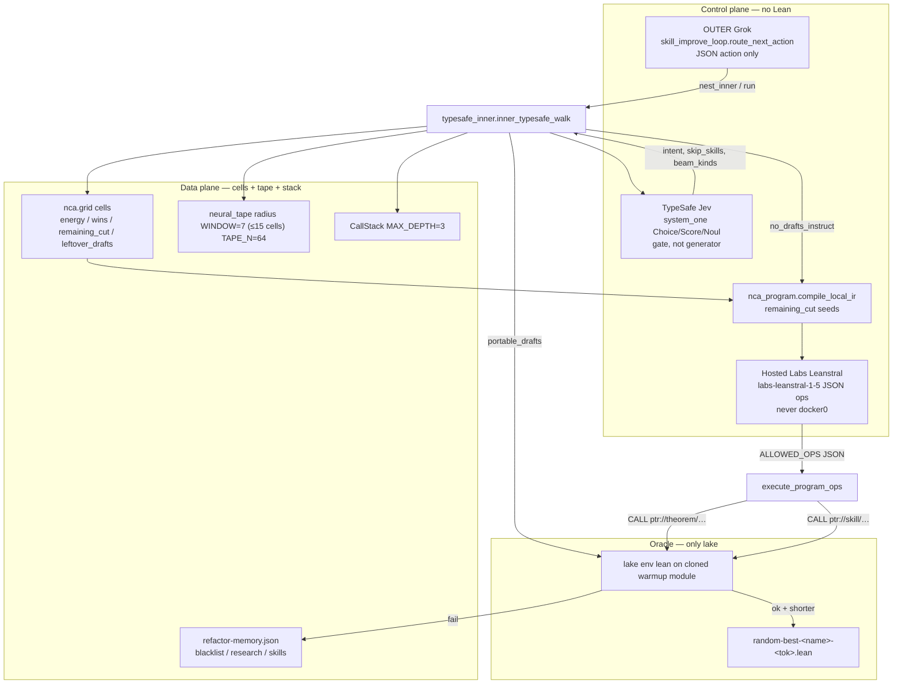
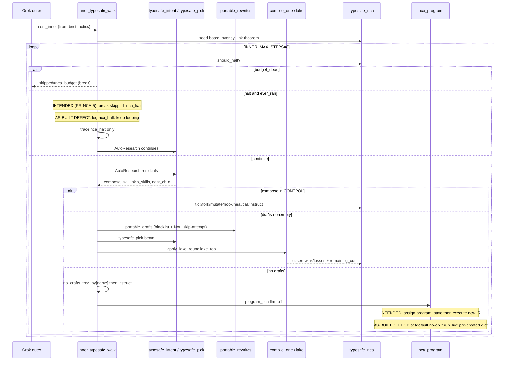

# As-Built TypeSafe Neural Cellular Automaton (NCA) — VeriCodeGen 2026 Lean Refactor Arena

| Field | Value |
| --- | --- |
| **Title** | As-built TypeSafe Neural Cellular Automaton for Lean Refactor Arena |
| **Author** | Benjamin Barber (`starworks5@gmail.com`) |
| **Date** | 2026-09-18 |
| **Status** | Current (landed 2026-09-18) |
| **Protocol** | `LRA/v1` |
| **Worktree** | `/home/barberb/lift_coding/.worktrees/vericodegen-lean_refactor_arena-2026` |
| **Harness** | `papers/completion/lean_refactor_arena/harness/` |
| **Kind** | As-built documentation of an implemented system, not a greenfield proposal |
| **Audience** | (1) coding agents that must operate the loop without violating LRA constraints; (2) software engineers who extend or debug the harness |
| **Not** | Arena scores. Not official Track 2. Not a token-savings claim. Never docker0. |

---

## Agent operating contract

> **Operate the TypeSafe NCA as a gate, not a generator.**
>
> 1. **Grok outer does not write Lean.** `skill_improve_loop.py` emits a closed JSON `action` (`run` / `nest_inner` / `mint` / `skip_stem` / `install_fold` / `stop`). TypeSafe inner walks the skill tree, spends Jev budget, and only mutates Lean via lake-ok portable folds.
> 2. **Jev does not write Lean.** `TypeSafeClient.system_one` answers Choice / Score / Noul. Code owns control flow (`typesafe_inner.inner_typesafe_walk`). Noul `true` = P(wrong) (SDE cookbook).
> 3. **`lake compile` is the only Lean oracle.** A shorter draft that does not compile is a retained failure. Accepted body for `--from-best` is: shortest `evidence/canaries/random-best-{safe}-*.lean` if present, else Inits `cascade-best-139.lean`, else the frozen JSONL tactic suffix. CCS (296) and Fsub (519) currently have **no** `random-best-*.lean`; those token counts are local warmup/keep sizes from `random-canary-latest.json`, not lake-cut artifacts.
> 4. **Never docker0.** Do not call `172.17.0.1` / `127.0.0.1:8080` from NCA instruct. Hosted Labs Leanstral is `labs-leanstral-1-5` (`track1_mistral_leanstral.py`, `hardware_class=mistral_labs_api`). Spark NVFP4 is `spark_gb10` only. Never conflate them.
> 5. **Live pass command** (from repo root, worktree above):
>
>    ```bash
>    /usr/bin/python3.12 papers/completion/lean_refactor_arena/harness/random_canary.py \
>      --live --all-small --from-best --init-139 --quiet
>    ```
>
>    Tests: `test_skill_improve_loop.py`, `test_random_canary.py`. `persist_memory=False` inhibits **every** `save_memory` in `run_loop` (per-step and final) so `memory={}` fixtures cannot wipe live `evidence/canaries/refactor-memory.json`. Covered by `test_persist_memory_false_never_writes`.
> 6. **Instruct is per canary**, stored in `observations.no_drafts_tree_by[name]` / `observations.no_drafts_instructed_by[name]`. There is no global `no_drafts` flag. `run_live` resets those maps at the start of a pass.
> 7. **Do not** rewrite original manuscripts, invent Arena / Track 2 scores, flip BLOCKED tasks (`LRA-S09`/`S10`, `LRA-024`/`025`/`027`) to completed, write the campaign DuckDB (`control.duckdb`), or claim unrun stages complete.
> 8. **Keep-bests as of last live pass** (local tokenizer; remaining_cut = warmup_tokens − keep tokens): subst 392, extracted 260, Inits 139, SKI 540, CCS 296, Fsub 519. On-disk lake-cut files exist for subst/extracted/Inits/SKI (`random-best-*-{392,260,139,540}.lean` plus Inits `cascade-best-139.lean`). Small canaries are those with warmup body ≤ 700 tokens (`MAX_LIVE_TOKENS`).
> 9. **Halt does not fire on a cold seed.** `should_halt` requires `ever_ran` (`program_state.last_ran` or journal events `call`/`instruct`/`jev`/`jev_pick`/`grok`) **or** `budget_dead`. Idle + never-ran is not halt (`test_cold_seed_does_not_halt`). Inner walk **logs** `nca_halt` but only **breaks** on `budget_dead`, so leftover-ranked small canaries still all run on a shared memory. Outer `run_loop` / `route_next_action` stop on full `should_halt`. `run_live` skips remaining canaries only on `budget_dead`. Inner halt-break would skip later canaries because `last_ran`/journal are shared.
> 10. **Exclusive DuckDB CAS is campaign-owned.** NCA overlay is read-only (`campaign_write=False`, `DatabaseTaskSource(..., install_schema=False)`). Sidecar AST DuckDB is `evidence/canaries/nca-ast.duckdb`, never `control.duckdb`. Overlay behind `LRA_NCA_READY_TASKS=1` is **already in tree**, not remaining work.

---

## Module map

All paths relative to `papers/completion/lean_refactor_arena/harness/` unless noted.

| Module | Role | Agents must not |
| --- | --- | --- |
| `skill_improve_loop.py` | OUTER Grok via `llm_router` (`generate_grok`); INNER TypeSafe nest via `random_canary.run_live` | Write Lean; treat `stop` as an Arena win; pass `persist_memory=True` (or omit it) on empty fixtures |
| `typesafe_inner.py` | Recursive TypeSafe walker; CALL/RETURN; per-canary `no_drafts_*_by`; `apply_lake_round`; `eval_theorem` | Treat Jev answers as Lean; set a global no_drafts flag; assume inner `break`s on idle halt (it only breaks on `budget_dead`) |
| `typesafe_nca.py` | Grid, tick, energy, `ptr://tool/budget`, halt, journal, `canonical_cell_id`, `merge_alias_cells`, remaining_cut | Fire halt on cold seed; write Lean; call docker0 |
| `nca_program.py` | `compile_local_ir` remaining-cut ranking; Leanstral JSON ops; `execute_program_ops` | Emit Lean snippets as ops; use docker0 Leanstral; treat instruct as lake |
| `nca_repair.py` | TypeSafe-ranked heal of corrupted NCA/tape/stack/ops | Invent new kernels; drop live ops that grow `diagnose()` |
| `neural_tape.py` | Ring tape `TAPE_N=64`, `WINDOW=7` **radius** (≤15 cells: `cells[head-7 : head+8]`); RETURN splice | Persist unbounded history; size prompts as 7 cells |
| `call_stack.py` | `ptr://` parse/coerce/resolve; CALL/RETURN forest; `MAX_DEPTH=3` | Exec the pointer tail; exceed depth 3 |
| `board_graph.py` | goals/subgoals/tasks/codepaths from `tasks.json`; `THEOREM_TASKS`; `seed_keepbest_theorems`; `overlay_ready_tasks` | Write `control.duckdb`; CAS; `install_schema=True` |
| `codepath_graph.py` | Harness AST sidecar + `nca-ast.duckdb` | Open campaign `control.duckdb`; dump source bodies; invoke inspect-only docker0 paths |
| `symbol_search.py` | DuckDB / vector / KG / AST / ripgrep ranking; SEARCH writes cells | Treat ranking as semantic authority |
| `typesafe_tools.py` | Closed tool catalog, MCP++ describe-only, `compose_decision_tree`, `register_subloop` | Live P2P; docker-hub submit |
| `portable_rewrites.py` | Keep-structure folds, `PIPELINE`, `SKILL_RESIDUAL`, `compose_pipeline`, `analyze_residuals` | Add folds that drop intro/constructor/grind/`<;>` without lake |
| `random_canary.py` | AutoResearch entry, `typesafe_intent`, `rank_live_records`, `run_live` | Rank by leftover work using the name `remaining_cut` |
| `binder_use.py` | Memory, blacklist, binder-safe drops, `rehydrate_from_skill_analysis` | Persist empty memory over live `refactor-memory.json` |
| `track1_ledger.py` | USD/Jev budget, fail-closed grok (`provider=grok`, no local fallback) | Mix Track 1 receipts into Track 2 / warmup trees; exceed US$3/problem |
| `typesafe_router.py` | Loop-v1 TypeSafe distill router (`LRA_TYPESAFE=off\|distill\|inloop`); frozen `ROUTE_QUESTION_SPEC` | Call Jev on official Track 2; mix Score with Noul as probabilities |
| `draft_fanout.py` / `pca_mca_fanout.py` | Closed draft families; PCA/MCA landscape on the frozen 15 | Use Jev to generate tactic text |
| `track1_mistral_leanstral.py` | Hosted Labs `labs-leanstral-1-5`; refuse docker0 | Conflate with Spark NVFP4 / `leanstral_local` |
| `test_skill_improve_loop.py` / `test_random_canary.py` | Contract tests | Run with `persist_memory=True` on empty fixtures; treat the visited-hot-task `should_halt` false case as a cold-seed test (it is not) |

---

## Overview

Lean Refactor Arena is not a proving contest: every frozen warm-up record already ships a Lean-correct reference proof. The game is to shorten the *proof body* while the theorem *statement* is preserved as the JSONL `statement` prefix of `src`, and while `lake env lean` still accepts the candidate on every listed tag. TypeSafe Jev cannot write that body. Grok (outer) cannot write that body. The as-built NCA exists so the inner TypeSafe walker has a **shared, tickable store** (cells + tape + call-stack forest) that (a) actually runs, (b) spends a fail-closed USD/Jev budget, and (c) changes Lean **only** when a portable fold lakes.

This document describes the implemented loop **and** three accidental defects that must not be frozen as contract (see **Implementation defects vs intended contract** below). Outer Grok (`skill_improve_loop.route_next_action`) chooses a closed action. Inner TypeSafe (`typesafe_inner.inner_typesafe_walk`) keep-loops up to `INNER_MAX_STEPS=8` at nest depth `NEST_MAX_DEPTH=3`, ranking portable drafts with AutoResearch (Choice + Score + Noul) and compiling them through `apply_lake_round`. When drafts are exhausted, the walker programs the NCA (`nca_program.program_nca`) with remaining-cut-ranked IR and optional hosted-Labs JSON work ops. Corrupted state is healed by closed kernels (`nca_repair.heal`). Lake remains the oracle. Negative results stay negative.

---

## Background & Motivation

### Why NCA exists

The outer Grok loop is a **control-plane router**. `skill_improve_loop.router_prompt` forbids Lean and admits only `ACTIONS = ("run", "nest_inner", "mint", "skip_stem", "install_fold", "stop")`. That is necessary (Grok must not invent tactic scripts under Track 1's US$3 cap and must not contaminate Track 2) but insufficient: TypeSafe still has to **do work**.

Without a shared store, the inner walker would:

- Re-seed the LRA board every nest, losing keep-best token counts and remaining_cut.
- Treat `port_foo` and `ptr://skill/port_foo` as different skills (alias collision).
- Halt on a cold seed because `diagnose()` is empty and no ops are pending.
- Instruct every canary after the first `no_drafts` because a global flag leaked across names.
- Wipe live `refactor-memory.json` when a unit test called `save_memory` on `{}` (**still open:** `persist_memory=False` does not gate the per-step save; PR-NCA-3).

The NCA is that store: a cell grid unified with a neural tape and a CALL/RETURN forest. A tick mixes self-energy, neighborhood, TypeSafe help/unsafe, and lake win-rate. Budget is a cell (`ptr://tool/budget`). Halt is a predicate on that grid, not a wall-clock.

### Current state (as of 2026-09-18)

- Frozen warm-up JSONL SHA-256 `6209680cf00cde0765b77b24834cd72c64dd585b2f7e3f2a58209980ab59a804` (15 problems, 36 tag-cells, 113 826 bytes).
- Native Quack campaign root: `/home/barberb/.local/state/ipfs_accelerate_py/vericodegen-2026-lra`. Campaign DuckDB: `…/lean_refactor_arena/control.duckdb`. NCA never writes it.
- Lake clones: `~/.local/state/ipfs_accelerate_py/vericodegen-2026-lra/track1-lake` (`random_canary.DEFAULT_STATE`).
- Live memory: `papers/completion/lean_refactor_arena/evidence/canaries/refactor-memory.json`.
- Small canary keep-bests (last live pass, local tokenizer): see Agent operating contract.
- Hosted Labs Leanstral (`labs-leanstral-1-5`, `hardware_class=mistral_labs_api`) is the NCA instruct generator. Spark NVFP4 docker0 (`172.17.0.1:8080`, `spark_gb10`) is the loop-v1 `run_warmup.py` generator and is **out of band** for NCA instruct.
- BLOCKED board cells: `LRA-S09`, `LRA-S10`, `LRA-024`, `LRA-025`, `LRA-027` (`board_graph.BLOCKED`). Energy clipped to ≤ 0.05, `do_not_fork=True`.

### Pain points this layer already paid for

| Pain | Symptom | Fix in tree |
| --- | --- | --- |
| Global `no_drafts` | First canary exhausted drafts; later canaries skipped instruct | `observations.no_drafts_tree_by` / `no_drafts_instructed_by` keyed by theorem name |
| Empty-memory wipe | Tests called `save_memory({})` over live blacklist/research | `run_loop(..., persist_memory=False)`; `rehydrate_from_skill_analysis` |
| Hoist ate `<;>` | `fold_hoist_repeated_simp` rewrote `induction post <;> simp […]` and dropped the combinator | Parent `semi` span: replace from `simp`, keep `<;>` (`test_hoist_repeated_simp_keeps_intro`) |
| Hoist adding `at *` | Parent `simp [substOld]` gained `at *` and closed intro-only `fvar`/`op` arms | Refuse hoist when `need_at and not parent["at_star"]` |
| `remaining_cut` vs leftover work | Ranking by warmup−keep hid canaries that still had portable drafts | `rank_live_records`: leftover un-blacklisted Noul-safe drafts first, then remaining_cut |

---

## Goals & Non-Goals

### Goals

1. Document the as-built TypeSafe NCA so a coding agent can run `--live --all-small --from-best` without violating LRA constraints.
2. Keep TypeSafe as a **gate**: rank, route, fire, heal. Code applies closed folds. Lake admits.
3. Spend Jev/Grok/Labs budget through `ProblemLedger` and the budget cell; halt when `budget_dead`.
4. Map theorems → LRA tasks → subgoals on a read-only board DAG seeded from `tasks.json`.
5. Program the automaton with remaining-cut-ranked IR and closed work ops (`CALL|TICK|SEARCH|MUTATE|BOARD|SLICE|KEEP|RETURN`).
6. Heal corrupted grid/tape/stack/ops with TypeSafe-ranked closed kernels.
7. Preserve keep-structure (`intro` / `constructor` / `grind` / `exact` / `use` / `<;>`) unless lake proves a cut.

### Non-goals (fail-closed rules, not optional)

These are standing LRA constraints. Violating any of them is a defect, not a stretch goal.

- **Original manuscripts unchanged.** Do not edit `manuscript/main.tex`, `warmup_table.tex`, or `main.pdf` from this loop.
- **Retain negative results.** Lake-fail rows stay in `memory.failures` and `blacklist`.
- **No general token-savings claims.** Local numbers are keep-best token counts / `local_proxy_*`. Never publish `token_savings` or Arena percentages.
- **No unrun stages as complete.** Completing warm-up is `verify_lra_batch --require-complete PASS`, not an NCA halt. Do not freeze the persist / `program_nca` / inner-halt defects as “as-built intent.”
- **No blocked→completed without a dedicated verifier.** `BLOCKED` cells stay `do_not_fork`.
- **No outside reviewers/submits.** LRA-027 / LRA-S10 remain blocked. Human author action.
- **`lake compile` is the only Lean oracle.** TypeSafe Noul, Grok JSON, and Leanstral JSON ops cannot flip a compile failure.
- **TypeSafe is gate not generator.** Jev does not write Lean.
- **Never docker0** (`172.17.0.1` / prototype local endpoint) from NCA instruct. `nca_program.leanstral_instruct` raises `Track1LedgerError` if `used_prototype_endpoint` or host in `{172.17.0.1, 127.0.0.1}`.
- **Hosted Leanstral (`labs-leanstral-1-5`) vs Spark NVFP4 never conflated.** Different `hardware_class` (`mistral_labs_api` vs `spark_gb10`).
- **Not Arena scores; not Track 2.** Payloads set `arena_score=None`, `official_track2=False`.
- **Exclusive DuckDB CAS is campaign-owned; NCA overlay is read-only.** `overlay_ready_tasks` requires `LRA_NCA_READY_TASKS=1` and `DatabaseTaskSource(..., install_schema=False)`.
- **BLOCKED:** `LRA-S09` / `LRA-S10`, `LRA-024` / `LRA-025` / `LRA-027`.
- **Tests must not persist empty memory** over live `refactor-memory.json`. Intended mechanism: `persist_memory=False` inhibits **all** `save_memory` in `run_loop`. As-built: only the final save is gated (defect, PR-NCA-3).

---

## Proposed Design (as-built)

### Implementation defects vs intended contract

Do **not** treat the following live Python as the design. They are accidental. Remaining PRs fix them.

| # | Contract | Status |
| --- | --- | --- |
| D1 | `persist_memory=False` inhibits **every** `save_memory` in `run_loop` (per-step and final). | **Fixed.** `test_persist_memory_false_never_writes`. `run_live` still saves (live path). |
| D2 | `program_nca` assigns `memory["nca"]["program_state"] = state` **before** `execute_program_ops`, then keeps `last_ran` / remaining ops / tactics. | **Fixed.** `test_program_nca_replaces_state_before_execute`. |
| D3 | Inner walk logs `nca_halt` but only **breaks** on `budget_dead`. Outer Grok stops on full `should_halt`. `run_live` skips remaining canaries only on `budget_dead`. | **As-built, keep.** Shared `last_ran`/journal means inner halt-break would skip later leftover-ranked canaries. |

Predicate `should_halt` itself is correct and must stay: cold seed (seeded board, empty journal, empty `last_ran`) is **not** halt. There is **no** existing test that `seed_nca_from_board` + empty journal/`last_ran` ⇒ `halt is False`. The false-halt fixture at `test_skill_improve_loop.py` ~1059 plants a **visited** task with energy 0.8, so `idle` is false. PR-NCA-6 adds that cold-seed assertion.

### 1. Control plane vs data plane



**Three authorities, fail-closed:**

| Plane | Actor | May do | May not do |
| --- | --- | --- | --- |
| Control | Grok (`generate_grok`, `FAIL_CLOSED_KWARGS`) | Emit one JSON action | Write Lean; fall back to Leanstral/HF; start llama-server |
| Control | Jev (`jev-latest`) | Rank family/skill/repair; fire Noul | Generate tactics; admit a proof; choose the next Python call |
| Control | Labs Leanstral (`labs-leanstral-1-5`) | Emit JSON `{ops:[…]}` | Emit Lean; call docker0 |
| Data | NCA grid / tape / stack | Store energy, remaining_cut, leftover_drafts, frames | Be the oracle |
| Oracle | `lake env lean` via `mcmc_beam.compile_one` | **Admit** or reject a body | Be overridden by Noul/Grok/Labs. Noul **may skip or deprioritize an attempt** (`fired_leaves`, `FIRE_T_RESIDUAL` drops from `portable_drafts` / `rank_live_records`, `skipped: noul_fire_all`). Noul cannot **accept** a body or flip a lake-fail to ok. |

Sequence of one inner step:



Outer `run_loop` / `route_next_action` already stop on `halt` or `budget_dead` after inner returns. `run_live` currently skips remaining canaries **only** on `budget_dead` (same defect as inner).

### 2. Cell grid as the shared store

`memory["nca"]["grid"]` is a dict of cells. Tape events and grid cells share identity via `canonical_cell_id`.

**Canonical ids** (`typesafe_nca.canonical_cell_id`):

| Input | Canonical |
| --- | --- |
| `ptr://…` | unchanged |
| `port_foo` / `mem_foo` | `ptr://skill/port_foo` |
| `residual:X` | `ptr://residual/X` |
| `proof:Name` | `ptr://theorem/Name` |
| `family:search_space` | `ptr://family/search_space` |
| kind ∈ {goal,subgoal,task,theorem,codepath,tool} | `ptr://{kind}/{raw}` |

`merge_alias_cells` collapses duplicates: wins/losses add, energy/tokens/help/unsafe/count take max, `remaining_cut = max(0, warmup_tokens − tokens)`, board edges rewritten to canonical pairs.

**Cell fields** (created by `_cell`):

```text
id, kind, energy ∈ [0,1], wins, losses, help, unsafe, tokens, tick
optional: warmup_tokens, remaining_cut, leftover_drafts, visited,
          do_not_fork, blocked, title, status, path, jev_calls, usd, updated_at
```

Kinds: `skill | residual | family | proof | tool | goal | subgoal | task | codepath | theorem | cell`.

**Energy tick** (`tick`, after `feed_state`):

```text
energy' = clip(
    0.45 * energy
  + 0.20 * mean(neighbor.energy)
  + 0.20 * (1 − unsafe)
  + 0.10 * win_rate
  + 0.05 * min(1, help/2)
)
energy' *= 0.98                          # per-tick decay
if stale > STALE_SECONDS=3600: energy' *= 0.85
if losses > wins:              energy' = clip(energy' − 0.15)
if do_not_fork or blocked:     energy' = min(energy', 0.05)
```

Neighborhood (cap 12): KG edges from `skill_knowledge_graph`, same-kind skills, `nca.board_edges`. Optional `focus` ticks only the focused cell and its board neighbors.

**Budget cell** `ptr://tool/budget` (`charge_budget`):

- Fresh cell starts at energy 1.0.
- With a `ProblemLedger`, `energy = remaining_usd / budget_usd` (US$3 default).
- Without a ledger, energy decays by `min(0.25, 0.02 * calls + min(0.2, usd))`.
- `budget_dead` ⇔ `visited` and `energy < 0.1`.

**remaining_cut vs leftover_drafts:**

| Field | Definition | Used for |
| --- | --- | --- |
| `warmup_tokens` | Local tokenizer count of frozen JSONL body suffix (`board_graph.warmup_token_map` → `run_warmup.token_count(split.body_suffix)`) | Baseline |
| `tokens` | Keep-best body tokens (`seed_keepbest_theorems` / lake-ok credit) | Current best |
| `remaining_cut` | `max(0, warmup_tokens − tokens)` | IR seed ranking (`compile_local_ir`); board_window theorem slice |
| `leftover_drafts` | Count of un-blacklisted, Noul-safe (`unsafe < FIRE_T_RESIDUAL`) portable drafts on the keep-best body | **Live pass order** (`rank_live_records` sorts `(-n_drafts, -remaining_cut, name)`) |

Do not use `remaining_cut` as a synonym for “work left.” A canary can have `remaining_cut=0` relative to an already-short keep-best and still have leftover drafts, or the reverse (Inits remaining_cut is large because warmup ≫ 139, but leftover drafts may be 0 after blacklist + residual Noul).

**Halt** (`should_halt`):

```text
issues     = nca_repair.diagnose(memory)
pending    = program_state.ops whose op ∉ {KEEP, RETURN}
hot_tasks  = task cells with visited ∧ ¬do_not_fork ∧ ¬blocked ∧ energy > 0.12
ever_ran   = last_ran nonempty  ∨  journal event in {call, instruct, jev, jev_pick, grok}
idle       = ¬issues ∧ ¬pending ∧ ¬hot_tasks
halt       = (ever_ran ∧ idle) ∨ budget_dead
```

Cold seed (board just inserted, journal empty, `last_ran=[]`) is **not** halt. `run_live` clears `last_ran` and strips those journal events at pass start so a previous pass cannot halt the next one via `ever_ran`.

**Who honors halt (intended vs as-built):**

| Layer | Intended | As-built |
| --- | --- | --- |
| `should_halt` predicate | `(ever_ran ∧ idle) ∨ budget_dead`; cold seed false | Matches |
| Outer `route_next_action` / `run_loop` | `stop` on `halt` or `budget_dead` | Matches |
| Inner `inner_typesafe_walk` | `break` on `halt` **or** `budget_dead`; lake row `skipped: nca_halt` | **Defect:** `halt` is only `trace.append`; only `budget_dead` `break`s (PR-NCA-5) |
| `run_live` canary loop | skip remaining on `halt` or `budget_dead` | **Defect:** skip remaining only on `budget_dead` |
| Tests | `seed_nca_from_board` + empty journal/`last_ran` ⇒ `halt is False` | **Missing.** Existing false-halt fixture has a visited hot task (energy 0.8) so `idle` is false (PR-NCA-6) |

**Journal** is a ring of 128 rows: `{tick, event, ptr, op, energy_delta, …}`. `replay_journal` re-applies the last 32 deltas onto canonical cells.

**Tape / grid unification.** `Tape.write` records `{kind, payload, energy, ptr, parent_frame, tokens, theorem_ok}`. `WINDOW = 7` is a **radius**: `window(width)` returns `cells[max(0, head-width) : min(n, head+width+1)]`, so at most **15** cells, not 7. `TAPE_N = 64` is the ring cap. `inner_typesafe_walk._after` always: tape.write → `tick(focus=ptr)` → `upsert_from_event` (EMA 0.7·old + 0.3·energy; wins clamp ≥ 0.7, losses ≤ 0.35; parent backprop 0.8/0.2) → persist window/stack onto memory. Child RETURN (`Tape.splice_return`) injects `{injected: True}` onto the parent tape.

### 3. Pointer algebra and CALL/RETURN forest

`call_stack.PTR_RE`:

```text
^ptr://(skill|family|theorem|module|tool|cell|subloop|mcpplusplus|goal|subgoal|task|codepath)/([A-Za-z0-9_./:-]+)$
```

`coerce_ptr` (no exec of the tail):

| Raw | Pointer |
| --- | --- |
| already `ptr://…` | unchanged |
| tool catalog key | `ptr://tool/{name}` |
| `foo.py` (no `/`, no `..`) | `ptr://module/foo.py` |
| `port_*` / `mem_*` | `ptr://skill/…` |
| family names (`search_space`, `dead_code`, …) | `ptr://family/…` |
| `skill_walk` / `nca_tick` / `nca_fork` / `eval_theorem` | `ptr://subloop/…` |
| `mcpplusplus` / `p2p_*` | `ptr://mcpplusplus/…` |
| `LRA-G*` / `LRA-S*` / `LRA-{digit}*` | goal / subgoal / task |
| `harness.*` / `codepath/…` | `ptr://codepath/…` |
| contains `.` (theorem-like) | `ptr://theorem/…` |
| else | `ptr://skill/…` |

`resolve_ptr` fail-closes unknown tools/subloops/MCP++ names and disallows `module` paths with `/` or `..`. Pointers never `eval`/`exec`.

**CallStack** is a forest, not only a linear stack:

- `call` pushes `f{n}` with `parent_id`, `child_ids`, closed `locals` (`CHILD_ARG_KEYS` only — no secrets, no API keys).
- Depth ≥ `MAX_DEPTH=3` returns `{ok: False, reason: "max_depth"}`.
- `ret` pops, stores `return_slot`, marks `live=False`, keeps the frame in `forest` for `walk` / `ancestors` / `children`.
- Walker tools: `stack_walk`, `stack_parent`, `stack_children`, `tape_populate`.

On `compose == "call"` or `nest_child` starting with `ptr://`, the inner walker: coerce → resolve → `stack.call` → kind-dispatch → `stack.ret` → `tape.splice_return`. Kind dispatch:

| Kind | Action |
| --- | --- |
| `theorem` | `eval_theorem` (small warmup only; `n_tokens > MAX_LIVE_TOKENS` fail-closed) then `credit_theorem` |
| `tool` | `typesafe_tools.run_tool` |
| `mcpplusplus` | local catalog/describe envelope (`live_p2p=False`) |
| `goal`/`subgoal`/`task` | `board_payload` (blocked cells energy 0.2) |
| `codepath` | `slice_cross_module`; inspect-only if name/path mentions generate_text/docker0/`172.17` (`invoked=False` in `execute_program_ops`) |
| `module` | `hook_and_eval` (path must sit under harness or paper root) |
| else, depth < max | nested `inner_typesafe_walk` with `allow_families` / `allow_skills` |

### 4. Board DAG: theorems → LRA tasks

`board_graph.load_lra_board` reads `papers/completion/lean_refactor_arena/tasks.json` (no Quack). Shape:

```text
ptr://goal/LRA-G000
  └─ ptr://subgoal/LRA-S01 … LRA-S10
       └─ ptr://task/LRA-010 … LRA-027
            └─ ptr://codepath/harness.*   (deliverables + suggested_code_paths)
```

`THEOREM_TASKS` (small canaries only):

| Theorem | Task | Subgoal credited |
| --- | --- | --- |
| `CallElimCorrect.substOldPostSubset` | LRA-017 | LRA-S04 |
| `CallElimCorrect.extractedOldExprInVars` | LRA-017 | LRA-S04 |
| `Cslib.LambdaCalculus.LocallyNameless.Fsub.Typing.progress` | LRA-017 | LRA-S04 |
| `Cslib.SKI.parallelReduction_diamond` | LRA-017 | LRA-S04 |
| `Core.InitsUpdatesComm` | LRA-019 | LRA-S05 |
| `Cslib.CCS.bisimilarity_congr_choice` | LRA-019 | LRA-S05 |

`credit_theorem` upserts theorem → task → subgoal, sets `visited` on the task, and writes `remaining_cut` when `warmup_tokens` is present. Unmapped theorems return `{ok: False, reason: "unmapped_theorem"}` (fail-closed, not a silent no-op that looks like success).

`seed_nca_from_board` is idempotent (`skipped=already_seeded` unless `force=True`). It also builds the AST sidecar DuckDB once (`nca.sidecar_built`) via `codepath_graph.build_sidecar_duckdb` and seeds call edges. `campaign_write` is always `False`.

**Live overlay** (`overlay_live_board`):

1. Default: if `quack-owner/paper-owner.ready.json` exists under the LRA lane, import `paper_supervisor_campaign.fetch_board` and copy **status only** onto existing task cells. Never CAS.
2. Cached after first success (`overlay_done`). `run_loop` pops `overlay_done` each outer step so a long loop can see newly-ready tasks.
3. Optional `overlay_ready_tasks`: off unless `LRA_NCA_READY_TASKS=1`. Then `replica_ready_page` opens `DatabaseTaskSource(endpoint, owner_id="lra-nca-overlay-readonly", install_schema=False)` and marks those aliases `status=ready`, `energy ≥ 0.55`. Missing ready JSON is not an error (`ok: True, n_ready: 0`).

Blocked cells (`BLOCKED`) are marked `do_not_fork` at seed and by heal kernel `mark_blocked`. IR / tick / fork skip them. `compile_local_ir` also drops `LRA-G000` and any `/goal/` seed so the root goal is never CALLed as work.

`board_window` has **three caps**, not one:

| Function | Cap | What it contains |
| --- | --- | --- |
| `refresh_board_window` | stores `window[:12]` | root goal + top-3 remaining_cut theorems + top-6 subgoals + top-6 ready/todo tasks (built in that order, then sliced) |
| `board_window()` getter | returns `[:8]` | prefix of the stored window |
| `nca_status_for_router` | slices again to `window[:6]` | what Grok actually sees in `nca=` |

Do not implement “Grok sees 12 rows / top-6 subgoals + top-6 tasks” from the stored construction order. The prompt sees at most 6. Unifying the three constants is optional hygiene, not remaining product work; the overlay/ranking already landed.

### 5. IR compile → optional Leanstral instruct → execute ops

`nca_program.compile_local_ir` ranking (then `ir_to_work_ops`):

1. `ptr://theorem/{problem}` if a current problem is set.
2. Theorem/proof cells with `remaining_cut > 0` (or `warmup_tokens > tokens`), **descending remaining_cut**.
3. Task cells that are `status=ready` or unvisited, not blocked / `do_not_fork`.
4. Remaining high-energy cells, excluding `do_not_fork` and the root goal.
5. Cap 8 seeds. Closed IR ops: `SeedEntities` → `Expand` → `Project` → `Limit`.

Optional enrichment (fail-open): `ipfs_datasets_py` QueryIR, modal decompiler (imported, **not executed** on NCA IR — “not a legal sample”), AdaptiveModalAutoencoder hints.

`ir_to_work_ops` emits at most 4 CALLs + `SLICE` + `TICK` + `KEEP`. `SEARCH` is prepended only when decompiled instructions exist. Ops outside `ALLOWED_OPS` are dropped.

**Instruct** (`leanstral_instruct`):

- Prompt: “You program a TypeSafe neural cellular automaton. Do not write Lean. Never call docker0… Reply with JSON `{ops:[…]}`.”
- `parse_work_ops` strips any object whose packed JSON contains Lean markers (`simp_all`, `intros `, `theorem `, `\nby\n`, `exact ⟨`, `induction `, `have :=`).
- Default `llm="off"` in the inner walker: use local IR ops, still `execute_program_ops`. Hosted Labs is opt-in (`llm="leanstral"` or a `generate` fixture). `used_prototype_endpoint` is a hard error.

**Execute** (`execute_program_ops`, `MAX_EXECUTE=8`):

| Op | Effect |
| --- | --- |
| `TICK` | `typesafe_nca.tick` |
| `BOARD` | `seed_nca_from_board` + `overlay_live_board` |
| `SLICE` | `slice_cross_module("harness.portable_rewrites:fold_hoist_repeated_simp")` + callee edges |
| `SEARCH` | `symbol_search.search_symbols` (writes up to 8 cells) |
| `MUTATE` | `typesafe_nca.mutate` (reorder / skip / fold / mint) |
| `CALL ptr://theorem/…` | `eval_theorem` + `credit_theorem` |
| `CALL ptr://skill/…` | match `portable_drafts` (or `compose_pipeline` if stem contains `pipeline`); `apply_lake_round` if `compile_fn` present |
| `CALL` goal/subgoal/task | `board_payload` |
| `CALL` codepath | slice; inspect-only if docker0-tainted |
| `CALL` mcpplusplus | local envelope |
| `CALL` tool | `nca_heal` / `symbol_search` / `board_walk` / `codepath_slice` only; others `{skipped: "no_nested_walk"}` |
| `KEEP` / `RETURN` | stop |

**Intended `program_nca` order (PR-NCA-4):** compile IR → optional Labs JSON → `memory["nca"]["program_state"] = state` **(replace, not setdefault)** → bump `ptr://tool/nca_program` energy → `execute_program_ops` (runs the **new** ops) → copy `last_ran`, remaining `ops`, `tactics` onto that same dict → `charge_budget(..., event="instruct")`.

**As-built defect:** `setdefault("program_state", state)` is a no-op when the dict already exists. `run_live` always does `nca.setdefault("program_state", {})["last_ran"] = []` before any walk, so the live instruct path executes leftover/empty ops, then assigns `state["ops"] = executed["remaining"]` and replaces `program_state` with a dict that **drops** `last_ran`. Newly compiled CALLs do not run on that call. Tests that only assert the trace action `no_drafts_instruct` do not catch this. The body-changing instruct test preloads `ops` with `CALL ptr://skill/port_trailing_tuple_comma` and never exercises “compile new IR, then execute those ops” after `run_live`’s empty `program_state`.

Inner `compose == "instruct"` uses `llm="off"` and, if tactics changed **and** no skill CALL already laked, runs one extra `apply_lake_round` on kind `nca_instruct`. Lean snippets still need lake. That extra lake round can still shorten the body even when D2 dropped the new IR CALLs; it is not a substitute for assign-before-execute.

### 6. Heal path

`nca_repair.diagnose` residuals → closed kernels. TypeSafe ranks; **`diagnose()` length is the oracle**, not Jev.

| Kernel | Residual codes | Family |
| --- | --- | --- |
| `coerce_cells` | `nca_not_dict`, `grid_not_dict`, `cell_not_dict`, `missing_kind` | cells |
| `clip_energy` | `energy_oob` (NaN/inf/out of [0,1]) | cells |
| `alias_cells` | `alias_collision` (`port_foo` vs `ptr://skill/port_foo`) | cells |
| `mark_blocked` | `blocked_unmarked` (id contains a `BLOCKED` token) | cells |
| `fix_tape` | `tape_cells_not_list`, `tape_head_oob` | tape_stack |
| `fix_stack` | `bad_frame`, `dangling_parent` | tape_stack |
| `fix_program_ops` | `bad_work_op`, `call_without_ptr`, `docker0_in_ops` (`172.17.0.1` stripped) | program |
| `reseed_board` | `missing_grid`, `missing_goal` | board |

`heal`: snapshot → apply → if `len(diagnose)` grew, revert that kernel and append it to `nca.heal_blacklist` (last 16). With a ledger, `typesafe_pick_repair` runs a Choice(family) + Choice(repair) + Noul(unsafe); if `unsafe > FIRE_T` take the first in-family kernel. `feed_state` auto-heals when diagnose is nonempty. Compose `heal` and tool `nca_heal` are the explicit path.

### 7. How an agent runs a live pass

Working directory: worktree root. Interpreter: `/usr/bin/python3.12`. Do not set `LRA_TYPESAFE` for this path (inner AutoResearch uses `TYPESAFE_API_KEY` directly). Do not start llama-server. Do not `LOCK_EX`.

```bash
cd /home/barberb/lift_coding/.worktrees/vericodegen-lean_refactor_arena-2026
export IPFS_ACCELERATE_LLAMA_CPP_AUTOSTART=0
/usr/bin/python3.12 papers/completion/lean_refactor_arena/harness/random_canary.py \
  --live --all-small --from-best --init-139 --quiet
```

What `run_live` does:

1. Load frozen JSONL; assert digest; fit PCA/MCA landscape; filter `n_tokens ≤ 700`.
2. `load_memory()` (scrubs patched bans, rehydrates from `skill-analysis.json` if blacklist/research/failures are empty).
3. **Reset per-canary instruct maps** (`no_drafts_tree_by` / `no_drafts_instructed_by` → `{}`); clear `last_ran`; strip journal `call|instruct|jev|jev_pick|grok`.
4. `rank_live_records`: leftover Noul-safe portable drafts first, then remaining_cut. Writes `leftover_drafts` / `remaining_cut` / `warmup_tokens` onto theorem cells.
5. Seed board, overlay (read-only), `seed_keepbest_theorems`.
6. For each record, unless `budget_dead`: `run_nested_canary` (keep-best body, clone restore around lake). **Intended (PR-NCA-5):** also skip remaining canaries when `should_halt` (idle+ever_ran), not only `budget_dead`.
7. Persist memory (`run_live` always `save_memory`s — no persist flag; operator live path is supposed to write). Write `skill-analysis.json` + `random-canary-latest.json`.

Optional outer loop (Grok routing, still no Lean):

```bash
/usr/bin/python3.12 papers/completion/lean_refactor_arena/harness/skill_improve_loop.py \
  --live --llm on --outer 3 --rounds 1 --lake-top 3
```

**Interpreting outcomes:**

| Signal | Meaning | Agent action |
| --- | --- | --- |
| `lake[].ok == true` + `random-best-<safe>-<tok>.lean` written | Lake-valid shorter body. Keep-best updated. | Do not revert. Credit is already on the theorem cell. |
| `lake[].ok == false` | Retained failure. `remember_failure` blacklisted `{name}::{kind}` (ephemeral kinds hash the body). | Do not retry the same kind/body. `skip_stem` is the outer action if all lake rows failed a `port_*`. |
| `skipped: no_drafts_self_improve` | First empty-draft hit: minted keep-structure + decision_tree; `no_drafts_tree_by[name]=True`. Walker **continues**. | Not a halt. Next step should instruct. |
| `action: no_drafts_instruct` | Second empty-draft hit: `program_nca(llm=off)` was invoked; `no_drafts_instructed_by[name]=True`. | Inspect `executed.ran`. **Until PR-NCA-4**, live `run_live` pre-created `program_state` means those new IR CALLs often did **not** run; `executed.ran` may be leftover/empty. Extra `nca_instruct` lake round only fires if tactics already changed. |
| `skipped: no_drafts_after_self_improve` | Instruct already ran this canary and drafts are still empty. | Stop this canary. Do not set a global flag. |
| `skipped: nca_budget` | Budget cell visited and energy < 0.1, or ledger hard-stop. Inner **and** outer stop. | Do not start another live pass without a new ledger. |
| `trace action: nca_halt` (no skip) | Inner logged idle+ever_ran halt but **kept looping** (defect). Outer `run_loop` will `stop` after this canary returns. | Until PR-NCA-5, do not treat inner `nca_halt` as a hard stop of the keep-loop. |
| `skipped: noul_fire_all` | Every draft leaf Noul-fired (`FIRE_T=0.7` or `FIRE_T_LEAF=0.45` on a previously failed stem). Legal **skip of the attempt**. | Do not force lake. Noul still cannot admit a body. |
| `skipped: no_clone` | Warmup clone missing under `DEFAULT_STATE`. | Fail closed; do not invent a PATH `lean` compile. |
| keep-best file unchanged | No lake-ok cut this pass. Legal. | Remaining_cut may still be > 0 (warmup − keep). That is **not** leftover drafts. |

Keep-best lookup (`starting_tactics` / `keep_best_board`):

1. Shortest `random-best-{safe}-*.lean` by token suffix, if any file exists.
2. Else, for `Core.InitsUpdatesComm` only, `cascade-best-139.lean` if present.
3. Else the frozen JSONL tactic block (`draft_fanout.tactic_block`).

`--from-best` uses that chain. CCS and Fsub currently have no `random-best-*.lean`; 296 / 519 are `keep_best_board` values from `random-canary-latest.json` `n_tokens`, not lake-cut files. `keep-best file unchanged` in the table above means “no new `random-best-*` written this pass,” which is the expected state for those two names.

### 8. How an engineer adds a portable skill

A new skill is a **keep-structure fold**, not a one-off string and not a Jev-written tactic.

1. **Write a pure function** `fold_<stem>(tactics: str) -> str` in `portable_rewrites.py`. It must:
   - No-op when the pattern is absent.
   - Refuse if `token_count(nxt) >= token_count(tactics)` (except when the fold is a keep-structure mint that is not a cut).
   - Keep `intro` / `intros` / `constructor` / `grind` / `induction` / `exact` / `use` / `<;>` unless the **parent already has** the combinator you would add (see hoist `at *` / `<;>` rules).
   - Be binder-safe: if it drops `have` / `rename_i` / named `intro`, call `binder_use.safe_to_drop_span` / `idents_in`. Never treat type ascriptions as binders (`have der' : Typing Γ t τ := der` binds `der'`, not `Typing`).
2. **Register residual** in `SKILL_RESIDUAL` (`stem → AutoResearch residual name`) so Noul `unsafe_{residual}` can skip it (`FIRE_T_RESIDUAL=0.5`).
3. **Decide PIPELINE vs drafts-only.** Default `PIPELINE` is applied by `compose_pipeline` in memory-weighted order (wins, losses, `nca.pipeline_bias`, research help, keep-structure first). `drop_intro_before_simp_all` is **intentionally not** on `PIPELINE` (high AutoResearch help, lake failed). Put high-risk folds in `portable_drafts` only.
4. **KEEP_STRUCTURE** (`trailing_tuple_comma`, `redundant_inner_simp`, `hoist_repeated_simp`) are minted when AutoResearch says `do_not_cut` (`unsafe ≥ 0.45`) via `binder_use.KEEP_MINTS` / `expand_skills_from_memory`.
5. **Blacklist hygiene.** Lake-fail calls `remember_failure` → `{name}::port_{stem}`. Ephemeral MCA/PCA kinds hash the body (`{name}::{family}::{sha12}`) plus `{name}::body::{sha12}`. If you **patch** a broken fold, add the stem to `_PATCHED_UNBAN` so `scrub_blacklist` drops the old ban (example: `port_unused_intros` now skips arms whose next tactic is `assumption`).
6. **Memory-installed folds** (`install_memory_skill`): literal `old→new` with `keep ⊆ ALLOWED_KEEP`. Rejected if the fold would drop a listed keep-word. Grok `install_fold` uses this; it does not exec Python.
7. **Tests.** Add a case to `test_random_canary.py` that: (a) shortens a fixture, (b) preserves the keep-word/`<;>`/`at *` invariant, (c) no-ops the unsafe parent. Do **not** persist memory (`persist_memory=False` after PR-NCA-3 actually inhibits writes; until then, do not call `run_loop`/`run_live`/`save_memory` against live `MEMORY_DEFAULT`).
8. **Do not** add a skill that calls docker0, writes `control.duckdb`, or treats Jev text as Lean.

Ranking skills (not Lean folds) live in `nca_rankers.py` and are CALLed as `ptr://skill/port_{random_forest,bayes_time,mcmc,svd,pca,thompson,ridge}`:

- **Random forest** — tiny CART forest on lake successes/failures. Ranks leftover drafts; writes `nca.pipeline_bias`. Needs ≥4 labeled rows.
- **Bayes over time** — Beta-Bernoulli `α,β` with forget `0.98` on each live `observe_bayes`. `sync_bayes_from_memory` rebuilds conjugate counts. Posterior mean is energy, not a lake admit.
- **Generalized MCMC** — Metropolis-Hastings over any state (`propose`, `energy`, optional hard `accept`). Default NCA skill permutes pipeline order; energy is `1 − Bayes mean`. Tactic MH still needs lake to admit.
- **Grid SVD (`port_svd`)** — truncated SVD of the **theorem × skill** lake matrix (win +1, fail −1). Recommends skills for a theorem from neighbors. This is **not** proof-AST PCA.
- **PCA CALL (`port_pca`)** — runs existing `pca_mca_fanout.fit_pca_mca` (`np.linalg.svd` on tactic counts) and writes family cells. Do not mint a second AST SVD.
- **Thompson (`port_thompson`)** — sample `Beta(α,β)` so a high-variance stem still gets a lake try.
- **Ridge (`port_ridge`)** — integer milles ridge; companion to the forest on small n.
- **Integer milles suite (`nca_int_rankers.py`)** — SVD, PCA, OLS, logistic, k-means, kNN, ICA, NMF, Kalman, Bayes, MCMC. Scores are `0..1000` milles. No float64 in the hot path. Kalman is 1-D `(x,P,Q,R)` ints. PCA CALL uses tactic-count integers + power-iteration SVD, not `np.linalg.svd`.

`pipeline_order` key:

```text
(−wins[stem], losses[stem], bias_index, −bayes_mean, −research_help, 0 if KEEP_STRUCTURE else 1, stem)
```

### 9. Failure modes already observed

#### 9.1 Global `no_drafts` flag

**Bug.** A single `observations.no_drafts_tree` / `no_drafts_instructed` boolean made the second small canary skip self-improve+instruct because the first canary had already exhausted drafts.

**Fix.** `_no_drafts_flag` / `_set_no_drafts_flag` key by `record["name"]` under `no_drafts_tree_by` / `no_drafts_instructed_by`. `bias_compose_no_drafts` reads those maps. `run_live` resets both maps at pass start. Test: `test_no_drafts_instruct_is_per_canary` (Inits and SKI both instruct on a shared memory).

#### 9.2 Empty-memory wipe (intended contract not implemented)

**Bug.** `run_loop` / tests called `binder_use.save_memory` on `{}` and overwrote live `refactor-memory.json` (blacklist, research, keep-structure skills, NCA grid, tape).

**Intended fix.** `persist_memory=False` inhibits **all** `save_memory` in `run_loop` — the per-step call after `apply_action` **and** the final save. Tests with `memory={}` must not touch `MEMORY_DEFAULT`. A contract test must point `MEMORY_DEFAULT` at a temp path (or patch `save_memory`) and assert zero writes.

**As-built (still broken; PR-NCA-3).** `persist_memory` only gates the **final** save:

```python
lra_bind.save_memory(memory)   # per outer step, unconditional (~433)
...
mem_path = lra_bind.save_memory(memory) if persist_memory else lra_bind.MEMORY_DEFAULT
```

`binder_use.save_memory` always writes `MEMORY_DEFAULT`. Tests `test_loop_uses_llm_router_fixture_not_docker0` and `test_outer_grok_runs_before_inner_typesafe` pass `memory={}` **and** `persist_memory=False`, then seed the board onto that empty dict and hit the per-step save. Passing the kwarg is not the fix. `load_memory` rehydrates blacklist/research from `skill-analysis.json` when those lists are empty; it does **not** restore clobbered NCA grid / tape / observations / skills. `run_live` always `save_memory`s twice with no persist flag (operator live path is supposed to persist; tests must not call `run_live` against live memory).

#### 9.3 Hoist ate `<;>`

**Bug.** `fold_hoist_repeated_simp` replaced the whole parent span `induction post <;> simp [substOld] at *`, dropping `<;>` and leaving `induction post simp […]`.

**Fix.** If `parent["semi"]`, `replace_start` is the `simp` token, not the span start. Test asserts `"<;>" in nxt.split("induction")[-1].split("case")[0]`.

#### 9.4 Hoist adding `at *`

**Bug.** Hoisting case-local `simp [getVars] at *` onto `induction post <;> simp [substOld]` added `at *` to the parent. Lake: `Case tag op not found` — intro-only fvar/op arms were closed too early.

**Fix.** `if need_at and not parent["at_star"]: return tactics`. Comment in `fold_hoist_repeated_simp` records the substOldPostSubset lake failure. Test: parent without `at *` must be unchanged.

#### 9.5 `remaining_cut` naming vs leftover work

**Bug.** Ranking live canaries by `warmup_tokens − keep_tokens` sent Inits first even when leftover portable drafts were 0 (everything Noul-fired or blacklisted), starving canaries that still had Noul-safe folds.

**Fix (already in tree).** `rank_live_records` sorts `(-len(drafts), -cut, name)` where drafts are un-blacklisted and `unsafe[residual] < FIRE_T_RESIDUAL`. Both numbers are written onto the theorem cell (`leftover_drafts`, `remaining_cut`). IR still ranks by remaining_cut (how much the frozen body can still fall). Live order ranks leftover drafts first. Test: `test_rank_live_and_rehydrate_gaps` expects Inits first **after** rehydrate makes leftover drafts 0, i.e. remaining_cut is the tie-break, not the primary key when drafts exist. Not remaining implementation work.

#### 9.6 `program_nca` setdefault vs replace-then-execute

**Bug.** `program_nca` installs compiled ops with `setdefault("program_state", state)`. Live `run_live` pre-creates that dict, so new IR never executes; `last_ran` is dropped when the leftover of the old execute is written back.

**Intended fix (PR-NCA-4).** Assign `memory["nca"]["program_state"] = state` **before** `execute_program_ops`. After execute, set `state["ops"] = remaining`, `state["last_ran"] = ran`, `state["tactics"] = body` on that same dict. Contract test: start from `program_state={"last_ran": []}` (the `run_live` shape) then `program_nca(...)` must execute newly compiled CALLs and leave `last_ran` populated.

#### 9.7 Inner walk logs `nca_halt` but does not break

**Bug.** `inner_typesafe_walk` treats `should_halt()["halt"]` as a trace event and continues AutoResearch / lake / instruct. Only `budget_dead` `break`s. `run_live` likewise skips remaining canaries only on `budget_dead`. Outer Grok already stops.

**Intended fix (PR-NCA-5).** After `should_halt`, if `halt` (including idle+ever_ran) **or** `budget_dead`: append the trace event, append a lake row `skipped: nca_halt` or `nca_budget`, and `break`. `run_live` skips remaining canaries on either flag. Do not halt on cold seed (PR-NCA-6 tests that).

---

## API / Interface Changes (as-built)

No new public packages. The following are the live interfaces an extender must preserve.

### Outer action (Grok)

```python
ACTIONS = ("run", "nest_inner", "mint", "skip_stem", "install_fold", "stop")
# parse_action: first JSON object; unknown → {"action": "run", "reason": "unknown_action"}
```

`apply_action` mutates memory only: blacklist key `{name}::port_{stem}`, `expanded` mint notes, or `install_memory_skill`. No `exec`.

### `persist_memory` (intended vs as-built)

```python
# INTENDED (PR-NCA-3): every save in run_loop
if persist_memory:
    lra_bind.save_memory(memory)   # per step and final

# AS-BUILT DEFECT: per-step save is unconditional
lra_bind.save_memory(memory)  # ~433, always
mem_path = lra_bind.save_memory(memory) if persist_memory else lra_bind.MEMORY_DEFAULT
```

Default `persist_memory=True` (operator live path). Tests **must** pass `False` **and** the implementation must honor it on every write. Rehydrate is recovery, not the write inhibit.

### Inner walk return

```python
{
  "tactics": str,
  "lake": list[dict],          # ok / tokens / error_class / skipped
  "ranked": dict,              # beam_kinds, fired_leaves, jev_generated_lean=False
  "trace": list[dict],         # nested_trace children; flatten_trace for outer
  "n_steps": int,
  "returned": True,
  "jev_generated_lean": False,
  "called_docker0": False,
  "tape": Tape.to_dict(),
  "stack": CallStack.to_dict(),
}
```

### Work ops

```python
ALLOWED_OPS = ("CALL", "TICK", "SEARCH", "MUTATE", "BOARD", "SLICE", "KEEP", "RETURN")
# CALL requires ptr://… ; docker0 host in the packed JSON is stripped by heal
```

### Ledger (fail-closed grok)

```python
FAIL_CLOSED_KWARGS = {
    "provider": "grok",
    "model_name": "grok-4.6",
    "temperature": 0.0,
    "allow_local_fallback": False,
    "allow_cross_provider_fallback": False,
    "disable_model_retry": True,
}
PROBLEM_BUDGET_USD = Decimal("3.00")
JEV_INPUT_USD_PER_MTOK = Decimal("0.042")   # output free
JEV_MODEL_ID = "jev-latest"
MISTRAL_MODEL_ID = "labs-leanstral-1-5"     # USD 0 logged, still counted in call caps
```

`ProblemLedger.authorize` hard-stops on official Track 2, max calls, or budget overrun. Skill-improve live ledgers raise `max_jev_calls` to `max(8, 6 * rounds * outer * 3 + 2)` because AutoResearch is many small Jev calls, not the Track-1-scored two-call envelope.

### TypeSafe cookbooks in this loop

| Cookbook | Where |
| --- | --- |
| System One | `TypeSafeClient.system_one` in `typesafe_intent`, `typesafe_pick`, `typesafe_pick_repair`, `typesafe_router` |
| Hierarchical classification | `family` Choice then `leaf_{fam}` Choice (`draft_tree`) |
| Confidence | `CONFIDENT=0.55`; high-stakes floor 0.85 (`Inits`, `CCS`); `UNCERTAIN=0.60` max-prob floor |
| SDE (Noul true=wrong) | `will_fail_compile`, `fail_{kind}`, `unsafe_{residual}`, heal `unsafe`; fire `FIRE_T=0.7`, residual `0.5`, leaf `0.45` |
| AutoResearch | `typesafe_autoresearch` → residual Score `help_*` + Noul `unsafe_*` drive `skip_skills` |
| Intent routing | `intent` Choice over families; `compose` Choice over CONTROL ∪ `{keep,single,pipeline}` |
| Fan-out | `draft_fanout.py`, `pca_mca_fanout.py`; inner still uses `random_drafts` + portable |
| Composite scoring | `0.45*(1−noul) + 0.25*leaf_p + 0.20*family_p + 0.10*cut_norm` |
| Skill suggestion | `skill` Choice over `available_skills` |
| Rerank | `rank_live_records`; `pipeline_order`; IR remaining_cut |

Score is a **rubric index**, not a probability (`SCORE_IS_RUBRIC_INDEX = True` in `typesafe_router.py`). Mixing Score with Noul as if both were P(true) is a contract break.

---

## Data Model Changes

### `refactor-memory.json` (`binder_use.MEMORY_DEFAULT`)

```text
successes[]     {name, kind, family, from_tokens, to_tokens}
failures[]      {name, kind, error_class, unknown, key}
blacklist[]     "{name}::{kind}" | "{name}::{family}::{sha12}" | "{name}::body::{sha12}"
research[]      last 8 snapshots per name: residuals, unsafe, help, skill, compose
expanded[]      keep-structure mint notes
skills[]        memory-installed literal folds
skill_params    {}
observations    no_drafts_tree_by, no_drafts_instructed_by, tool payloads
subloop_returns last 32
nca             {grid, tick, journal, board_edges, board_window, program_state,
                 pipeline_bias, mutations, overlay_done, live_overlay, sidecar_built,
                 heal_blacklist, call_edges}
tape            {cells[≤64], head, n}
```

### NCA program_state

```text
ops            remaining ALLOWED_OPS
last_ran       executed rows with ok / detail_ok
ir             compile_local_ir blob
tactics        body after execute
provider       local_ir | fixture | mistral
hardware_class nca_local_ir | fixture | mistral_labs_api
called_docker0 False
```

### Sidecar (not campaign CAS)

- JSON: `evidence/canaries/nca-ast-sidecar.json`
- DuckDB: `evidence/canaries/nca-ast.duckdb`
- Campaign: `/home/barberb/.local/state/ipfs_accelerate_py/vericodegen-2026-lra/lean_refactor_arena/control.duckdb` — **never opened by NCA write paths**

### Keep-best artifacts

```text
evidence/canaries/random-best-{safe_name}-{tokens}.lean
  # present today: subst 392, extracted 260, Inits 139, SKI 540
  # absent today:  CCS 296, Fsub 519  (JSON n_tokens only; --from-best uses JSONL suffix)
evidence/canaries/cascade-best-139.lean          # Inits fallback
evidence/canaries/random-canary-latest.json      # keep_best_board also reads n_tokens here
evidence/canaries/skill-analysis.json            # rehydrate source (blacklist/research only)
evidence/canaries/skill-improve-loop-latest.json
```

### Migration

No schema migration. `scrub_blacklist` + `_PATCHED_UNBAN` is the compatibility path. `rehydrate_from_skill_analysis` recovers blacklist/research after an accidental empty write; it is **not** a substitute for persist gating. `merge_alias_cells` is the id-unification path. Heal is the structural repair path. `program_nca` must replace `program_state` before execute (PR-NCA-4); no migrator needed.

---

## Alternatives Considered

### Alt 1 — Grok writes Lean under Track 1

Rejected. Outer prompt forbids Lean; `FAIL_CLOSED_KWARGS` still cannot emit tactic blocks into `apply_lake_round`. Track 1 budget is US$3/problem; a free-form Grok script blows both cost and the “Jev/Grok are gates” contract.

### Alt 2 — Jev generates tactic scripts (TypeSafe as generator)

Rejected. Standing LRA rule: TypeSafe is gate not generator. Inner walker would become an agent loop (explicitly rejected in `design_win_plan.md` Alt 3). Noul cannot be the oracle.

### Alt 3 — Docker0 Leanstral as NCA instruct

Rejected. Loop v1 `run_warmup.py` is the docker0 HTTP client (`172.17.0.1:8080`, never `LOCK_EX`). NCA instruct uses hosted Labs `labs-leanstral-1-5`. Conflating them would mix `spark_gb10` wall-clock with `mistral_labs_api` JSON ops and would re-open docker0 from a path that must stay closed. `leanstral_instruct` fail-closes on prototype host.

### Alt 4 — Campaign DuckDB as the NCA store

Rejected. Learned from LA-031 ART-index crashes. Exclusive CAS is campaign-owned. NCA uses in-memory `nca.grid` persisted inside `refactor-memory.json`, plus a **sidecar** DuckDB for AST ids. Overlay is read-only, `install_schema=False`.

### Alt 5 — Halt when the grid is idle, including cold seed

Rejected. A freshly seeded board has no issues, no pending ops, and no visited hot tasks. Halt-on-idle would skip the first live pass. `ever_ran` (or `budget_dead`) is required. Inner **must** still `break` once `ever_ran ∧ idle` (PR-NCA-5); that is not this alternative.

### Alt 6 — Rehydrate after wipe instead of gating all memory I/O

Rejected. `rehydrate_from_skill_analysis` restores blacklist/research only. NCA grid, tape, observations, and memory-installed skills stay clobbered. Tests with `memory={}` must not write `MEMORY_DEFAULT` at all (`persist_memory=False` on **every** `save_memory`, PR-NCA-3).

### Alt 7 — Execute leftover ops, then install newly compiled IR (`setdefault`)

Rejected. Live `run_live` pre-creates `program_state`, so `setdefault` never installs the new ops and `last_ran` is dropped. Intended: replace-then-execute (PR-NCA-4). Preloading `ops` in tests hides the bug.

---

## Security & Privacy Considerations

| Threat | Severity | Mitigation |
| --- | --- | --- |
| TypeSafe / xAI / Mistral keys in memory or receipts | High | In-tree clients never store keys; `CHILD_ARG_KEYS` closed bag; advisor contract; no debug body logs in scored runs |
| docker0 / prototype endpoint from NCA instruct | High | Host check in `leanstral_instruct`; heal strips `172.17.0.1` from ops; inspect-only codepaths; payloads `called_docker0=False` |
| Track contamination (Jev on official Track 2) | High | `LRA_TYPESAFE=off` on Track 2; NCA is not the Track 2 runner; ledger `official_track2` refuses spend |
| Pointer exec / path escape | High | `parse_ptr` charset; `hook_and_eval` allowlist (harness + paper root); module ptr rejects `/` and `..` |
| Campaign CAS write from overlay | High | `campaign_write=False`; `install_schema=False`; `LRA_NCA_READY_TASKS` opt-in; never `compare_and_set` |
| Empty test memory wiping live blacklist | High | **Intended:** `persist_memory=False` gates every `save_memory` (PR-NCA-3). Rehydrate is recovery only. **As-built:** per-step save still writes. |
| Statement mutation | High | Prefix bind remains `src.startswith(statement)`; NCA only edits tactic bodies; `eval_theorem` reloads warmup records |
| `sorry` / axiom smuggling | High | Lake + `#print axioms` on the compile worker; NCA does not admit proofs |
| MCP++ live P2P / docker-hub | Medium | Catalog/describe envelopes only; `live_p2p=False` |
| Stack depth bomb | Medium | `MAX_DEPTH=3`, `FORK_MAX=4`, `INNER_MAX_STEPS=8`, `NEST_MAX_DEPTH=3` |

---

## Observability

- **Per-pass JSON:** `random-canary-latest.json` (`schema=lra-random-canary/v1`) with landscape, canaries, lake rows, skill_analysis, nca_status, ledger. `arena_score` always `null`.
- **Per-outer JSON:** `skill-improve-loop-latest.json` with history `{action, board, n_ok, max_trace_depth, nca_halt}`.
- **Grid window:** stored ≤12 (`refresh_board_window`), getter ≤8 (`board_window()`), Grok prompt ≤6 (`nca_status_for_router`).
- **Journal:** last 128 `{event, ptr, op, energy_delta}` including `tick`, `upsert`, `call`, `BUDGET`, `instruct`, `grok`, `jev`, `heal`.
- **Halt snapshot:** `{halt, n_issues, n_pending_ops, n_hot_tasks, budget_energy, budget_dead, called_docker0}`.
- **Ledger:** `jev_calls` / `grok_calls` / `mistral_calls` / `spent_usd` / `remaining_usd` / `hard_stopped`. Budget cell energy is the NCA view of the same spend.
- **Alerts (operator, not code):** digest mismatch vs frozen SHA; `called_docker0=True` anywhere; `campaign_write=True`; empty `refactor-memory.json` after a test run; keep-best token **increase**; BLOCKED cell with `do_not_fork=False`.
- **Tests as contract:** `test_skill_improve_loop.py` (overlay, remaining_cut, per-canary instruct, MCP++, heal, IR ranking). `test_random_canary.py` (folds, hoist `<;>` / `at *`, binder gates, PCA landscape, frozen digest). **Gaps:** persist gating is not proven (kwarg passed, per-step save still writes); `should_halt` false fixture is a visited hot task, **not** a cold seed; `program_nca` after `run_live`-shaped empty `program_state` is not asserted. PR-NCA-3/4/6 add those. Hoist tests already exist; do not reland them.

---

## Rollout Plan

The NCA core, leftover-vs-remaining ranking, and `LRA_NCA_READY_TASKS` read-only overlay are **already in tree**. Remaining work is (a) land this document, (b) **fix the three defects** (persist gating, `program_nca` assign-before-execute, inner halt-break), (c) a true cold-seed halt test. Not a rewrite. Not a second overlay. Not a rename of `remaining_cut`.

1. **Land this document** next to `design_win_plan.md` / `RUNBOOK.md` (PR-NCA-1/2/7). Cross-link live-pass command and fail-closed rules. Do not claim Arena/Track 2.
2. **Gate persist I/O** (PR-NCA-3). `persist_memory=False` must inhibit every `save_memory` in `run_loop`. Prove it with a temp-path / patched-save test.
3. **Replace-then-execute** (PR-NCA-4). `program_nca` assigns `program_state` before `execute_program_ops`. Prove it from `run_live`-shaped `{last_ran: []}`.
4. **Inner halt-break** (PR-NCA-5) plus **cold-seed test** (PR-NCA-6). Inner and `run_live` stop on full `should_halt`; `seed_nca_from_board` alone does not halt.
5. **Rollback:** `--from-best` bodies (file if present, else JSONL suffix); memory blacklist retains failures. Disable instruct by not exhausting drafts, or run with no Labs key (`llm=off` local IR). Disable outer Grok with `skill_improve_loop --llm off`. Official Track 2 remains `LRA_TYPESAFE=off` and is not this loop. Do not roll back overlay/ranking — those already landed.

Feature flags actually consulted by this layer:

```text
LRA_NCA_READY_TASKS=1          # opt-in read-only ready_tasks replica
LRA_TYPESAFE=off|distill|inloop  # typesafe_router (loop v1 / Track 2); inner AutoResearch uses TYPESAFE_API_KEY directly
LRA_TRACK1 / LRA_GENERATOR     # track1_ledger mode; NCA grok still fail-closed
IPFS_ACCELERATE_LLAMA_CPP_AUTOSTART=0
```

---

## Open Questions

1. **Should `remaining_cut` be renamed `warmup_minus_keep` in a later memory version?** As-built code and tests use `remaining_cut`. A rename needs a one-shot migrator on `refactor-memory.json` grid cells. Default: keep the name, document leftover_drafts as the live-order key.
2. **When to set `LRA_NCA_READY_TASKS=1` in operator runs.** Replica requires `paper-owner.ready.json` and a reachable Quack endpoint. Default off is safer.
3. **Hosted Labs Leanstral retire date** recorded as `2026-09-30` in `track1_mistral_leanstral.LABS_RETIRE_DATE`. After retire, instruct stays `llm=off` local IR unless a new hosted identity is frozen. Do not fall back to docker0.
4. **Warmup body token map vs JSONL `proof_length`.** `remaining_cut` uses local `token_count(body_suffix)`, not organizer `proof_length`. Do not publish the delta as an Arena score.
5. **4×A100 / SM80 GGUF / Track 2** remain gated (`LRA-S09`, `LRA-024`, `LRA-025`). This document does not resolve them.

---

## Key Decisions

1. **TypeSafe inner must actually run, spend budget, and change Lean only via lake-ok.** Rationale: Grok outer is forbidden from writing Lean; a gate that never fires and never lakes is a no-op. NCA is the shared store that makes the inner loop stateful across nests.
2. **Three planes: Grok JSON actions, TypeSafe tree walk, lake oracle.** Rationale: mixing them (Jev as generator, Grok as tactic author, Noul as admit) violates LRA and Track split. Code owns control flow.
3. **Cell grid unified with tape and stack, not a second database.** Rationale: campaign DuckDB is exclusive CAS; LA-031 taught INSERT-only / filesystem. `refactor-memory.json` is the persist path; sidecar DuckDB is AST ids only.
4. **Budget is a cell (`ptr://tool/budget`), halt requires `ever_ran` or `budget_dead`.** Rationale: cold seed must not halt (`test_cold_seed_does_not_halt`); spend must be visible to Grok via `nca_status_for_router`. Inner only *breaks* on `budget_dead` so leftover-ranked canaries still all run.
5. **Canonical `ptr://` ids + `merge_alias_cells`.** Rationale: `port_foo` and `ptr://skill/port_foo` double-counted wins and broke remaining_cut.
6. **`ptr://` kinds closed; CALL/RETURN forest `MAX_DEPTH=3`.** Rationale: unbounded nested grok/Jev blows the US$3 cap and the “no agent loop” rule. Pointers never exec.
7. **Board from `tasks.json`, overlay read-only, BLOCKED clipped.** Rationale: NCA must see LRA-S09/S10 and LRA-024/025/027 as non-forkable without writing `control.duckdb`.
8. **IR seeds rank by remaining_cut; live canaries rank leftover drafts first.** Rationale: observed starvation of draft-bearing canaries when remaining_cut was the only key.
9. **Instruct is hosted Labs JSON ops, never Lean, never docker0; lake still required.** Rationale: Spark NVFP4 and Labs Leanstral are different hardware classes. Lean markers stripped in `parse_work_ops`.
10. **Heal is closed kernels ranked by TypeSafe; `diagnose()` length is the accept oracle.** Rationale: same pattern as portable folds. Jev may pick; a kernel that grows residuals is reverted and blacklisted.
11. **Per-canary `no_drafts_*_by[name]`, reset at `run_live` start.** Rationale: a global flag skipped instruct on later canaries.
12. **`persist_memory=False` is a process-wide write inhibit, not a final-path skip.** Rationale: empty fixture writes destroyed live blacklist/research **and** NCA grid/tape. Per-step and final `save_memory` are both gated (`test_persist_memory_false_never_writes`).
13. **Hoist must preserve `<;>` and must not add `at *` to a parent that lacks it.** Rationale: two distinct lake failures on CallElim (combinator drop; intro-only arms closed).
14. **Keep-structure folds over one-off strings; binder-use gates drops; blacklist is per-problem.** Rationale: substOldPostSubset `trigger1` / Fsub `der'` / CCS `μ` were binder bugs, not ranking bugs.
15. **Noul true = wrong (SDE); FIRE_T=0.7, FIRE_T_RESIDUAL=0.5, FIRE_T_LEAF=0.45.** Rationale: ident-shorten Noul ~0.49 still laked and failed; leaf fire skips earlier on previously failed stems. Noul **may skip or deprioritize an attempt** (`noul_fire_all`, residual skip); it cannot **admit** a body or override a lake-fail.
16. **Not Arena scores, not Track 2, original manuscripts unchanged, negative results retained.** Rationale: standing LRA protocol `LRA/v1`.
17. **`program_nca` replaces `program_state` before execute.** Rationale: `run_live` pre-creates `program_state` with `last_ran=[]`. Assign-before-execute is the contract (`test_program_nca_replaces_state_before_execute`).
18. **Inner TypeSafe logs `nca_halt` but only breaks on `budget_dead`.** Rationale: `last_ran`/journal are shared across canaries. Breaking the inner walk on idle halt would skip later leftover-ranked small canaries. Outer Grok still stops on full `should_halt`.
19. **`--from-best` body is file-if-present else JSONL suffix.** Rationale: CCS/Fsub have no `random-best-*.lean`; token counts 296/519 are JSON `n_tokens`, not lake-cut artifacts. Do not claim keep-best files are the only accepted bodies.

---

## Risks

| Risk | Severity | Mitigation |
| --- | --- | --- |
| Agent writes Lean via Grok/Jev/Labs | High | Closed actions; parse_work_ops Lean-marker strip; lake oracle; tests assert `jev_generated_lean=False` |
| docker0 from instruct | High | Host check; heal strip; inspect-only codepaths |
| Memory wipe | High | `persist_memory=False` gates every `run_loop` `save_memory`. Rehydrate is recovery only. |
| Halt on cold seed (regression) | High | `ever_ran` predicate + `test_cold_seed_does_not_halt`. |
| Inner keep-loop after `nca_halt` | Medium | By design for multi-canary live: inner only breaks on `budget_dead`; outer stops on halt. |
| Instruct IR never executed on live path | High | Assign `program_state` before `execute_program_ops`. |
| Overlay CAS on control.duckdb | High | install_schema=False; campaign_write=False; env opt-in |
| remaining_cut / leftover_drafts confusion | Medium | Distinct fields; rank_live_records docstring; this document |
| Hosted Labs retire 2026-09-30 | Medium | llm=off local IR; never docker0 fallback |
| Keep-structure regression on hoist | Medium | Unit tests for `<;>` and `at *` |
| Track 2 contamination | High | This loop is not Track 2; flags stay off; no SM80 claims |

---

## References

- `papers/completion/lean_refactor_arena/design_win_plan.md` — winning architecture; TypeSafe as gate; docker0 client protocol for loop v1 (out of band for NCA instruct).
- `papers/completion/lean_refactor_arena/harness/RUNBOOK.md` — warm-up operator command; `verify_lra_batch --require-complete`; not Track 2.
- `papers/completion/lean_refactor_arena/NATIVE_BOARD.md` — dedicated campaign state-root; blocked tasks.
- `papers/completion/lean_refactor_arena/tasks.json` — board import source.
- `papers/completion/lean_refactor_arena/protocol.md` — `LRA/v1`.
- `papers/completion/lean_refactor_arena/harness/typesafe_nca.py` and siblings listed in Module map.
- TypeSafe cookbooks as implemented: System One, hierarchical classification, confidence, SDE, AutoResearch, intent routing, fan-out, composite scoring, skill suggestion, rerank.
- Frozen warm-up SHA-256 `6209680cf00cde0765b77b24834cd72c64dd585b2f7e3f2a58209980ab59a804`.

---

## PR Plan

The core NCA, leftover-drafts ranking, `LRA_NCA_READY_TASKS` read-only overlay, hoist `<;>` / `at *` tests, and per-canary instruct maps are **already in tree**. Do **not** re-implement overlay or ranking. Remaining work is documentation plus the three defects and a true cold-seed test. Do **not** rewrite original manuscripts or claim Arena / Track 2.

**Already landed (not remaining PRs):** `rank_live_records` leftover-then-remaining_cut (docstring + `test_rank_live_and_rehydrate_gaps`); `overlay_ready_tasks` / `replica_ready_page` with `install_schema=False` (env-off and missing ready JSON already tested); `test_hoist_repeated_simp_keeps_intro`.

### PR-NCA-1 — Land as-built NCA design next to the paper

- **PR title:** `lra: as-built TypeSafe NCA design (unscored, never docker0)`
- **Files/components:** `papers/completion/lean_refactor_arena/harness/NCA.md` (or `design_nca.md`); optional pointer from `harness/RUNBOOK.md` and `NATIVE_BOARD.md`
- **Dependencies:** none
- **Description:** Check in this document in-tree. State keep-bests **and** the CCS/Fsub JSONL fallback, FIRE_T*, ptr:// kinds, halt/`ever_ran`, per-canary instruct, leftover_drafts vs remaining_cut, and the three defects vs intended contract. Explicit non-goals: manuscripts, Arena scores, Track 2, docker0, blocked tasks. No code behavior change in this PR.

### PR-NCA-2 — RUNBOOK cross-links for the live TypeSafe pass

- **PR title:** `lra: RUNBOOK live NCA pass and fail-closed contract`
- **Files/components:** `harness/RUNBOOK.md`
- **Dependencies:** PR-NCA-1 (link target)
- **Description:** Add a section that is **not** the loop-v1 docker0 operator command: `random_canary.py --live --all-small --from-best`, how to read `no_drafts_*_by`, lake-fail blacklist, keep-best **file-if-present else JSONL suffix**, persist_memory intended contract. Reaffirm hosted Labs vs Spark NVFP4. Do not mark warm-up complete. Do not write Arena scores.

### PR-NCA-3 — Gate every `save_memory` on `persist_memory`

- **PR title:** `lra: persist_memory=False inhibits all run_loop memory writes`
- **Files/components:** `skill_improve_loop.py` (`run_loop` per-step save ~433 and final save); `test_skill_improve_loop.py`
- **Dependencies:** none
- **Description:** Wrap **both** `save_memory` calls in `if persist_memory`. Default remains `True` for operator live. Add a test that points `MEMORY_DEFAULT` at a temp path (or patches `save_memory`) with `memory={}` and `persist_memory=False` and asserts **no write**. Do not treat “tests pass the kwarg” as the fix. `run_live` stays a persisting operator entry (no persist flag); tests must not call it against live memory. Rehydrate stays recovery, not the inhibit.

### PR-NCA-4 — `program_nca` assign-before-execute

- **PR title:** `lra: program_nca replaces program_state before execute`
- **Files/components:** `nca_program.py` (`program_nca`); `test_skill_improve_loop.py`
- **Dependencies:** none
- **Description:** Replace `setdefault("program_state", state)` with `memory["nca"]["program_state"] = state` **before** `execute_program_ops`. After execute, copy `last_ran`, remaining `ops`, and `tactics` onto that same dict (do not drop `last_ran`). Contract test: `program_state={"last_ran": []}` (the `run_live` shape) then `program_nca(...)` must execute newly compiled CALLs and leave `last_ran` populated. Do not count the preloaded-ops instruct test as covering this.

### PR-NCA-5 — Inner walk and `run_live` break on full `should_halt`

- **PR title:** `lra: inner TypeSafe breaks on nca_halt, not only budget_dead`
- **Files/components:** `typesafe_inner.py` (`inner_typesafe_walk` halt branch); `random_canary.py` (`run_live` canary loop); tests in `test_skill_improve_loop.py`
- **Dependencies:** none (predicate already correct)
- **Description:** When `should_halt()["halt"]` and not only `budget_dead`: append `nca_halt`, append lake `{skipped: "nca_halt"}`, `break`. `run_live` skips remaining canaries on `halt` or `budget_dead`. Outer already stops. Do **not** halt on cold seed.

### PR-NCA-6 — True cold-seed halt test

- **PR title:** `lra: should_halt is false on seed_nca_from_board alone`
- **Files/components:** `test_skill_improve_loop.py`
- **Dependencies:** none (can land with or after PR-NCA-5)
- **Description:** Assert `should_halt` is false after `seed_nca_from_board` with empty journal and empty/`absent` `last_ran` (no visited hot task). The existing false-halt fixture (~1059, visited task energy 0.8) does **not** cover this. Do not reland hoist tests.

### PR-NCA-7 — Engineer cookbook: adding a portable skill

- **PR title:** `lra: portable-skill extension notes (keep-structure / binder-use / blacklist)`
- **Files/components:** short section in the in-tree NCA doc from PR-NCA-1; optional module docstring on `portable_rewrites.PIPELINE`
- **Dependencies:** PR-NCA-1
- **Description:** Copy the “How an engineer adds a portable skill” contract: residual map, PIPELINE vs drafts-only, `_PATCHED_UNBAN`, no docker0, tests must not persist memory (after PR-NCA-3, `persist_memory=False` actually works). No new folds in this PR unless a live lake-fail needs a patched unban.

Each PR is independently reviewable. None of them execute Track 2, write manuscripts, or claim scores.
